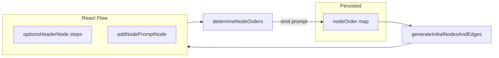

# Add-node placeholder (prompter) on empty diagram

## Current behavior (relevant files)

- [`src/components/diagram/flow-diagram.tsx`](src/components/diagram/flow-diagram.tsx): React Flow state (`useNodesState` / `useEdgesState`), `addNode` appends an `optionsHeaderNode`, and a `useEffect` calls `determineNodeOrders(nodes, edges)` → `onNodeOrderChange`.
- [`src/components/diagram/flow-diagram-helpers.ts`](src/components/diagram/flow-diagram-helpers.ts): `generateInitialNodesAndEdges` builds nodes from `nodeOrder`; **empty `{}` yields `nodes: []`**. `determineNodeOrders` serializes every node in `nodes` into `NodeOrderMap`.
- [`src/components/diagram/node-form.tsx`](src/components/diagram/node-form.tsx): Add flow is already controllable via `showAddNodeDialog` / `setShowAddNodeDialog` (same pattern as the toolbar button in `FlowDiagram`).

## React Flow recommended practices ([Custom Nodes](https://reactflow.dev/learn/customization/custom-nodes), [TypeScript](https://reactflow.dev/learn/advanced-use/typescript))

Align the new node type with the library’s documented patterns:

- **Stable `nodeTypes`**: The docs recommend defining `nodeTypes` **outside** the `FlowDiagram` component so the object identity does not change every render (which would hurt performance and can cause unnecessary `<ReactFlow />` updates). Today [`flow-diagram.tsx`](src/components/diagram/flow-diagram.tsx) uses `useMemo(..., [])` for a stable reference; when implementing, **prefer moving to module scope**: export a single `nodeTypes` constant next to thin wrapper components, and wire behavior via **refs** (same idea as `handleEditNodeRef` for `OptionsHeaderNode`). Update both `optionsHeaderNode` and `addNodePromptNode` wrappers to use that pattern so the whole map is stable and matches the docs.
- **Typed custom node**: Define an explicit node type, e.g. `type AddNodePromptNode = Node<AddNodePromptNodeData, 'addNodePromptNode'>` and implement the component as `memo(function AddNodePromptNode(props: NodeProps<AddNodePromptNode>) { ... })` so `data` and `type` are type-safe per the TypeScript guide.
- **Interactive content**: For the CTA button (and any future focusable controls inside the node), add the **`nodrag`** class so clicks do not start a drag ([Custom Nodes](https://reactflow.dev/learn/customization/custom-nodes) — same pattern as their input example). Shadcn `Button` can use `className={cn('nodrag', ...)}`.
- **Handles**: Omit source/target handles on the prompter so it cannot connect; this matches “add handles when you need connections” from the docs.

## React performance in the flow builder

Apply standard React patterns so the canvas stays cheap to re-render as graphs grow (aligned with [React Flow custom nodes](https://reactflow.dev/learn/customization/custom-nodes) and general React guidance):

- **Stable props into `<ReactFlow />`**: Keep **`nodeTypes`** and **`edgeTypes`** at **module scope** (already planned). Also hoist **`defaultEdgeOptions`** to a **module-level constant** (or `useMemo` with `[]`) so a new object is not created every parent render—today [`flow-diagram.tsx`](src/components/diagram/flow-diagram.tsx) passes an inline `defaultEdgeOptions={{ type: 'buttonEdge' }}`, which allocates each time.
- **`useCallback` for handlers** that are passed to `ReactFlow` or close over state: keep **`onConnect`**, **`isValidConnection`**, and any new handlers **memoized** with correct dependency arrays; avoid recreating them unless inputs they close over change.
- **Memoized custom nodes**: `AddNodePromptNode` and existing [`OptionsHeaderNode`](src/components/diagram/options-header-node.tsx) stay **`memo`**’d; avoid anonymous components inside `nodeTypes` (use named wrappers only).
- **Refs for instance-specific callbacks**: Continue using **refs** for edit / open-dialog actions so **`nodeTypes` does not depend on** changing callback identities each render (same pattern as `handleEditNodeRef`).
- **Expensive work**: Keep **`generateInitialNodesAndEdges`** behind **`useMemo`** keyed by `nodeOrder` and template params (already the case); do not add per-render work that scales with node count in the component body.
- **Effects**: The new “re-inject prompter” **`useEffect`** should use a **minimal dependency list** and guard clauses to avoid **setState loops** and redundant `setNodes` calls (compare before updating when possible).
- **Top-level export**: Keep the default export wrapped in **`memo(FlowDiagram)`** so parent re-renders do not re-render the flow unless props change.

During implementation, cross-check edited files against the repo’s **Vercel React best practices** skill (`.agents/skills/vercel-react-best-practices`) for any additional TSX-specific items touched in this change.

## Recommended approach: synthetic, non-persisted node

Avoid extending `NodeData` / DB schema: treat the prompter as a **client-only** node with a stable id and dedicated `type`, and **strip it inside `determineNodeOrders`** so the parent always receives `{}` when only the prompter is present.

## Implementation steps

### 1. Helpers: create, detect, and exclude the prompter

In [`src/components/diagram/flow-diagram-helpers.ts`](src/components/diagram/flow-diagram-helpers.ts):

- Add exported constants, e.g. `ADD_NODE_PROMPT_NODE_ID` (fixed string) and node type string `addNodePromptNode`.
- Add `isAddNodePromptNode(node)` (check `node.type` and/or `node.id` for defense in depth).
- Add `createAddNodePromptNode(): Node` with `position: { x: 0, y: 0 }`, minimal `data`, and **no handles** (so it cannot participate in edges; aligns with existing connection rules).
- **`generateInitialNodesAndEdges`**: when `Object.keys(nodeOrder).length === 0`, return `{ nodes: [createAddNodePromptNode()], edges: [] }` instead of empty arrays.
- **`determineNodeOrders`**: run the existing algorithm on `nodes.filter(n => !isAddNodePromptNode(n))` only, so the prompt never appears in saved order.

### 2. New UI component: `AddNodePromptNode`

Add something like [`src/components/diagram/add-node-prompt-node.tsx`](src/components/diagram/add-node-prompt-node.tsx):

- Implement as a **`memo`**’d component with **`NodeProps<AddNodePromptNode>`** (explicit `Node<..., 'addNodePromptNode'>` type) per [TypeScript custom nodes](https://reactflow.dev/learn/advanced-use/typescript).
- Short copy prompting the user to create a step, plus a primary button with the **`nodrag`** class (see React Flow section above).
- On button click, invoke `onOpenAddNode` from props; the wrapper registered in **module-level** `nodeTypes` should forward to a ref (same stability pattern as `OptionsHeaderNode` + `handleEditNodeRef`).
- Omit edit/delete header actions (unlike `OptionsHeaderNode`) so users are not encouraged to “delete” the empty state; if they still remove the node via keyboard/React Flow, step 4 re-adds it.

### 3. Wire `FlowDiagram`

In [`src/components/diagram/flow-diagram.tsx`](src/components/diagram/flow-diagram.tsx):

- **Refactor `nodeTypes` to module scope** (see React Flow section): one stable `nodeTypes` map, module-level ref(s) for “open add dialog” and existing edit handler, assigned in `useEffect` inside `FlowDiagram`. Register `addNodePromptNode` there; it calls `setShowAddNodeDialog(true)` via the ref (reuses existing [`NodeForm`](src/components/diagram/node-form.tsx) mount path).
- **Performance pass** (see “React performance” section): hoist **`defaultEdgeOptions`**; confirm **`onConnect`** / **`isValidConnection`** / other `ReactFlow` props stay stable; implement the prompter **`useEffect`** without feedback loops.
- **`addNode`**: when appending the new `optionsHeaderNode`, first **remove any prompter** from state (`filter` + `concat`), so the placeholder disappears as soon as a real node exists.
- **`isFirstNode`**: today `nodes.length === 0` is used in `addNode`; change to **count non-prompter nodes** so the first real node still gets `isFirstNode: true` when the prompter was on screen.
- **`useEffect` guard**: when there are **no real nodes** and the prompter is **missing** (e.g. user deleted the last step, or deleted the prompter), `setNodes` to include `createAddNodePromptNode()`. Avoid duplicates when the prompter is already present.

### 4. Tests

Extend [`src/components/diagram/flow-diagram-helpers.test.ts`](src/components/diagram/flow-diagram-helpers.test.ts):

- Empty `nodeOrder` → `generateInitialNodesAndEdges` returns exactly one node of type/id matching the prompter.
- `determineNodeOrders` with only the prompter node → `{}`.
- Existing tests for real nodes remain valid.

(Optional) Add a focused test around `FlowDiagram` behavior if you already have a component test harness; otherwise helper tests plus a quick manual check in the app are enough.

### 5. Template / scaffold parity

Mirror the same files under the scaffold copies so new projects match the app:

- [`templates/blank/src/components/diagram/`](templates/blank/src/components/diagram/) and [`templates/starter/src/components/diagram/`](templates/starter/src/components/diagram/)
- [`packages/create-appraisejs/templates/blank/...`](packages/create-appraisejs/templates/blank/src/components/diagram/) and [`packages/create-appraisejs/templates/starter/...`](packages/create-appraisejs/templates/starter/src/components/diagram/)

(Per [`.cursor/rules/project-context.mdc`](.cursor/rules/project-context.mdc), root `src/` is canonical; keep templates in sync with whatever your usual `sync-template` / package sync workflow is.)

## Notes / non-goals

- **Parent `nodeOrder` prop updates without remount**: `useNodesState` only uses the initial value on first mount; this is unchanged. The new `useEffect` covers the common case (empty canvas after deleting all nodes). Full resync when `nodeOrder` is replaced externally would be a separate follow-up if needed.
- **Persistence**: The prompter never enters `NodeOrderMap`, so no migration or API changes.
