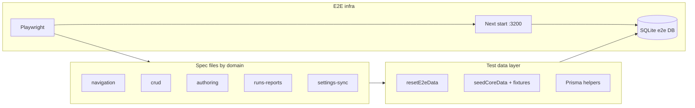

# Enhance AppraiseJS E2E Test Suite

## Current state

The root suite lives in `[e2e/](e2e/)` and runs via `[playwright.config.ts](playwright.config.ts)` (`npm run validate:e2e`, wired in `[.github/workflows/ci.yml](.github/workflows/ci.yml)`). Infrastructure is solid:

- Isolated SQLite DB per run (`DATABASE_URL`), migrations via `[e2e/apply-migrations.mjs](e2e/apply-migrations.mjs)`, app boot via `[e2e/start-server.mjs](e2e/start-server.mjs)`
- Deterministic reset/seed in `[e2e/helpers/test-data.ts](e2e/helpers/test-data.ts)` (`resetE2eData`, `seedCoreData`, rich report/run graph)
- Thin UI helpers in `[e2e/helpers/ui.ts](e2e/helpers/ui.ts)` (`createModule`, `createEnvironment`, `createTag`, `saveForm`)

`[e2e/appraise-smoke.spec.ts](e2e/appraise-smoke.spec.ts)` has **6 tests** covering:

| Area                | Covered today                                                   | Gap                                                                    |
| ------------------- | --------------------------------------------------------------- | ---------------------------------------------------------------------- |
| Dashboard / nav     | Partial (dashboard, modules, test-cases, test-suites, settings) | Reports, test-runs list, template pages, metric drill-downs            |
| CRUD                | Module create/edit/delete; env/tag create; locator lists        | Locator groups, locators, suites, cases, templates — no full CRUD      |
| Test authoring      | Modify seeded case + scenario preview                           | Full create flow, steps, flow blocks, inline dialogs                   |
| Feature files       | Generator unit-style test (not UI)                              | Optional UI trigger after suite save                                   |
| Test runs / reports | Seeded completed run + report link                              | List filters, create form (no submit), cancel/delete, logs API surface |
| Settings sync       | Sync All only                                                   | Per-script sync buttons, pending badges                                |

**Scope constraint (confirmed):** UI + seeded data only — **no live Cucumber/Playwright test-run execution** in E2E. Avoid `createTestRunAction` submit paths that spawn `cucumber-js` (`[src/lib/executor/local-executor-adapter.ts](src/lib/executor/local-executor-adapter.ts)`).

---

## Target architecture

### 1. Split specs by domain (keep smoke as gate)

Replace the monolithic smoke file with focused specs under `e2e/`:

| File                       | Purpose                                                                                                                                                  |
| -------------------------- | -------------------------------------------------------------------------------------------------------------------------------------------------------- |
| `appraise-smoke.spec.ts`   | Thin regression gate (~3–4 tests): app boots, dashboard, one CRUD path, one seeded run/report                                                            |
| `navigation.spec.ts`       | Every primary route from `[src/components/navigation/nav-command-helpers.ts](src/components/navigation/nav-command-helpers.ts)` renders expected heading |
| `crud-*.spec.ts`           | One file per entity group (or `crud.spec.ts` with `test.describe` blocks)                                                                                |
| `authoring.spec.ts`        | Test case / template / flow-builder flows                                                                                                                |
| `runs-and-reports.spec.ts` | Lists, filters, detail pages, report sub-routes                                                                                                          |
| `settings-sync.spec.ts`    | Individual sync scripts from `[src/lib/sync/sync-registry.ts](src/lib/sync/sync-registry.ts)`                                                            |

Use Playwright `test.describe` + `test.beforeEach(reset + seed)` consistently (same as today).

### 2. Expand helpers (page workflows, not selectors in specs)

Extend `[e2e/helpers/ui.ts](e2e/helpers/ui.ts)` and add:

- `**e2e/helpers/navigation.ts**` — `gotoAndExpectHeading(path, heading)`, nav command palette smoke (optional)
- `**e2e/helpers/table.ts**` — filter by placeholder, open row menu, confirm delete dialog
- `**e2e/helpers/forms.ts**` — entity-specific create/edit helpers mirroring existing `createModule` pattern

Keep selectors role/label-first (already aligned with app a11y).

### 3. Fixture factories in `test-data.ts`

Extend `[e2e/helpers/test-data.ts](e2e/helpers/test-data.ts)` with composable seed functions:

- `seedTemplateCatalog()` — template step group, template step (with params), template test case
- `seedSecondModuleSuite()` — second module/suite/case for assignment tests
- `seedTestRunVariants()` — `PENDING`, `FAILED`, `RUNNING` (if UI supports static display) + matching `testRunLog` / `report` rows for filters and dashboard metrics
- `seedDashboardAttentionMetrics()` — non-zero `dashboardMetrics` + `testCaseMetrics` so `[src/app/page.tsx](src/app/page.tsx)` “Attention Needed” drawer links resolve

Export stable `seededIds` for deep-link tests (pattern already used for `testRun`, `testCase`).

### 4. Playwright projects / tags (optional, low cost)

In `[playwright.config.ts](playwright.config.ts)`:

- `@smoke` — files or tests for PR fast path (future: `validate:e2e:smoke`)
- `@crud`, `@authoring`, `@sync` — grep in CI or local runs

Default CI keeps running full `validate:e2e`; smoke tag is for local iteration.

---

## Coverage map (what to add)

### Navigation and dashboard

- Visit all **41** `(base)` routes under `[src/app/(base)/](src/app/(base)`/) plus `[src/app/page.tsx](src/app/page.tsx)`: assert page heading / empty-state CTA (tables may be empty where seed is minimal).
- Dashboard: assert metric cards; click “Attention Needed” items and assert target URLs (`/test-runs?filter=recentFailed`, `[reports/test-cases](src/app/(base)`/reports/test-cases/page.tsx), etc.) per `[src/app/(dashboard-components)/app-drawer.tsx](src/app/(dashboard-components)`/app-drawer.tsx).

### CRUD — configuration entities

For each entity, follow the **module pattern** already in smoke: create → list visible → modify → save → delete (where delete exists in data table).

| Entity               | Routes                    | Notes                                                             |
| -------------------- | ------------------------- | ----------------------------------------------------------------- |
| Modules              | `/modules/`*              | Done partially — keep as reference                                |
| Environments         | `/environments/*`         | Add edit + delete                                                 |
| Tags                 | `/tags/*`                 | Add edit + delete; FILTER vs other tag types if form exposes them |
| Locator groups       | `/locator-groups/*`       | Requires `moduleId` from seeded module                            |
| Locators             | `/locators/*`             | Link to seeded group; assert list after create                    |
| Template step groups | `/template-step-groups/*` | New                                                               |
| Template steps       | `/template-steps/*`       | Signature + parameter fields                                      |
| Template test cases  | `/template-test-cases/*`  | Steps + linkage to template steps                                 |

### CRUD — test hierarchy

| Entity                  | Routes                             | Notes                                                                                                                                                                    |
| ----------------------- | ---------------------------------- | ------------------------------------------------------------------------------------------------------------------------------------------------------------------------ |
| Test suites             | `/test-suites/*`                   | Create suite, assign seeded test case, edit name/description, delete                                                                                                     |
| Test cases              | `/test-cases/*`                    | **Full create**: title, add step from template catalog, save; modify steps; delete                                                                                       |
| Test case from template | `/test-cases/create-from-template` | Select template → generate flow → land on modify with prefilled title/steps (`[create-from-template/page.tsx](src/app/(base)`/test-cases/create-from-template/page.tsx)) |

### Authoring and flow builder

- **Scenario preview** — extend current test to cover step add/remove if UI allows without flaky canvas coords.
- **Flow diagram** (`[test-case-flow.tsx](src/app/(base)`/test-cases/test-case-flow.tsx)): smoke-level assertion that flow panel mounts on modify page (avoid deep React Flow drag in v1).
- **Inline dialogs**: open “create tag” / “create test suite” from test case form (`[inline-tag-creation-dialog.tsx](src/app/(base)`/test-cases/inline-tag-creation-dialog.tsx), `[inline-test-suite-creation-dialog.tsx](src/app/(base)`/test-cases/inline-test-suite-creation-dialog.tsx)) — create child record and assert it appears in selector.

### Test runs and reports (seeded only)

- **List** `[/test-runs](src/app/(base)`/test-runs/page.tsx): seeded run visible; `?filter=recentFailed` shows failed seed when `seedTestRunVariants()` includes failed recent run.
- **Detail** `[/test-runs/[id]](src/app/(base)`/test-runs/[id]/page.tsx): extend existing test — status badge, test case table row, link to logs (assert log text from seed, no live polling stress).
- **Create form** `[/test-runs/create](src/app/(base)`/test-runs/create/page.tsx): load suites/env/tags, fill name, select suite/tag — **stop before submit** OR assert validation errors on empty submit (avoids spawning Cucumber).
- **Reports** `[/reports](src/app/(base)`/reports/page.tsx), `[/reports/[id]](src/app/(base)`/reports/[id]/page.tsx), `[/reports/test-cases](src/app/(base)`/reports/test-cases/page.tsx), `[/reports/test-suites](src/app/(base)`/reports/test-suites/page.tsx): list + filter query params with seeded metrics rows.
- **Cancel/delete run** (if UI exposes on seeded `PENDING` run): assert status transition in DB via Prisma helper, not process execution.

### Settings / sync

From `[settings-sync-panel.tsx](src/app/(base)`/settings/settings-sync-panel.tsx) and registry (9 scripts + Sync All):

- One test: click each `aria-label` sync button; expect success toast within timeout (same pattern as Sync All).
- Assert pending count badges decrease or zero after sync (when automation folder state allows — may need minimal files under `automation/` in seed or repo fixtures).
- Keep **Sync All** in smoke; move detailed per-script coverage to `settings-sync.spec.ts`.

### Feature generation (keep hybrid)

- Retain programmatic `[generateSeededFeature()](e2e/helpers/test-data.ts)` assertion (fast, stable).
- Add **UI-adjacent** test: after creating/editing a test suite in UI, optionally read filesystem via helper (if suite save triggers generation) — only if deterministic in e2e DB; otherwise document as unit/integration concern.

### Explicitly out of scope (document in `e2e/README.md`)

- Live `cucumber-js` execution and report JSON ingestion during E2E
- Locator picker companion / external browser extension
- Bidirectional feature sync CLI (`[src/lib/bidirectional-sync.ts](src/lib/bidirectional-sync.ts)`) — covered by unit/scripts tests unless exposed in Settings UI later

---

## Implementation phases

### Phase 1 — Foundation (1–2 PRs)

- Refactor helpers (`navigation`, `table`, `forms`)
- Add `seedTemplateCatalog`, `seedTestRunVariants`, `seedDashboardAttentionMetrics`
- Add `navigation.spec.ts` (full route matrix)
- Trim smoke file to true smoke; ensure CI still green

### Phase 2 — CRUD coverage (2–3 PRs)

- `crud-configuration.spec.ts` — environments, tags, locator groups, locators, templates
- `crud-tests.spec.ts` — suites, cases (full create/edit/delete)
- Mirror changes to `[templates/starter/e2e/](templates/starter/e2e/)` and run `npm run sync-template` + `npm --prefix packages/create-appraisejs run sync-templates` when editing shared e2e assets

### Phase 3 — Authoring and runs/reports (1–2 PRs)

- `authoring.spec.ts` — template-from-case, inline dialogs, flow panel mount
- `runs-and-reports.spec.ts` — lists, filters, create form (no execution submit), extended detail/report pages

### Phase 4 — Sync and polish (1 PR)

- `settings-sync.spec.ts` — per-script sync
- `e2e/README.md` — how to run, seed model, scope boundaries, debugging (`trace`, `video`)
- Optional: `validate:e2e:smoke` npm script for local dev

---

## Quality and maintenance

- **Stability**: prefer `getByRole` / `getByLabel`; avoid `waitForTimeout`; reuse `saveForm`; use `toHaveURL` after saves (existing pattern).
- **Parallelism**: keep `workers: 1` and `fullyParallel: false` until DB isolation per worker is proven (current design uses single shared DB per run).
- **Timeouts**: sync tests may need 60–120s (already used for Sync All); set per-test timeout only where needed.
- **Verification before merge**: `npm run validate:e2e` locally and in CI; no change to live execution stack.
- **Unit tests remain** the home for executor, bidirectional sync, and report parsing (`[src/lib/test-run/report-parser.test.ts](src/lib/test-run/report-parser.test.ts)`, etc.) — E2E complements, does not duplicate.

---

## Success criteria

- Every nav item in `[nav-command-helpers.ts](src/components/navigation/nav-command-helpers.ts)` has at least one E2E assertion.
- Each major CRUD surface has create + edit + delete (or documented exception).
- Test case authoring covers create, modify, preview, and template-based create.
- Test runs/reports/dashboard attention flows work off **seeded** multi-status data without starting Cucumber.
- Settings: Sync All + each registry script exercised once.
- Smoke suite stays under ~5 minutes in CI; full suite target < 15 minutes on ubuntu-latest (adjust if sync tests require it).

