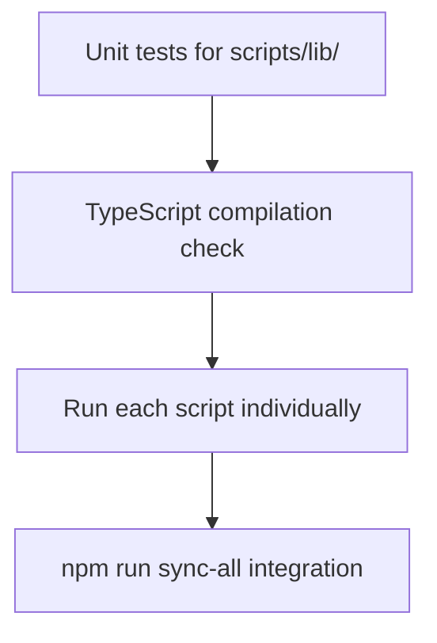

# Refactor `scripts/` Directory

## Current State

15 TypeScript files, 5,485 total lines. All are CLI scripts (no exports). The sync scripts follow an identical pattern: scan filesystem, diff against DB, create/update/delete, print summary. Significant duplication exists across files, and two files exceed the 500-line threshold.

---

## Phase 1: Extract Shared Utilities into `scripts/lib/`

The sync scripts duplicate the same helpers verbatim. Extract them into a shared `scripts/lib/` module.

### 1a. `scripts/lib/tag-parsing.ts` -- shared `splitTagLine`

`splitTagLine` is copy-pasted identically in three files:

- [sync-tags.ts](scripts/sync-tags.ts) (line 38)
- [sync-test-suites.ts](scripts/sync-test-suites.ts) (line 51)
- [sync-test-cases.ts](scripts/sync-test-cases.ts) (line 77)

Extract once, import in all three.

### 1b. `scripts/lib/jsdoc-parser.ts` -- shared `parseGroupJSDoc`

`parseGroupJSDoc` is a near-identical ~90-line function duplicated in:

- [sync-template-steps.ts](scripts/sync-template-steps.ts) (line 101)
- [sync-template-step-groups.ts](scripts/sync-template-step-groups.ts) (line 49)

Extract once. Both files import from the shared location.

### 1c. `scripts/lib/filename-utils.ts` -- shared filename helpers

These are duplicated across multiple scripts:

- `extractTestSuiteNameFromFilename`: in [sync-test-suites.ts](scripts/sync-test-suites.ts) (line 42) and [sync-test-cases.ts](scripts/sync-test-cases.ts) (line 68)
- `extractLocatorGroupName`: in [sync-locators.ts](scripts/sync-locators.ts) (line 61) and [sync-locator-groups.ts](scripts/sync-locator-groups.ts) (line 111)
- `extractModulePathFromLocatorFile`: in [sync-locators.ts](scripts/sync-locators.ts) (line 53) and [sync-locator-groups.ts](scripts/sync-locator-groups.ts) (line 103) and [sync-modules.ts](scripts/sync-modules.ts) (line 89)

### 1d. `scripts/lib/sync-summary.ts` -- generic summary printer

Every sync script has its own `generateSummary` function with nearly identical structure. Extract a generic helper that takes a label, counts object, and detail lists, then prints the standardized `Sync Summary:` block that `sync-all.ts` parses.

### 1e. `scripts/lib/sync-script-runner.ts` -- shared `main` boilerplate

Every sync script repeats the same pattern:

```typescript
async function main() {
  try {
    // ...script logic...
    if (result.errors.length === 0) {
      console.log('\n✅ Sync completed successfully!')
    } else {
      console.log('\n⚠️  Sync completed with errors...')
      process.exit(1)
    }
  } catch (error) {
    console.error('\n❌ Error during sync:', error)
    process.exit(1)
  } finally {
    await prisma.$disconnect()
  }
}
main()
```

Extract a `runSyncScript(fn)` wrapper that handles try/catch/finally/disconnect/exit. Each script becomes:

```typescript
runSyncScript(async () => {
  /* script-specific logic */
})
```

---

## Phase 2: Fix Critical Issues in `sync-test-cases.ts`

### 2a. Fix N+1 template step query (performance)

`matchGherkinStepToTemplateStep` (line 238) calls `prisma.templateStep.findMany()` on **every Gherkin step**, loading all template steps from the DB each time. This is O(steps x templates).

Fix: load all template steps **once** at the start of `syncTestCasesToDatabase`, pass them as a parameter to `matchGherkinStepToTemplateStep` (rename to a pure function like `findMatchingTemplateStep`).

### 2b. Extract duplicated cascade-delete transaction

Lines 700-742 and 771-834 in [sync-test-cases.ts](scripts/sync-test-cases.ts) contain two nearly identical `$transaction` blocks that cascade-delete a test case and all its dependents. Extract into a single `deleteTestCaseWithCascade(tx, testCaseId, identifierTagId?)` function.

### 2c. Break up `syncTestCasesToDatabase` (190 lines)

This function (line 489) handles:

1. Module resolution
2. Test suite lookup
3. Tag resolution
4. Test case create vs update
5. Step sync
6. Orphan deletion

Split into:

- `upsertTestCase(testCase, suitesByModuleId, result)` -- handles a single test case
- `deleteOrphanedTestCases(fsTestCaseTags, result)` -- handles the orphan sweep

---

## Phase 3: Split Large Files

### 3a. `sync-test-cases.ts` (961 lines)

Extract step-matching logic into `scripts/lib/step-matcher.ts`:

- `signatureToRegex`
- `extractParametersFromGherkinStep`
- `findMatchingTemplateStep` (refactored from `matchGherkinStepToTemplateStep`)
- `determineStepTypeAndIcon`
- `sameResolvedParameters`
- Related interfaces (`ParameterMatch`, `TemplateStepMatch`)

This moves ~120 lines of pure logic out, leaving `sync-test-cases.ts` focused on the sync workflow.

### 3b. `sync-template-steps.ts` (844 lines)

Extract AST parsing into `scripts/lib/step-file-parser.ts`:

- `parseStepJSDoc`
- `mapTypeToParameterType`
- `extractFunctionDefinition`
- `parseStepFile` (the Babel AST traversal)
- Related interfaces (`StepJSDoc`, `StepParameter`, `ParsedStep`, `StepData`)

This moves ~230 lines of parsing logic out, leaving `sync-template-steps.ts` focused on sync.

---

## Phase 4: Targeted Fixes

### 4a. Fix misleading metric in `sync-tags.ts`

Line 165: when a tag exists but has the wrong type, the code increments `tagsCreated` and pushes to `createdTags`. This should increment a new `tagsUpdated` counter and push to an `updatedTags` list instead.

### 4b. Remove unused parameters

- [sync-locators.ts](scripts/sync-locators.ts) line 99: `_modulePath` parameter in `findOrCreateLocatorGroup` -- remove it
- [sync-template-steps.ts](scripts/sync-template-steps.ts) line 329: `keyword` parameter in `extractFunctionDefinition` -- remove it

### 4c. Fix stale usage comments

- [sync-template-steps.ts](scripts/sync-template-steps.ts) line 9: says `template-step-sync.ts`, should say `sync-template-steps.ts`
- [sync-template-step-groups.ts](scripts/sync-template-step-groups.ts) line 9: says `template-step-group-sync.ts`, should say `sync-template-step-groups.ts`

### 4d. Wrap `sync-appraise-base-template.ts` in a `main` function

Currently runs all logic at the top level (lines 115-217). Wrap in an `async function main()` for consistency and to isolate side effects.

### 4e. Fix broken emoji in `setup-env.ts`

Lines 14-19 show `?` characters where emoji should be. Replace with proper emoji or plain text.

### 4f. Remove dead fields in `sync-template-step-groups.ts`

`SyncResult` interface includes `groupsSkippedNoJSDoc` and `skippedNoJSDocFiles` fields that are declared but never incremented. Remove them.

---

## Phase 5: Testing and Validation

No tests currently exist for any script in `scripts/`. The project is moving to **vitest** for unit testing (already used in `packages/create-appraisejs`). We adopt vitest here as well.

### Testing Strategy Overview

Validation happens in four layers, applied incrementally after each phase:



### 5a. Unit Tests for Extracted Pure Functions

Create test files alongside the new `scripts/lib/` modules using **vitest** (`describe`, `it`, `expect`). These cover the extracted pure functions that have no DB dependency.

A `vitest.config.ts` will be added at the repo root (or a `scripts/vitest.config.ts` scoped to scripts) so `vitest run` picks up the new tests. Add `vitest` as a root devDependency if not already present.

`**scripts/lib/tag-parsing.test.ts`

- `splitTagLine` with single tag, multiple tags, mixed whitespace, empty string, no `@` prefix

`**scripts/lib/jsdoc-parser.test.ts`

- `parseGroupJSDoc` with valid ACTION JSDoc, valid VALIDATION JSDoc, missing `@type`, missing `@name`, empty content, imports before JSDoc, malformed close

`**scripts/lib/filename-utils.test.ts`

- `extractTestSuiteNameFromFilename` with `.feature` extension, nested path, backslash paths
- `extractLocatorGroupName` with `.json` extension, nested path

`**scripts/lib/step-matcher.test.ts`

- `signatureToRegex` with `{string}`, `{int}`, `{boolean}`, `{number}` placeholders, mixed placeholders, no placeholders
- `extractParametersFromGherkinStep` with matching/non-matching text, parameter count mismatch
- `determineStepTypeAndIcon` for each keyword (Given, When, Then, And, But, unknown)
- `sameResolvedParameters` with equal, different length, different values

`**scripts/lib/step-file-parser.test.ts`

- `parseStepJSDoc` with valid step JSDoc, missing `@icon`, missing `@name`
- `mapTypeToParameterType` for each supported type (SelectorName, string, number, int, boolean, Date) and one unsupported type
- `parseStepFile` with a minimal valid `.step.ts` content string containing one When step

Run with: `npx vitest run` (using root vitest config that includes `scripts/lib/`)

### 5b. TypeScript Compilation Check

After each phase, run `npx tsc --noEmit` scoped to the scripts directory to catch:

- Broken imports after extraction
- Type mismatches from function signature changes
- Missing exports from new `scripts/lib/` modules

This catches issues like forgetting to export a function or importing from the wrong path.

### 5c. Run Each Sync Script Individually

After all refactoring is complete, run every script individually against the existing dev database and verify:

- Each script exits with code 0 (no errors)
- The stdout contains the expected `Sync Summary:` block
- No unhandled exceptions or stack traces in stderr

Scripts to run in order (matching `sync-all` dependency order):

1. `npx tsx scripts/sync-modules.ts`
2. `npx tsx scripts/sync-environments.ts`
3. `npx tsx scripts/sync-locator-groups.ts`
4. `npx tsx scripts/sync-locators.ts`
5. `npx tsx scripts/sync-tags.ts`
6. `npx tsx scripts/sync-template-step-groups.ts`
7. `npx tsx scripts/sync-template-steps.ts`
8. `npx tsx scripts/sync-test-suites.ts`
9. `npx tsx scripts/sync-test-cases.ts`

Also verify the non-sync scripts: 10. `npx tsx scripts/setup-env.ts` 11. `npx tsx scripts/install-playwright.ts` (dry check -- already installed) 12. `npx tsx scripts/regenerate-features.ts --dry-run`

Skip `protect-seeded-files.ts` (modifies .gitignore) and `sync-appraise-base-template.ts` (destructive template rebuild) during automated validation -- verify those manually.

### 5d. End-to-End Integration: `npm run sync-all`

The final gate. Run `npm run sync-all` which orchestrates all sync scripts in dependency order via child processes. This validates:

- All scripts are importable and executable as subprocesses
- The stdout `Sync Summary:` format is preserved (sync-all parses it)
- The aggregated summary displays correctly
- Exit code is 0 with no failed scripts

**Before/after comparison**: capture `npm run sync-all` output **before** refactoring begins (snapshot), then compare the summary counters after refactoring. The scanned/existing/created/updated/deleted counts should be identical (since no behavior changed). Only formatting/wording changes are acceptable.

### 5e. Validation Checkpoints Per Phase

| Phase                         | Validation                                                    |
| ----------------------------- | ------------------------------------------------------------- |
| Phase 1 (extract shared)      | 5b (tsc), 5a (unit tests for new modules), 5d (sync-all)      |
| Phase 2 (fix sync-test-cases) | 5b (tsc), individual run of sync-test-cases                   |
| Phase 3 (split large files)   | 5b (tsc), 5a (unit tests for new modules), individual runs    |
| Phase 4 (targeted fixes)      | 5b (tsc), individual run of affected scripts                  |
| Final                         | Full 5c (all scripts) + 5d (sync-all before/after comparison) |

---

## What This Plan Does NOT Do (by design)

- Does not change any sync behavior or database operations
- Does not introduce new abstractions beyond the shared `scripts/lib/` module
- Does not change the `sync-all.ts` orchestration or stdout parsing contract
- Does not refactor code outside the `scripts/` directory
- Does not change the dependency order or execution model of sync scripts
