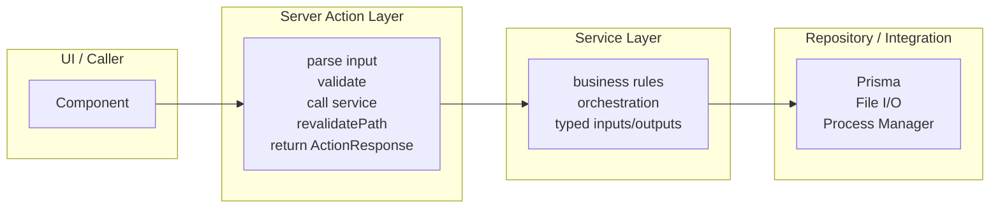

# Server Action Service-Layer Refactor

## Current State Assessment

**17 Server Action files** under `[src/actions/](src/actions/)` with ~100 exported functions. **No service layer, no repository layer.** Prisma is called directly. `[ActionResponse](src/types/form/actionHandler.ts)` is loosely typed. Vitest exists but only covers `scripts/lib/**/*.test.ts` -- no tests exist for any action or service logic.

---

## Identified Structural Problems

### Worst Offenders (by severity)

1. `**[test-run-actions.ts](src/actions/test-run/test-run-actions.ts)` (1277 lines) -- `createTestRunAction` alone is ~500 lines containing: tag expression building, suite normalization, DB record creation, process spawning, event listener wiring, log collection, status management, metrics updates, report storage. Fire-and-forget `.then()/.catch()` chains contain duplicated cancel-check logic (3 occurrences). This is the highest-priority extraction target.
2. `**[report-actions.ts](src/actions/reports/report-actions.ts)` (617 lines) -- `storeReportFromFile` is 230 lines of nested loops creating features/scenarios/steps/hooks/tags one-by-one, mixed with test-case matching logic and metrics updates.
3. `**[locator-actions.ts](src/actions/locator/locator-actions.ts)` (490 lines) -- `syncLocatorsFromFilesAction` (~165 lines) mixes file I/O, business-level conflict detection, and DB writes.
4. `**[dashboard-actions.ts](src/actions/dashboard/dashboard-actions.ts)` (241 lines) -- `getTestSuiteExecutionDataAction` has ~130 lines of in-action data aggregation and percentage calculation.
5. `**[test-case-actions.ts](src/actions/test-case/test-case-actions.ts)`** and `**[test-suite-actions.ts](src/actions/test-suite/test-suite-actions.ts)\*\*` -- CRUD with significant orchestration (cascading deletes, identifier tag management, feature regeneration).

### Cross-Cutting Smells

- **Inconsistent error handling**: Some actions use `error instanceof Error ? error.message : 'Unknown error'`, others use raw template `${error}`.
- **Weak `ActionResponse`**: `data` is typed `unknown`, `status` is `number` (not a union).
- **Inconsistent function style**: Mix of `export async function` and `export const = async`.
- **Missing 404 checks**: Many `getById` actions return `{ status: 200, data: null }` instead of 404.
- **Dead code**: `[review-actions.ts](src/actions/review/review-actions.ts)` has two near-identical functions (`getReviewsByReviewerAction`, `getAllReviewsByCreatorAction`).
- **Magic number `7`**: "7 days ago" threshold used in 3 files without a shared constant.
- **Inconsistent return shapes**: Some return `data: count`, others `data: 'string'`, others `data: object`.

---

## Target Architecture

### New Directory Structure

- `src/services/{domain}/{domain}-service.ts` -- business logic
- `src/services/{domain}/__tests__/{domain}-service.test.ts` -- unit tests
- `src/services/shared/` -- shared constants (e.g. `RECENT_PERIOD_DAYS`), error types, result types

### Layer Rules Applied

- **Server Actions**: Parse input with Zod, call one service function, handle `revalidatePath`/`redirect`, wrap in `ActionResponse`.
- **Services**: Pure business logic. Accept typed inputs, return typed results or throw domain errors. No `revalidatePath`, no `ActionResponse`. Dependencies (prisma, processManager) passed or imported directly (not via DI framework).
- **Repository**: Prisma already serves as the repository. Only extract dedicated repository functions for complex multi-step DB operations (cascading deletes, transaction-heavy operations). Simple `findMany`/`findUnique` stay in service functions.

### Improved `ActionResponse`

Tighten the existing type to a discriminated union with `success: boolean` while keeping backward compatibility through the existing `status` field. Add generic `data` typing per-action where beneficial.

### Error Handling Convention

Introduce a `ServiceError` class that services throw for domain-level failures (not found, validation, conflict). Actions catch `ServiceError` and map to appropriate `ActionResponse` status codes. Unknown errors map to 500.

---

## Batch Plan

### Batch 1: Foundation + Highest-Impact Extractions

**Goal**: Establish the pattern, refactor the two worst files, prove the approach with tests.

1. **Shared infrastructure**

- Create `[src/services/shared/errors.ts](src/services/shared/errors.ts)` -- `ServiceError` class with `code` field (`NOT_FOUND`, `VALIDATION`, `CONFLICT`, `INTERNAL`).
- Create `[src/services/shared/constants.ts](src/services/shared/constants.ts)` -- `RECENT_PERIOD_DAYS = 7`.
- Update `[vitest.config.ts](vitest.config.ts)` to include `src/services/**/*.test.ts` alongside the existing `scripts/lib/**/*.test.ts` pattern.

1. **Extract `test-run-service.ts`** from `[test-run-actions.ts](src/actions/test-run/test-run-actions.ts)`

- Extract `buildTagExpression()` (tag expression construction from tags or test suites).
- Extract `resolveTestRunTestCases()` (suite normalization + test case resolution).
- Extract `createAndExecuteTestRun()` (DB record creation, process spawning, log collection, status management -- the core of `createTestRunAction`).
- Extract `cancelTestRun()` (process kill + status transitions).
- Extract `deleteTestRuns()` (artifact cleanup, cascading deletes, metrics recalculation).
- Extract `updateTestCaseScenarioStatus()` (status mapping, matching, DB update, metrics).
- Keep thin `createTestRunAction`, `cancelTestRunAction`, `deleteTestRunAction` wrappers that call service + `revalidatePath`.
- Deduplicate the 3 occurrences of cancel-status-check logic into one helper.

1. **Extract `report-service.ts`** from `[report-actions.ts](src/actions/reports/report-actions.ts)`

- Extract `storeReport()` (parse file, create DB records, match test cases, update metrics).
- Extract `aggregateMetricsForReport()` (suite execution tracking, metrics update).
- Keep query-only actions (`getAllReportsAction`, `getReportByIdAction`, `getReportByTestRunIdAction`) as thin actions with direct prisma calls (they are already thin).
- Move in-action filtering for `getAllTestCaseMetricsAction` and `getAllTestSuiteMetricsAction` to service functions.

1. **Unit tests for Batch 1 services**

- `src/services/test-run/__tests__/test-run-service.test.ts`
- `src/services/report/__tests__/report-service.test.ts`
- Coverage: happy path, validation failures, not-found cases, cancel-state edge cases, metrics-failure resilience.

### Batch 2: CRUD-Heavy Domains

1. **Extract `test-case-service.ts`** from `[test-case-actions.ts](src/actions/test-case/test-case-actions.ts)`

- Extract cascading delete logic, identifier tag management, step create/replace orchestration.

1. **Extract `test-suite-service.ts`** from `[test-suite-actions.ts](src/actions/test-suite/test-suite-actions.ts)`

- Extract identifier tag creation, feature regeneration coordination, name/module change detection.

1. **Extract `locator-service.ts`** from `[locator-actions.ts](src/actions/locator/locator-actions.ts)` and `[locator-picker-actions.ts](src/actions/locator-picker/locator-picker-actions.ts)`

- Extract `syncLocatorsFromFiles()` (file scanning, conflict detection, bidirectional merge).
- Extract `savePickedLocator()` (group resolution, duplicate check, sync orchestration).

1. **Unit tests for Batch 2 services**

### Batch 3: Simple CRUD + Cleanup

1. **Thin refactor for simple CRUD actions** (environments, modules, tags, template steps, reviews, conflict)

- These are already relatively thin. Standardize error handling, null checks, return shapes.
- Remove dead code in `review-actions.ts`.
- Standardize inconsistent function declaration style to `export async function`.

1. **Extract `dashboard-service.ts`** from `[dashboard-actions.ts](src/actions/dashboard/dashboard-actions.ts)`

- Extract `getTestSuiteExecutionData()` (query + aggregation + percentage calculation).

1. **Unit tests for Batch 3 services**

---

## Conventions Established by This Refactor

- **File naming**: `src/services/{domain}/{domain}-service.ts`
- **Test location**: `src/services/{domain}/__tests__/{domain}-service.test.ts`
- **Error signaling**: Service functions throw `ServiceError` for domain failures.
- **Actions catch and map**: `ServiceError` -> `ActionResponse` with appropriate status.
- **Unknown errors**: Caught at action level, logged, returned as `{ status: 500, error: '...' }`.
- **Shared constants**: Magic numbers consolidated in `src/services/shared/constants.ts`.
- **Function style**: All Server Actions use `export async function` (not `const`).
- **All `getById` actions**: Return 404 when entity is null.

---

## What This Refactor Does NOT Change

- No new dependencies or DI frameworks.
- No class hierarchies or base-service patterns.
- No changes to the Prisma schema or API routes.
- No changes to UI components or form schemas.
- No changes to the `automation/` layer or sync scripts.
- Template directories (`templates/default/`, `packages/create-appraisejs/templates/default/`) are out of scope -- they will be synced later via existing `sync-template` mechanisms.

---

## Verification (follow-up)

Unit tests under `src/services/**/*.test.ts` cover dashboard aggregation, environment CRUD guards, locator-group name/id checks, template *ByIdOrThrow* not-found paths, `detectAndCreateConflicts` (with `session-manager` mocked), `deleteTestCasesByIds` (transaction + projection mocks), `getAllTestCaseMetricsForFilter` / `getAllTestSuiteMetricsForFilter`, shared `ServiceError` helpers, and other batch-1/2 services. Tests are co-located as `*-service.test.ts` (not under `__tests__/`) for consistency with the repo.

`ActionResponse` exposes a named `ActionResponseData` alias and documents success/error usage; call sites still use a single structural type so `error` remains optional on all responses. `RECENT_PERIOD_DAYS` is imported from `src/services/shared/constants.ts` in metrics code paths that participate in the report/dashboard window.

Run `npx tsc --noEmit` and `npx vitest run` locally after install; if Vitest fails on missing `@rolldown/binding-win32-x64-msvc`, run `npm install` (or install that optional package) so Rolldown’s native binding is present.
