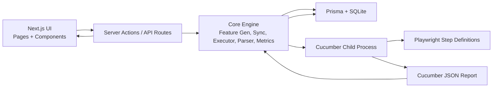
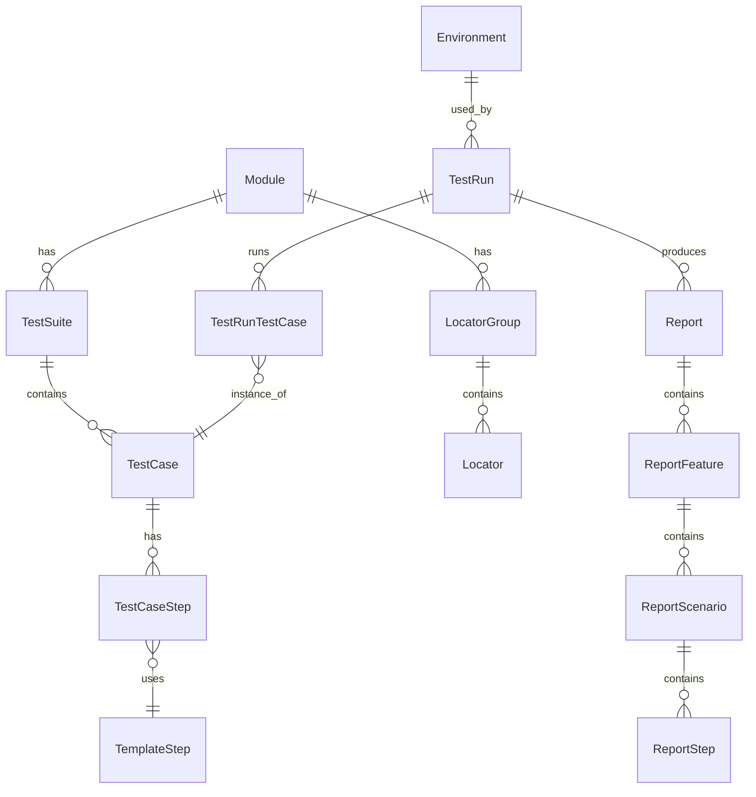
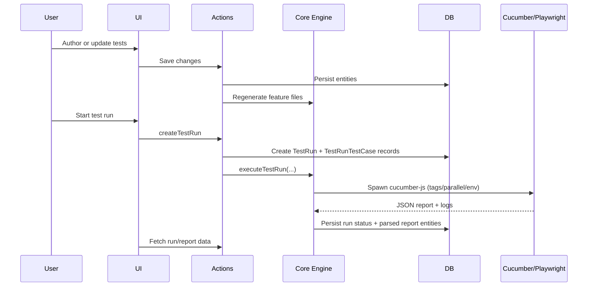

# AppraiseJS

---

#### Test management, re-engineered

Appraisejs is a visual test development, management and execution platform built for the modern day Test Engineers. It is a Nextjs application that runs locally and helps users develop and orchestrate test scenarios without the hassle of learning coding or a new framework. 

---

## Quick Start

### Prerequisites

- Node.js 18+
- npm

### Local setup

```bash
npm run setup
npm run sync-all
npm run dev
```

Open `http://localhost:3000` after the server starts.

### Environment configuration

- Copy `.env.example` to `.env`, or let `npm run setup` create it.
- Default local database: `DATABASE_URL="file:./prisma/dev.db"`.

### Common scripts

- `npm run dev` - Start the Next.js development server
- `npm run build` - Build production assets
- `npm run lint` - Run lint checks
- `npm run test` - Run Cucumber test suite

---

## Community

- Contribution guide: `CONTRIBUTING.md`
- Code of conduct: `CODE_OF_CONDUCT.md`
- Security policy: `SECURITY.md`
- Support: `SUPPORT.md`

---

## Why Appraisejs?

#### Test management, orchestration and execution all in one place without any coding.

- **Test management, orchestration, and execution — all in one place. Without writing code.**
No glue code. No tool-hopping. No fragile integrations. Everything you need to get started is built in.
- **No-code, but not low-power.**  
Build real, production-grade automation flows visually—without writing a single line of code.
- **User-agnostic by design.**  
QA engineers, manual testers, developers, and even product teams can use AppraiseJS with minimal onboarding and shared understanding.
- **Low configuration, fast setup.**  
One command. Sensible defaults. You’re productive in minutes, not days.
- **Automation without vendor lock-in.**  
AppraiseJS generates real, portable test artifacts (Gherkin, Playwright, Cucumber). You own your tests—always.
- **Visual-first, logic-driven testing.**  
Complex test logic built through composable blocks, not brittle scripts.
- **Framework-level consistency by default.**  
Tests follow a consistent structure, conventions, and execution model—without manual enforcement.

---

## Architecture Overview

AppraiseJS runs as a single local Next.js app with a clear split of responsibilities:

1. **UI layer**: users design tests and start runs.
2. **Server layer**: server actions and API routes validate requests and coordinate work.
3. **Core engine (`src/lib`)**: generates feature files, runs tests, parses results, and computes metrics.
4. **Data layer**: Prisma + SQLite persist project and run data.
5. **Execution layer**: Cucumber + Playwright execute tests in a child process.

If you are new to the project, use this mental model:

- **Build test data in UI** -> **Generate `.feature` files** -> **Execute with Cucumber/Playwright** -> **Parse report into DB** -> **Display run insights in UI**

---

### At a glance



- **UI (`src/app/(base)`, `src/components`)**
  Captures user intent: create modules, suites, cases, steps, runs, and report views.
- **Server (`src/actions`, `src/app/api/test-runs/[runId]`)**
  Handles writes and exposes run artifacts (logs, traces, downloads).
- **Core (`src/lib`, `src/lib/test-run`)**
  Holds shared orchestration logic:
  - feature generation
  - DB <-> filesystem sync
  - run execution/process management
  - report parsing and metrics
- **Data (`prisma`, SQLite)**
  Stores authored structure, run state, and parsed outputs.
- **Execution (`src/tests`)**
  Uses Cucumber for scenario execution and Playwright for browser automation.

---

### Core entities (what the app stores)



- **Module -> Suite -> Case -> Step** defines the authored test structure.
- **TemplateStep** provides reusable step behavior used by authored steps.
- **LocatorGroup/Locator** model reusable selectors for UI interactions.
- **TestRun/TestRunTestCase** capture execution state per run and per case.
- **Report entities** store parsed Cucumber output for report pages and analytics.

---

### End-to-end execution flow



1. **Authoring**: Users build test scenarios in the visual UI; data is saved via server actions.
2. **Feature generation**: Core logic converts DB state into Gherkin `.feature` files.
3. **Run startup**: A `TestRun` is created with selected environment, tags, and cases.
4. **Execution**: Cucumber runs scenarios; Playwright performs browser actions in step definitions.
5. **Ingestion**: JSON output is parsed and persisted as report entities and per-test results.
6. **Visibility**: UI and API endpoints expose status, logs, traces, and final reports.

---

### Why this architecture works

- **Single app, clear boundaries**: no separate backend service to manage.
- **Portable artifacts**: generated Gherkin and Playwright-based steps stay inspectable.
- **Traceable pipeline**: authored test -> generated feature -> executed run -> persisted report.
- **Extensible core**: execution, parsing, and metrics are centralized in `src/lib`.

---
### Key directories

| Path | Purpose |
|------|--------|
| `src/app/(base)/` | App Router pages: modules, test-suites, test-cases, test-runs, reports, environments, locators, tags, template-steps, template-test-cases, reviews |
| `src/actions/` | Server actions per domain (test-run, test-case, test-suite, report, dashboard, etc.) |
| `src/lib/` | Feature generation, sync, test-run executor, report parser, metrics, transformers |
| `src/lib/test-run/` | Execution (test-run-executor, process-manager), logging, report parsing |
| `src/tests/` | Cucumber config, step definitions, support (hooks, parameter types, utils), locators/mapping |
| `src/app/api/test-runs/[runId]/` | Logs, trace, and download endpoints for a run |
| `prisma/` | Schema and migrations (SQLite) |
| `scripts/` | Sync scripts (e.g. sync-all, sync-test-cases, regenerate-features) |
| `templates/` | Generated or templated step/feature artifacts |

---

### Technology stack

- **Runtime:** Node.js; **Framework:** Next.js 16 (App Router), React 19.
- **Database:** SQLite with **Prisma**.
- **Testing:** **Cucumber** (Gherkin), **Playwright** (browser automation).
- **UI:** Tailwind CSS, Radix UI, Recharts, React Flow (diagrams), TanStack Table/Form.
- **Tooling:** TypeScript, ESLint, Prettier.

