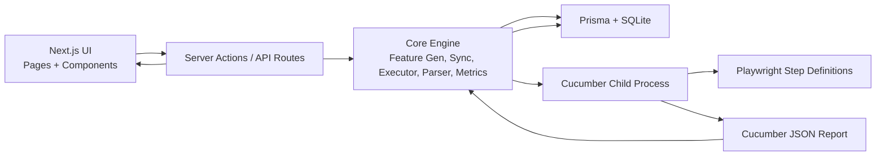
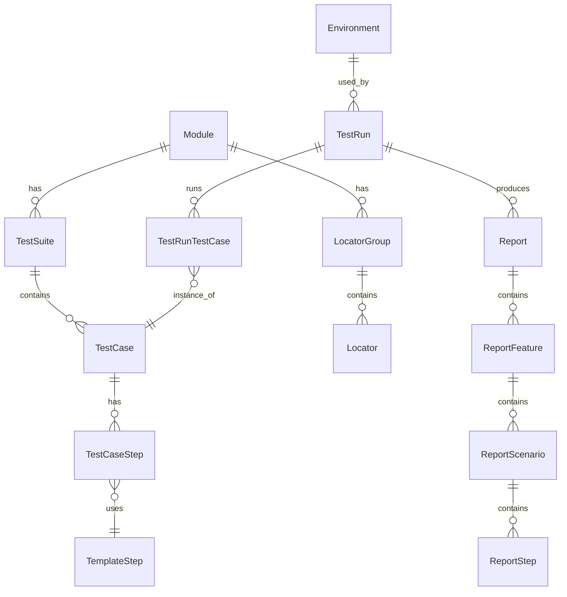
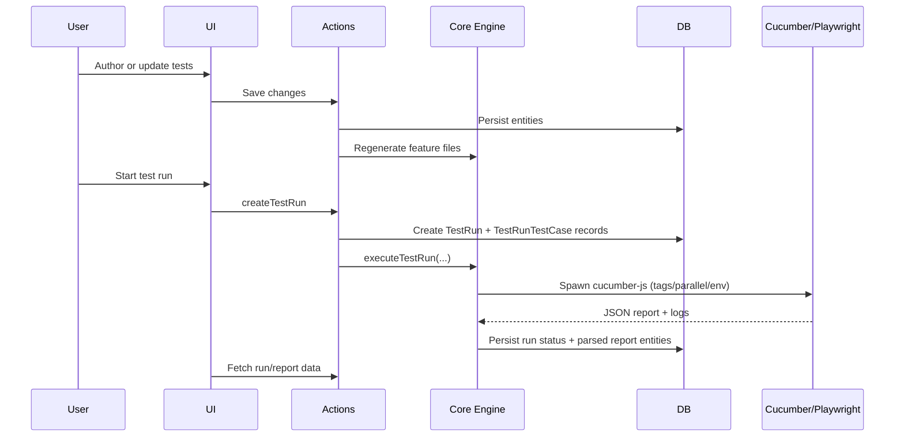

# AppraiseJS

---

#### Test management, re-engineered

AppraiseJS is a visual test development, management and execution platform built for the modern day Test Engineers. It is a Nextjs application that runs locally and helps users develop and orchestrate test scenarios without the hassle of learning coding or a new framework.

---

## Why AppraiseJS?

#### Test management, orchestration, and execution all in one place without any coding.

- **Test management, orchestration, and execution” all in one place. Without writing code.**
  No glue code. No tool-hopping. No fragile integrations. Everything you need to get started is built in.
- **No-code, but not low-power.**  
  Build real, production-grade automation flows visually” without writing a single line of code.
- **User-agnostic by design.**  
  QA engineers, manual testers, developers, and even product teams can use AppraiseJS with minimal onboarding and shared understanding.
- **Low configuration, fast setup.**  
  One command. Sensible defaults. You're productive in minutes, not days.
- **Automation without vendor lock-in.**  
  AppraiseJS generates real, portable test artifacts (Gherkin, Playwright, Cucumber). You own your tests always.
- **Visual-first, logic-driven testing.**  
  Complex test logic built through composable blocks, not brittle scripts.
- **Framework-level consistency by default.**  
  Tests follow a consistent structure, conventions, and execution model without manual enforcement.

---

## Quick Start

This guide is in two parts: **installation** (get the app running) and **authoring and executing tests** (define scenarios, run them, and view reports).

### 1. Installation

#### Prerequisites

- Node.js 18+
- npm

Choose one of the following ways to get started.

#### Option A: Create a new app (recommended)

Scaffold a new AppraiseJS app in a folder of your choice using the official create script:

```bash
npx create-appraisejs
```

Follow the prompts (project name, directory), then go into the new project and start the dev server:

```bash
cd <your-project-name>
npm install
npm run dev
```

Open `http://localhost:3000` after the server starts.

#### Option B: Clone and run from the repo

Clone the repository and run the monorepo setup:

```bash
git clone https://github.com/jamil2018/appraisejs-core.git
cd appraisejs-core
npm run setup
npm run sync-all
npm run dev
```

Open `http://localhost:3000` after the server starts.

#### Environment configuration

- Copy `.env.example` to `.env`, or let `npm run setup` create it (clone method) or use the one created by `create-appraisejs`.
- Default local database: `DATABASE_URL="file:./prisma/dev.db"`.

#### Common scripts

- `npm run dev` - Start the Next.js development server
- `npm run build` - Build production assets
- `npm run lint` - Run lint checks
- `npm run test` - Run Cucumber test suite

### 2. Authoring and executing tests

This section introduces the main concepts in AppraiseJS and then walks you through creating and running your first tests step by step.

#### Core entities: what you work with

Before you start authoring tests, it helps to know the main building blocks. Everything in the app fits into a few concepts:

| Concept           | What it is                                                                                                                                                       | Example                                                   |
| ----------------- | ---------------------------------------------------------------------------------------------------------------------------------------------------------------- | --------------------------------------------------------- |
| **Module**        | A high-level area of your application.                                                                                                                           | "Login", "Checkout", "Dashboard"                          |
| **Test suite**    | A group of test cases, belonging to one module.                                                                                                                  | "Login with valid credentials", "Password reset"          |
| **Test case**     | A single scenario: a sequence of steps that describe one flow.                                                                                                   | "User logs in with email and password"                    |
| **Step**          | One action or assertion in a test case. Each step uses a **template step** and parameters (e.g. which button, what text).                                        | "Click the Login button", "Verify the title is 'Welcome'" |
| **Template step** | A reusable action or assertion. AppraiseJS includes many built-in template steps (click, type, assert text, etc.); you pick one per step and fill in parameters. | "Click on element", "Fill input with value"               |
| **Locator**       | A named reference to an element on the page (e.g. "Login button", "Email field"). Steps refer to locators by name so selectors are defined once and reused.      | "loginButton", "emailInput"                               |
| **Locator group** | A set of locators, often for one page or one module.                                                                                                             | "Login page", "Header"                                    |
| **Environment**   | Where tests run: e.g. base URL (staging, production). You choose an environment when you start a test run.                                                       | "Local", "Staging", "Production"                          |
| **Test run**      | One execution of a set of test cases. You create a run, pick an environment and which tests to run; execution starts automatically.                              | "Smoke run – 15 Jan"                                      |
| **Report**        | The result of a test run: which scenarios and steps passed or failed, duration, and details. One report per run.                                                 | View after a run completes                                |

**How they fit together**

- You organize tests as **Module** → **Test suite** → **Test case** → **Steps**.
- Each step uses a **template step** (e.g. "click") and parameters (e.g. locator name **"loginButton"**). Locators are defined in **locator groups**.
- When you run tests, you create a **test run**, choose an **environment** and which cases to run; the app executes them and produces a **report**.

You do not need to memorize this; the step-by-step guide below follows this order so you can learn by doing.

---

#### Step-by-step guide

Follow these steps in order. After installation, run `npm run sync-all` once so built-in template steps and any starter data are available in the app.

**Step 1: Sync built-in template steps (one-time)**

- In your project folder, run: `npm run sync-all`
- This loads **built-in template steps** (click, type, fill, assert visibility, navigate, etc.) from `src/tests/steps/` into the app. You will use these when authoring test case steps. You can also add your own template steps later via the UI or by adding files and syncing again.

**Step 2: Create an environment**

- In the app, open **Environments** (sidebar or navigation).
- Create an environment (e.g. "Local") and set the **base URL** where your application runs (e.g. `http://localhost:3000`). You will select this environment when you start a test run so the runner knows where to open the browser.

**Step 3: Create a module**

- Open **Modules** and create a module that represents one area of your app (e.g. "Login" or "Home"). Modules are the top level; test suites will belong to a module.

**Step 4: Create locator groups and locators**

- Open **Locator groups** and create a group (e.g. "Login page"). Then open **Locators** and add locators inside that group: give each a **name** (e.g. `loginButton`, `emailInput`) and a **selector** (CSS or XPath). These names are what you will choose in test case steps (e.g. "click on **loginButton**"). You can define locators per page or per module; the app can also sync to/from `src/tests/locators/*.json` and `src/tests/mapping/locator-map.json` if you prefer file-based definitions.

**Step 5: Create a test suite**

- Open **Test suites** and create a new suite (e.g. "Login flow"). Assign it to the module you created. Test suites group related test cases (e.g. by feature or user flow).

**Step 6: Create a test case and add steps**

- Open **Test cases** and create a new test case (e.g. "User logs in with valid credentials"). Attach it to the test suite you created.
- Open the test case to edit it. Add steps one by one:
  - For each step, choose a **template step** (e.g. "Navigate to URL", "Fill input", "Click on element", "Assert text").
  - Fill in the parameters (e.g. URL, locator name like `emailInput`, value like `user@example.com`). The locator names must match those you defined in Step 4.
- You can add steps using the flow/diagram view or the step list, depending on the UI. Save when done. Optionally, you can use **Template test cases** as blueprints and generate test cases from them ("Create from template").

**Step 7: Create a test run and run tests**

- Open **Test runs** and click **Create test run** (or use the "Create Test Run" action in the app).
- Give the run a name (e.g. "First smoke run").
- Select the **environment** you created (e.g. "Local").
- Choose which tests to run: either by **tags** (if you tagged test cases) or by **test cases** (select the suites/cases you want). Confirm and submit.
- The run is created and **execution starts automatically**. You are redirected (or can open) the run detail page.

**Step 8: Monitor the run**

- On the **test run detail** page you see the run status (e.g. RUNNING, COMPLETED) and **live logs** from the browser run. The page updates until the run finishes. You can leave it open to watch progress.

**Step 9: View the report**

- When the run has completed, open **Reports** in the app. You will see a report for that run. Open it to see pass/fail per scenario and per step, duration, and drill-down (features → scenarios → steps). You can also open the same report from the test run detail page via **View Report**.

```mermaid
flowchart LR
  Sync["Step 1: Sync template steps"] --> Env["Step 2: Create environment"]
  Env --> Module["Step 3: Create module"]
  Module --> Locators["Step 4: Locators"]
  Locators --> Suite["Step 5: Create test suite"]
  Suite --> Case["Step 6: Create test case and steps"]
  Case --> Run["Step 7: Create test run"]
  Run --> Monitor["Step 8: Monitor run"]
  Monitor --> Report["Step 9: View report"]
```



## Architecture Overview

AppraiseJS runs as a single local Next.js app with a clear split of responsibilities:

1. **UI layer**: users design tests and start runs.
2. **Server layer**: server actions and API routes validate requests and coordinate work.
3. **Core engine (`src/lib`)**: generates feature files, runs tests, parses results, and computes metrics.
4. **Data layer**: Prisma + SQLite persist project and run data.
5. **Execution layer**: Cucumber + Playwright execute tests in a child process.

If you are new to the project, use this mental model:

- **Build test data in UI** -> **Generate `.feature` files** -> **Execute with Cucumber/Playwright** -> **Parse report into DB** -> **Display run insights in UI**

---

### At a glance



- **UI (`src/app/(base)`, `src/components`)**
  Captures user intent: create modules, suites, cases, steps, runs, and report views.
- **Server (`src/actions`, `src/app/api/test-runs/[runId]`)**
  Handles writes and exposes run artifacts (logs, traces, downloads).
- **Core (`src/lib`, `src/lib/test-run`)**
  Holds shared orchestration logic:
  - feature generation
  - DB <-> filesystem sync
  - run execution/process management
  - report parsing and metrics
- **Data (`prisma`, SQLite)**
  Stores authored structure, run state, and parsed outputs.
- **Execution (`src/tests`)**
  Uses Cucumber for scenario execution and Playwright for browser automation.

---

### Core entities (what the app stores)



- **Module -> Suite -> Case -> Step** defines the authored test structure.
- **TemplateStep** provides reusable step behavior used by authored steps.
- **LocatorGroup/Locator** model reusable selectors for UI interactions.
- **TestRun/TestRunTestCase** capture execution state per run and per case.
- **Report entities** store parsed Cucumber output for report pages and analytics.

---

### End-to-end execution flow



1. **Authoring**: Users build test scenarios in the visual UI; data is saved via server actions.
2. **Feature generation**: Core logic converts DB state into Gherkin `.feature` files.
3. **Run startup**: A `TestRun` is created with selected environment, tags, and cases.
4. **Execution**: Cucumber runs scenarios; Playwright performs browser actions in step definitions.
5. **Ingestion**: JSON output is parsed and persisted as report entities and per-test results.
6. **Visibility**: UI and API endpoints expose status, logs, traces, and final reports.

---

### Why this architecture works

- **Single app, clear boundaries**: no separate backend service to manage.
- **Portable artifacts**: generated Gherkin and Playwright-based steps stay inspectable.
- **Traceable pipeline**: authored test -> generated feature -> executed run -> persisted report.
- **Extensible core**: execution, parsing, and metrics are centralized in `src/lib`.

---

### Key directories

| Path                             | Purpose                                                                                                                                            |
| -------------------------------- | -------------------------------------------------------------------------------------------------------------------------------------------------- |
| `src/app/(base)/`                | App Router pages: modules, test-suites, test-cases, test-runs, reports, environments, locators, tags, template-steps, template-test-cases, reviews |
| `src/actions/`                   | Server actions per domain (test-run, test-case, test-suite, report, dashboard, etc.)                                                               |
| `src/lib/`                       | Feature generation, sync, test-run executor, report parser, metrics, transformers                                                                  |
| `src/lib/test-run/`              | Execution (test-run-executor, process-manager), logging, report parsing                                                                            |
| `src/tests/`                     | Cucumber config, step definitions, support (hooks, parameter types, utils), locators/mapping                                                       |
| `src/app/api/test-runs/[runId]/` | Logs, trace, and download endpoints for a run                                                                                                      |
| `prisma/`                        | Schema and migrations (SQLite)                                                                                                                     |
| `scripts/`                       | Sync scripts (e.g. sync-all, sync-test-cases, regenerate-features)                                                                                 |
| `templates/`                     | Generated or templated step/feature artifacts                                                                                                      |

---

### Technology stack

- **Runtime:** Node.js; **Framework:** Next.js 16 (App Router), React 19.
- **Database:** SQLite with **Prisma**.
- **Testing:** **Cucumber** (Gherkin), **Playwright** (browser automation).
- **UI:** Tailwind CSS, Radix UI, Recharts, React Flow (diagrams), TanStack Table/Form.
- **Tooling:** TypeScript, ESLint, Prettier.

---

## Community

- Contribution guide: `CONTRIBUTING.md`
- Code of conduct: `CODE_OF_CONDUCT.md`
- Security policy: `SECURITY.md`
- Support: `SUPPORT.md`

---
