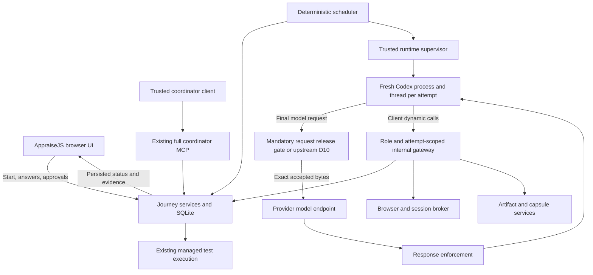

> Historical snapshot preserved on 2026-09-11. Superseded for active work by [PLAN.md](PLAN.md) and [TASK_REGISTER.md](TASK_REGISTER.md). Old gates, next actions and statuses below apply only to the deferred managed-runtime architecture. Evidence is retained, not newly qualified.

# AppraiseJS-Owned Quality Journey Coordinator — Development Plan

Status: the user adopted the dynamic-tool plus mandatory Appraise interlock direction and a separate deterministic
development gate on 2026-09-11. P0.R2d is blocked by canonical schema loss in Codex 0.154.0 (B0-005). Production-provider Gate G0 remains blocked; G0D passed independent review, but the user has selected provider-blocker resolution before Phase 1. P0.R2f identifies a lossless serializer repair target and the additional auth-retry blocker B0-006.
The upstream D10 contract remains the durable target, with D14 the adopted temporary qualification route.

This plan is the named specification for replacing external Quality Journey coordination with an AppraiseJS-owned
local runtime. The [task register](TASK_REGISTER.managed-runtime-archive.md) is authoritative for task status, dependencies, verification
evidence, phase gates, blockers, and the next executable task. Saving these documents does not execute the migration.

## 1. Outcome and accepted product decisions

A user creates a Quality Journey in AppraiseJS, explicitly starts it, answers questions and reviews artifacts in
AppraiseJS, and receives a completed, evidence-backed report. AppraiseJS schedules and supervises the workers and
test runtime throughout. The user does not open an external coding-agent task to coordinate the Journey.

| Decision                | Selected behavior                                                                                                                                  |
| ----------------------- | -------------------------------------------------------------------------------------------------------------------------------------------------- |
| Product scope           | Complete Quality Journey: analysis, discovery, scenario design, automation preparation, execution, triage, revision/remediation/rerun, and closure |
| Coordinator             | Deterministic workflow engine; AI workers perform bounded role assignments                                                                         |
| Initial provider        | Installed Codex CLI through App Server; provider-neutral internal contract                                                                         |
| Authentication          | Provider-native account login; no automatic API-key or billing fallback                                                                            |
| Deployment              | Local macOS service with the existing browser UI                                                                                                   |
| Starting work           | Explicit Start Journey action after confirmation; confirmation alone does not spend AI work                                                        |
| Continuation            | Automatic between existing human gates while the Start grant remains valid                                                                         |
| Target modes            | Existing local-workspace and remote-black-box web targets                                                                                          |
| Authenticated scouting  | Included in the first production release                                                                                                           |
| Target sign-in          | Human login/SSO/MFA in an AppraiseJS-owned browser; no automated password login in v1                                                              |
| Browser session storage | In memory; restarting the owning service requires sign-in again                                                                                    |
| External workflow       | Full replacement; the feature is unreleased, so no active external-Journey migration path                                                          |
| Concurrency             | One active AI worker globally in v1; enforce through persisted ownership                                                                           |
| Attempt policy          | Preserve existing authorization attempt ceilings; no automatic increases                                                                           |
| Active-work deadline    | Default 30 minutes per AI attempt; display before Start; expiry creates an operational pause requiring user action                                 |
| Provider qualification  | Upstream D10 remains the durable target; D14 adopts mandatory Appraise request/response enforcement around dynamic tools as the temporary route    |

Human waits do not consume the active-work deadline. Pausing admission is distinct from cancelling a Journey or
changing a lifecycle blocker. Budget changes cannot silently modify an already-issued immutable authorization.

Out of scope: general coding-task coordination, autonomous product-code repair, Claude/Cursor adapters, hosted
execution, desktop application packaging, Linux/Windows qualification, automated target credential login, and
changes to the repository-development swarm policy. Existing test-automation preparation is in scope.

## 2. Research findings and feasibility

The product direction remains selected. D14 adopts a mandatory Appraise request/response interlock around the
zero-MCP dynamic-tool adapter as the temporary provider qualification route; D10 remains the durable upstream target.
D15 separates deterministic Phase 1 development admission (G0D) from production provider admission (G0). A maintained
provider patch still requires separate direction. Synthetic interlock evidence does not qualify production use.
AppraiseJS already owns durable Journey state and acceptance rules, but its current handoff asks an external harness to coordinate workers. This split plausibly explains handoff and continuation
friction; it does not prove that all workflow failures originate there.

### Current source baseline

Reverify these observations before implementation; file names and line numbers may change after this research.

| Existing mechanism                                                               | Reuse or missing work                                                                                              |
| -------------------------------------------------------------------------------- | ------------------------------------------------------------------------------------------------------------------ |
| Journey stages, versions, immutable artifacts, commands and events               | Keep as domain authority                                                                                           |
| Transactional work claim, authorization, assignment, input hash and dispatch key | Reuse; add runtime ownership and renewal                                                                           |
| Agent Factory `supports` / `dispatch` interface                                  | No production registration was found; add the operational adapter                                                  |
| `DISPATCH_UNRESOLVED` and explicit resume                                        | Reuse safe blocking; add continuous provider reconciliation                                                        |
| Worker lease expiry and heartbeat interval                                       | No Journey worker renewal implementation was found                                                                 |
| Scout submission validation                                                      | No concrete Scout browser runtime was found                                                                        |
| Scout credential scope                                                           | Currently empty; authenticated scouting requires a new immutable profile version                                   |
| Capsule execution reserve/launch/reconcile                                       | Reuse and connect to managed progression                                                                           |
| Human decision and consent services                                              | Preserve exact revision/scope binding                                                                              |
| Broad project coordinator bearer token                                           | Keep out of workers; introduce a narrower gateway and runtime principal                                            |
| Existing full `appraisejs` MCP over stdio/loopback HTTP                          | Reuse its schemas, coordinator client and domain services; do not expose its full tool registry to managed workers |

Primary local navigation:

- [Agent Factory](../../../../../src/lib/quality-journey/agent-factory.ts)
- [Role definitions](../../../../../src/lib/quality-journey/role-definitions.ts)
- [Journey service](../../../../../src/services/coordinator/quality-journey-service.ts)
- [Discovery service](../../../../../src/services/coordinator/quality-journey-discovery-service.ts)
- [Execution runtime service](../../../../../src/services/coordinator/quality-journey-runtime-service.ts)
- [Handoff service](../../../../../src/services/coordinator/quality-journey-handoff-service.ts)
- [Persistence schema](../../../../../prisma/schema.prisma)
- [Coordinator request guard](../../../../../src/lib/coordinator-api/request-guard.ts)

### External findings

T3Code provides a useful precedent: the server owns agent processes and workspace operations, orchestration records
durable intent, and provider adapters translate normalized commands/events. Its engine commits events, projections
and command receipts together before publishing resulting state. This is architectural evidence, not proof that its
runtime satisfies AppraiseJS role isolation. Sources: [architecture][t3-architecture], [engine][t3-engine],
[adapter contract][t3-adapter].

Codex App Server documents stdio JSON-RPC, thread creation/resume/read, turn start/interruption, approval requests,
provider-managed login and experimental client-executed dynamic tools. The locally observed CLI was `0.153.4`; this
is a qualification candidate, not a certified version. P0.R2c found dynamic tools to be a narrower stock worker
surface than MCP, but their experimental status and resume persistence require pinning and requalification.
[Codex App Server][codex-server]

Configuration controls exist for shell, memory and other surfaces. Requested settings do not establish an effective
tool inventory or enforce every filesystem/context boundary. [Codex configuration][codex-config]

Future Claude integration must separately resolve authentication: the SDK documentation restricts third-party
subscription-login offerings without prior approval. Cursor has a documented bidirectional ACP integration,
including permissions and cancellation. Neither adapter is part of v1. [Claude SDK][claude-sdk], [Cursor ACP][cursor-acp]

Playwright provides isolated browser contexts and authenticated state. Saved state can contain credentials capable
of impersonating the account; v1 keeps session state in memory and outside worker payloads. [Playwright auth][pw-auth]

### Unproven feasibility conditions

Phase 0 must establish effective tool inventory, context isolation, interception of unauthorized effects, process
ownership after supervisor death, and safe thread/turn reconciliation for the qualified Codex build. It must also
establish a viable browser isolation approach. Prompt instructions and negative probes alone are insufficient proof
of host-enforced confinement. Store effective host/configuration evidence alongside behavioral probes.

If a required boundary is unsupported, stop production-provider admission at G0. Record the unsupported behavior and
review the replacement confinement design. D15 permits only explicitly dependency-bounded deterministic development
through G0D while provider qualification remains blocked. Do not fabricate attestations, relax the role contract, silently use full access, or
replace Codex with another provider. The full-release estimate must then be reconsidered.

### Phase 0 no-go disposition and durable remediation

The Codex 0.153.4 qualification candidate did not expose the required Journey MCP, retained ambient MCP servers and
provided no authoritative inventory of the native tools visible to the model. The recovery harness proved conservative
policy decisions but did not execute the required real App Server fault matrix. Gate G0 therefore remains blocked.

The remediation run subsequently verified the isolated launcher and the attempt-scoped worker gateway. Its P0.R2
no-model probe attached the exact Requirement Analyzer MCP profile with no ambient MCP, but the installed App Server
protocol still supplied no trusted view of the complete post-filter model-visible manifest or binding to the request
later dispatched. Per the investment-gate rule, remediation stopped there. The bounded adapter proposal and exact
candidate evidence are recorded in `evidence/P0.R2.md`; maintaining that patch requires separate explicit direction.

The existing AppraiseJS MCP path is reusable infrastructure, but it is a broad coordinator surface for a trusted
project-bound client. It registers Journey creation, work claim/dispatch, lifecycle decisions, execution, stop and
repository-collaboration operations together. It is not the per-role worker boundary described by this plan.

Resolve the gap by supporting two trust profiles over the same canonical schemas, coordinator client and Journey
domain services:

1. Keep the existing full coordinator MCP for trusted human-directed or harness-native coordinator clients.
2. Add an attempt-scoped worker MCP registration profile. Derive its concrete tools from the canonical operation
   definitions, but register only the exact subset mapped to the assigned role's abstract capabilities.
3. Resolve target, Journey, role, attempt, generation, lease and runtime principal from a sealed grant on the trusted
   side. Do not expose the broad project bearer, owner token or caller-selected actor to the worker.
4. Revalidate the sealed grant before and after external I/O and issue content-bound broker receipts. The same Journey
   services and specialized ingress remain authoritative; the worker gateway is not a second business API.
5. Require the provider to suppress all unrequested native and ambient tools before constructing the model request and
   expose the actual post-filter tool manifest for trusted verification. An OS sandbox independently contains
   filesystem, network and process effects, but inert model-visible tools do not satisfy the exact-tool contract.

The durable boundary is provider-neutral. Codex remains one adapter and may use an upstream capability or a minimal
pinned compatibility patch, but the patch must remain inside the adapter boundary. A provider build is disabled for
managed Journeys until the complete role-boundary and recovery conformance suites pass. Provider executable,
protocol, configuration or confinement changes invalidate the affected qualification evidence.

The accepted long-term resolution for `B0-001` is an upstream provider-supported two-phase turn contract. A no-model
prepare operation must traverse the exact production request-construction path and return the final ordered tool
specifications, contributor origins, schema hashes and a manifest digest together with a sealed, single-use token.
The corresponding bound-dispatch operation must recompute and validate that state immediately before model I/O and
again at tool dispatch, failing closed on drift. AppraiseJS consumes this through a provider-neutral attestation
adapter, retains the role-scoped worker gateway and sealed attempt grant as authority, and uses OS sandboxing as an
independent containment layer. This decision selects the remediation design; `B0-001` remains open until an exact
provider build implements it and P0.R2/P0.R3 qualification passes against that artifact.

### Mandatory wire-gateway stress test — 2026-09-11

The [P0.R2a evidence](evidence/P0.R2a.md) records that stock Codex `0.153.4` was confined by macOS Seatbelt to one
non-forwarding Appraise loopback listener. The exact build resolved the custom Responses provider configuration,
made one HTTP request with no observed retry for each account-free 418, 401, 429, 500, connection-reset and
interrupted-stream fixture, and accepted a synthetic namespaced MCP function call whose output appeared in the next
captured request. No external endpoint, real credential, provider response or model was reachable.

The run also falsified a passive validation proxy. With one synthetic role MCP tool, `dynamicTools: []`, isolated
state and no ambient MCP, the actual serialized request still contained ten top-level tool entries. Shell/session,
resource, user-input, image, multi-agent and web-search surfaces remained alongside the intended MCP namespace. A
role-exact gateway would reject that request rather than qualify it.

The viable compatibility candidate is therefore a mandatory request/response interlock, not a transparent proxy. It
must construct or transform the complete final outbound request, attest and release those exact immutable bytes,
and buffer streamed tool-bearing events until their role, schema, origin, handler and attempt bindings pass. Codex
must remain OS-confined to the interlock while the interlock alone may reach one fixed provider upstream. This moves
provider credentials, prompt bytes and response enforcement into the AppraiseJS trusted computing base and creates
an ongoing qualification/maintenance obligation.

The stress test establishes a route around the missing stock App Server preview primitive, but does not itself close
`B0-001`: production request transformation, streaming response enforcement, provider-native login, fixed-upstream
forwarding, all six roles and recovery remain unverified. Upstream two-phase attestation remains the durable target.
At the time of P0.R2a, adoption required a user decision. That decision is now recorded as D14 below; this historical
experiment still supplies no production/provider qualification.

### Role-local configuration stress test — 2026-09-11

The [P0.R2b evidence](evidence/P0.R2b.md) records a second account-free route against the same Codex `0.153.4`
executable. A complete isolated role configuration reduced the final wire manifest from ten top-level entries to
five. The accepted structured `tools.experimental_request_user_input.enabled = false` setting reduced it again to
four: the intended role MCP namespace plus `list_mcp_resources`, `list_mcp_resource_templates` and
`read_mcp_resource`.

Current stock source registers those three helpers whenever any MCP server exists. Synthetic responses proved all
three are executable: Codex dispatched each to the only configured worker MCP and included its result in a second
local fixture request. Because the fixture advertises tools only and implements no resources or templates, all three
failed with MCP `-32601 Method not found`; no resource data or external effect was observed.

This verifies a useful defense-in-depth envelope, not exact-tool qualification. Each managed attempt should use a
fresh root App Server process, a generated complete config, no inherited user state, multi-agent disabled and exactly
one tool-only attempt-scoped worker MCP. Native custom-agent files may express equivalent settings, but their parent
inheritance and selector behavior must not become the security boundary.

The accepted contract still requires the role-only provider manifest, pre-turn binding and streamed-call
enforcement, so P0.R2 and B0-001 remain blocked. A weaker four-entry effect-constrained contract is technically
plausible only if the role MCP permanently advertises no resources/templates, rejects all resource methods, and
manifest drift fails closed. Adopting that weaker invariant would require an explicit product/security decision and
requalification; this experiment does not make that decision or permit Phase 1.

### Zero-MCP dynamic-tool stress test — 2026-09-11

The [P0.R2c evidence](evidence/P0.R2c.md) records an account-free experiment against the same Codex `0.153.4`
executable using no MCP server and `thread/start.dynamicTools`. With the complete isolated role configuration,
`dynamicTools: []` produced one serialized request with an empty tool manifest. One strict synthetic dynamic tool
produced two serialized requests containing exactly that function, with stable definition/schema identity and no
native or MCP helper tools.

A synthetic allowed function call reached the Appraise-owned client through `item/tool/call`; the bounded dispatcher
returned synthetic output and the follow-up request retained the exact one-tool manifest. Deterministic dispatcher
tests reject missing/empty call identity, unknown tools, malformed arguments, replay, cross-thread and stale-turn
calls. The live App Server stream exercised only the allowed call, so those negative cases are not yet end-to-end
provider-path evidence.

This closes the narrow feasibility question that stock Codex can emit an exact dynamic-tool-only model surface and
eliminates the MCP resource helpers by configuring no worker MCP. It does not close `B0-001` or qualify P0.R2: the
actual manifest was observed only after `turn/start`, no D10 prepare/sealed bound-dispatch token exists, the tool was
synthetic rather than a canonical role projection, and resume/restart, provider-native login, all roles and recovery
remain unverified.

Retain the Journey work graph, Agent Factory and P0.R1 authorization/domain gateway. In this candidate adapter, role
tools are generated as client-owned dynamic functions and dispatched internally through that gateway rather than
registering the worker MCP into Codex. The full coordinator MCP remains the trusted-client surface. Dynamic tools alone do
not replace D10. D14 subsequently adopted their combination with an Appraise-owned request/response boundary; the
P0.R2c experiment alone remains insufficient for production qualification.

### Exact stable-candidate refresh — Codex 0.154.0

The [P0.R2 candidate refresh](evidence/P0.R2-0.154.0.md) inspected and exercised the official `0.154.0` stable arm64
macOS package without replacing the installed desktop binary. Its generated experimental v2 protocol still exposes
`thread/start`, `thread/resume` and `turn/start` but no request preview, effective-tool manifest, prepare or sealed
bound-dispatch method. The newly visible `attestation/generate` server request has empty parameters and returns an
opaque client token for the upstream `x-oai-attestation` header; it does not attest the model request or tools.

The no-model P0.R2 harness remained fail-closed with `native_tool_inventory_unavailable`, while the P0.R2c empty and
one-tool wire arms reproduced their narrow exact dynamic-tool surfaces and cleaned up with zero survivors. This keeps
D13 viable as a compatibility component but does not close B0-001, qualify P0.R2 or make downstream remediation or
Phase 1 eligible.

### Adopted interlock and development-gate split — 2026-09-11

The user accepted the proposed direction and requested a test plus plan/blocker updates. D14 adopts the mandatory
Appraise interlock around D13 dynamic tools as a temporary boundary; D15 separates development from production
provider admission. This removes the unresolved architecture decision, not the unproven production boundaries.

The changed invariant is explicit: a confined Codex process may construct its request after `turn/start`, but the
sole egress gate must validate, bind and release the exact immutable bytes before external provider/model I/O.
The gate must forward accepted body bytes unchanged and reject drift, rather than repair unknown requests.
Every accepted request, including follow-ups, must retain matching raw ingress/upstream-received byte lengths and
SHA-256 hashes; parsing must never replace the released buffer with a re-serialized body.
All follow-up requests require the same enforcement. Tool-bearing responses must be validated before dispatch.
Appraise accepts responsibility for the interlock's credential-transit boundary, fixed-upstream policy,
request/response validation and ongoing requalification. The actual native credential owner and compatible transit
mechanism remain unproven until P0.R2e; this decision does not claim authentication works.
D10 remains the durable target; no maintained Codex fork or provider/billing substitution is selected.

D14 evidence has two layers: canonical role/schema-to-dynamic-function-to-handler provenance, and observed final
outbound bytes bound to the trusted runtime/attempt. It does not claim visibility into Codex internal contributor
origins. Keep this explicitly versioned evidence contract separate from the unchanged upstream D10 checker.

P0.R2d tests one canonical role against a second local synthetic upstream, using account-free credentials and
bounded complete-response buffering. It must distinguish live allowed/request-denial/response-denial paths from
unit fault cases. It cannot establish real streaming compatibility, provider-native login, all six roles, recovery,
or authenticated browser containment. P0.R2e addresses authentication compatibility before further provider investment.

G0D is a development-admission decision, not provider qualification. After independent review of the revised plan,
it admits P1.1–P1.5 in dependency order using only a deterministic adapter and disabled production admission. Existing
persistence, ownership, idempotency and fake-provider recovery acceptance remains unchanged. P2.1 requires both G1
and production-provider G0. UI, browser and later recovery development may be split into provider-independent tasks
in a subsequent bounded plan change; this decision does not make all later tasks eligible.

The worker remains disposable: Appraise owns authoritative progress, operation/effect records and accepted artifacts.
A worker proposes content or requests a brokered operation; its transcript never becomes lifecycle authority. Ambiguous
external effects stay fenced. Start, human review, execution consent, one-worker concurrency, attempts and deadlines
are unchanged. Completing this experiment does not implement Phase 1.

### P0.R2d result — lossless canonical schema is unsupported by the current candidate

The [P0.R2d experiment](evidence/P0.R2d.md) reached the mandatory gate under the verified isolated configuration.
The two canonical Requirement Analyzer functions were the only tools, but Codex removed 79 semantic constraint
occurrences from the submit schema: string length/pattern and array maximum limits. All three live arms therefore
failed closed at request validation, with zero synthetic upstream requests, zero effects and zero surviving owned
processes. The intended allowed round trip and live response-denial path were not reached. Direct tests are not
substituted for that missing live proof.

B0-005 records this additional provider blocker. Do not normalize away those constraints to qualify the build.
D14 remains adopted but unqualified; D10 alone would not repair a lossy schema serialization path either. P0.R2f
must find a lossless supported encoding or present a separately reviewed architecture change. G0 remains blocked;
this result does not retract the independent deterministic-development direction under D15/G0D.

### P0.R2f result — concrete repair target, full provider proof still required

The [P0.R2f investigation](evidence/P0.R2f.md) tests all six canonical profiles, four nesting probes and two
size-policy probes. Stock schema conversion loses constraints in every role; wrappers do not repair the shared
limited representation. Compaction is a second loss mechanism. Stop rerunning the unchanged stock composition.

A compiled schema-only canary reproduces 20 observed stock schemas and preserves all 20 inputs after bypassing
lossy lowering with explicit size rejection. The next experiment, P0.R2g, must integrate a narrowly reviewed
lossless dynamic-tool path into a disposable App Server build and rerun full composition. The source-only
canary does not establish a production path or authorize maintaining/distributing a fork.

Synthetic external-auth success/error routing works, but the live retry has different bytes for equal JSON.
Direct gate tests show byte-identical requests rejected as replay and reserialized copies accepted as new
releases. B0-006 therefore requires a reviewed logical retry identity and bounded refresh transition, preserving
actual-body binding and ambiguous-delivery fencing. Do not remove replay protection to obtain success.

G0 remains blocked; native managed login, real endpoint schema acceptance, full interlock composition, recovery
and authenticated browser qualification remain outstanding. G0D's historical pass is unchanged. The user's latest
instruction places P1.1–P1.5 on a sequencing hold while the provider path is established; Phase 1 is not the next task.

### Investigation findings and proposed progression — 2026-09-10

The [blocker investigation](evidence/PHASE0-BLOCKER-INVESTIGATION.md) distinguishes an unsuccessful qualification
attempt from proof that Codex cannot support the design. The existing launcher inherits the host environment, does
not register the required Journey MCP and hardcodes native inventory as unavailable. Rerunning it unchanged cannot
qualify a provider. The checker also accepts an empty tool list and null boundary fields when supplied a true native
inventory Boolean. This is a reproduced qualification-integrity defect, not an observed production escape; the current
launcher keeps that Boolean false. Record it as `B0-003` and repair it before trusting a future success receipt.

Proposed execution order, with task status owned only by the register:

1. **P0.R0a — Harden qualification acceptance.** Reject the reproduced false pass and validate exact manifests,
   semantic boundary fields, readiness and trusted provenance. Fixture acceptance is not provider qualification.
2. **P0.R0b — Isolate qualification launch.** Use dedicated state/configuration, an allowlisted environment and a
   synthetic required MCP. Capture resolved sources and identities without copying account secrets. Prove the
   no-model launch and missing/unhealthy/ambient-MCP rejection paths.
3. **P0.R1 — Prototype the scoped worker gateway.** Derive all six role maps from canonical definitions, beginning
   integration with the smallest role surface. Preserve trusted-client full MCP and specialized Journey authority.
4. **P0.R2a — Stress-test a mandatory wire interlock.** Use a fake credential, non-forwarding loopback listener and
   exact-port OS confinement to test stock request capture, failure retries and synthetic response parsing. This is
   candidate evidence only and cannot close P0.R2.
5. **P0.R2b — Stress-test role-local configuration.** Explicitly disable native/hosted capabilities, capture the
   final request and invoke every residual helper against a tool-only worker MCP. Retain the configuration as
   defense-in-depth without silently relaxing the exact-tool invariant.
6. **P0.R2c — Stress-test zero-MCP dynamic tools.** Supply no MCP and compare empty and one-tool dynamic manifests;
   exercise client-owned dispatch and retain the result as candidate evidence without claiming pre-turn binding.
7. **P0.R2 — Resolve the provider investment gate.** Inspect and qualify an exact upstream build's request-construction
   and dispatch paths. Require actual post-filter manifest evidence and fail-closed enforcement before model work.
   If upstream cannot support this, stop and present a bounded compatibility-patch proposal with maintenance,
   authentication, signing and requalification consequences. Saving this plan does not authorize maintaining a fork.
8. **P0.R3 and P0.R4 — Qualify boundaries and recovery.** Use the same qualified artifact. Independent fixture work may
   proceed concurrently, but serialize provider turns under the one-worker policy. Recovery must yield exact resume,
   proven-safe retry or fenced `UNKNOWN`; define deterministic-backend equivalence before using it as evidence.
9. **P0.R3b — Close browser feasibility evidence.** Exercise controlled human login/MFA, owning-process restart and
   hostile observations through the qualified Scout/gateway boundary. This is a disposable proof, not Phase 3 product
   implementation. Track the previously acknowledged omissions as `B0-004`.
10. **P0.R5 — Review the combined artifact and reevaluate G0.** Require every blocker closed and all original/remediation
    task acceptance satisfied. P0.R4 supplies the evidence needed to resolve P0.3; it does not silently waive that task.

P0.R0a, P0.R0b, P0.R1 and the P0.R2a/P0.R2b/P0.R2c compatibility-candidate stress tests are verified. D14/D15
now supply the next architectural direction. P0.R2d has a retained no-go: Codex strips canonical schema constraints. Investigate lossless transport through
P0.R2f before rerunning P0.R2d and proceeding to P0.R2e.
G0D has passed, but the current user-directed sequence holds Phase 1 until the provider path is established. P0.R2 and G0 remain production
qualification blockers; P0.R3/P0.R4/P0.R3b/P0.R5 keep their dependencies. No real provider/model I/O is inferred from
local fixture success, and no maintained provider patch is authorized.

## 3. Architecture and invariants



### Ownership

1. Journey services and SQLite retain lifecycle authority. Do not introduce a parallel workflow truth in provider
   transcripts, browser state, the CLI, or a second database.
2. Extend the existing `appraisejs` CLI with a runtime entrypoint. It communicates through authenticated runtime
   endpoints; domain services continue to own database mutations.
3. Supervise the local application and runtime independently of browser tabs. A launchd user service is the macOS
   production packaging target. Sleep/logout interrupt availability; wake/restart initiates reconciliation.
4. The trusted supervisor owns provider transport/authentication, process control and sealed runtime capabilities.
   Model-visible workers receive only canonical assignment data and role-permitted tools.
   The provider-attestation boundary is either the selected upstream two-phase contract or the D14-adopted
   mandatory Appraise request/response interlock; an ordinary proxy is not a qualified boundary.
5. The browser broker owns target cookies and authenticated sessions. Target credentials, provider login and
   execution consent are separate authorities.
6. `NETWORK` scope describes worker-visible target/data access. Provider transport connectivity belongs to the
   trusted control plane; this distinction must be explicit in contract documentation and evidence.

### Worker isolation and effects

- Use a fresh process, configuration/work directory and new thread per attempt. Do not fork external conversations.
- Same-attempt resume requires the persisted exact thread identity and matching runtime/configuration digest.
  Replacement gets a new process/thread and no predecessor transcript.
- Disable unrequested native tools, apps, memory, inherited configuration and project instruction ingestion using
  the qualified provider mechanism; verify actual effective state before the first model turn.
- Route model-visible artifact, browser and filesystem operations through the scoped gateway. The worker cannot
  directly access the database, broad coordinator token, lease token, raw credentials or unrestricted shell/network.
- Derive the worker gateway from the existing canonical MCP definitions and coordinator client, but register only the
  exact role subset. The existing full MCP remains a separate trusted-client surface and must not be attached to a
  managed worker.
- Map every exposed concrete tool to an allowed abstract role capability. Unexpected tools/approval requests fail
  closed; answering a provider approval cannot broaden a Journey assignment.
- Validate attempt, generation, lease, role, input and authorization before a tool call and again after external I/O.
  Preserve an audit record of effects that occurred before revocation; rejecting output cannot undo those effects.
- Broker receipts bind attempt, tool, canonical argument/result hashes, policy decision and evidence identity.
  Worker narratives and raw stdout cannot substitute for those receipts or specialized semantic validation.

### Persistence and interfaces

Use additive migrations. Extend existing records where responsibility matches; do not duplicate immutable lineage.

| Record/interface      | Required content or behavior                                                                                                                                                        |
| --------------------- | ----------------------------------------------------------------------------------------------------------------------------------------------------------------------------------- |
| Start grant           | Journey and requirement identity, allowed automatic progression, limits, issue/revocation state; never a human-gate approval                                                        |
| Runtime ownership     | Installation owner, expiry and monotonically increasing fencing generation                                                                                                          |
| Provider dispatch     | Unique dispatch key, attempt, adapter, process birth identity, version/config digest, thread/turn IDs, state and reconciliation result                                              |
| Outbox                | Unique effect identity, canonical payload hash, pending/claimed/acknowledged/unknown status and attempt generation                                                                  |
| Inbox                 | Provider delivery identity or stable adapter-derived identity, payload hash, processing status and durable cursor                                                                   |
| Runtime attestation   | Actual evidence content, digest, qualified executable/protocol/config identities and effective boundaries                                                                           |
| Browser session grant | Journey/target/environment, allowed origins/routes/actions, issue/expiry/revocation state and opaque session reference                                                              |
| Adapter               | Dispatch, inspect/reconcile, event observation, interrupt and confirmed termination; provider-specific behavior stays here                                                          |
| Runtime endpoints     | Start/pause/resume/status, fenced claims/renewal, event/effect ingestion and reconciliation; authenticated principal determines authority                                           |
| Worker gateway        | Sealed attempt principal plus exact role-derived MCP subset; scoped reads/proposals/observations only; no broad project token, worker-selected actor or arbitrary lifecycle command |

Do not accept a client-supplied `actor: USER` or an adapter-authored digest as proof of authority. Resolve principals
and attestation provenance on the trusted side. Preserve useful MCP/catalog capabilities outside the removed external
coordination flow.

### Launch and recovery protocol

Dispatch state: `RESERVED -> STARTING -> READY -> RUNNING -> OUTPUT_RECEIVED -> FINISHED`, with explicit `UNKNOWN`
and `FAILED` outcomes. Physical stop state is independent: `STOP_REQUESTED -> STOPPING -> STOPPED`, or `STOP_FAILED`.

1. Atomically persist claim, immutable assignment and launch intent before any external spawn.
2. Claim the outbox effect under current runtime/attempt fencing. Persist `STARTING` before spawning.
3. Create and identify the provider process, handshake, create the thread and qualify its effective boundaries.
   No model turn begins until the session identity and valid receipt are durable (`READY`).
4. Persist turn-start intent, then request the turn. A lost acknowledgement produces `UNKNOWN`; inspect the bound
   session rather than blindly sending another turn.
5. Persist normalized events and deduplicate effects. Accept output only through its specialized role ingress.
6. Revoke capabilities on logical cancellation immediately. Track physical termination until confirmed.
7. Resume the exact bound attempt, prove absence/non-start and retry safely, or remain unresolved. These are the
   only automatic recovery outcomes. No replacement while a predecessor may still execute.

Do not claim exactly-once external model execution. AppraiseJS transitions and accepted artifacts must be idempotent;
provider creation/turn ambiguity remains explicit unless a qualified provider primitive proves otherwise.

### Scheduler policy

| Current persisted condition                          | Automatic action                                                      |
| ---------------------------------------------------- | --------------------------------------------------------------------- |
| Eligible work + valid Start grant + available slot   | Claim next eligible role in existing stage order                      |
| Claimed work without dispatch                        | Reserve and dispatch                                                  |
| Starting/unknown dispatch or uncertain termination   | Reconcile only                                                        |
| Confirmed worker active                              | Observe and renew the current fenced lease                            |
| Output received                                      | Invoke specialized role validation; never infer completion from prose |
| Analyzer/design/report feedback                      | Issue only the existing revision work authorized by that decision     |
| Execution ready                                      | Start only when exact existing execution consent is valid             |
| Remediation/rerun proposed                           | Wait for required exact proposal approval before issuing new work     |
| Question, review, login or operational pause pending | Wait; do not busy-loop or invent consent                              |
| Revoked/cancelled/closed                             | Revoke access, stop owned processes and reconcile termination         |

Start grants authorize scheduling, not analysis/scenario approval, execution consent, remediation/rerun approval,
report review, risk acceptance or closure. Preserve every specialized human gate already present.

### Authenticated browser behavior

The user signs in through an AppraiseJS-launched isolated browser. Scout receives authorized observations and an
opaque grant reference, never cookies, headers, passwords or login-page captures. Session expiry pauses for login;
service restart loses the session and visibly requests login again. Automated password login is excluded from v1.

Scope page, resource and identity-provider origins explicitly. Enforce redirects, frames, background requests,
service workers, WebSockets and downloads through the qualified broker policy; unsupported traffic fails visibly.
Authentication effects need their own user authorization. Observation access does not authorize arbitrary form
submissions, mutations or cross-origin navigation. Do not equate GET/navigation with a universal absence of target
side effects. Validate application-specific interaction policy using controlled fixtures.

## 4. How to progress through this plan

### Start or resume an implementation session

1. Read this plan and the register, then current root/package `AGENTS.md` and applicable skills. Classify the task
   through the repository router. Default to one coordinator for a bounded, verifiable task.
2. Confirm what the user requested: one task, a phase, or the complete plan. Work only within that authorized range.
   A request to save or revise this plan is not a request to start implementation.
3. Inspect branch and dirty state. Branch before implementation using `codex/`; preserve unrelated work, including
   the pre-existing `package-lock.json` modification observed when this plan was saved.
4. Reverify the source baseline relevant to the next task. Treat source drift as evidence to record, not a reason to
   silently change accepted product decisions.
5. Select the lowest-numbered `pending` task within the selected provider or deterministic-development track whose dependencies are `verified` and whose admission gate passed (G0D for Phase 1; G0 plus G1 for P2.1).
   Set its status to `in_progress` and fill in the active handoff record before editing source.

### Execute a task

1. Read the task's scope, acceptance and verification. Define its exact changed surface and any fault fixture first.
2. Keep work bounded. If a task requires independent responsibilities or is too large for a focused change, split
   it into suffix IDs (for example `P1.3a`, `P1.3b`) in the register before implementing; preserve parent acceptance.
3. Implement canonical source. Change scaffold templates only through the root-to-template sync workflow.
4. Run focused checks and the task-specific behavioral tests. Expand checks based on affected surfaces and risk.
5. Review the exact diff. Obtain independent review for boundary, authentication, persistence and recovery changes.
   Bind that review to a commit SHA or a content digest covering the complete reviewed artifact.
6. Record commands, outcomes, artifact references and unresolved limitations in the task's evidence record.
7. Only then mark the task `verified` and its master checkbox `[x]`. `Implemented`, `tests not run`, `waived` and
   `looks correct` are not equivalent to verified.
8. Continue to the next eligible task within the user's requested range. Do not ask for routine reapproval at each
   task. Pause only at a genuine missing decision, required product gate, or failed feasibility boundary.

### Phase gates

At each phase end, evaluate the gate criteria in the register. All required tasks must be verified, evidence must
match the current artifact, and blocking findings must be resolved. Record `passed` or `blocked`; do not advance on a
partial pass. A later change invalidating a gate reopens the affected tasks and gate before downstream work proceeds.

G0 remains the production-provider admission gate. A failure requires an explicit unsupported-boundary record and
reviewed design, not a best-effort production adapter. D15 adds G0D for deterministic Phase 1 development only;
passing G0D does not waive any G0 criterion or count simulated recovery as provider recovery. Complete Phase 0
remediation before admitting the production adapter. P2.1 requires both G1 and G0.

A deterministic backend supports turn-level provider recovery evidence only when it traverses the exact production
path and is demonstrably equivalent for the protocol states/events under test; otherwise retain the unresolved check
or use a separately authorized account-safe real-provider turn. Existing human lifecycle gates are unchanged.

### Blockers, changes and safe stopping

- Record a blocker ID, affected task/gate, observed behavior, reproduction, impact, attempted resolution and exact
  condition required to unblock. Differentiate code defects, infrastructure failures and product decisions.
- Continue independent authorized work only when dependencies permit. Never mark a blocked task complete.
- A change to providers, isolation, authority, human gates, concurrency policy, billing, target-login method or
  supported platforms requires explicit user direction and an updated decision record.
- Do not weaken required boundaries, bypass hooks, reset the database or discard dirty changes to get green checks.
- On interruption, leave an exact next action, file/branch state, test evidence and any owned process identities.
  A successor must recheck live process ownership before signalling or replacing anything.
- Commit/push/PR/merge/release only within the user's authorized delivery scope. Do not invent a publication task.
  When publication is requested, record terminal CI and exact reviewed/merged identity; do not mark publication
  complete merely because a PR was opened.

### Recordkeeping rules

The register is the sole task-status source. Keep task IDs stable. Update the master row, its evidence record and
active handoff together. Do not duplicate status checkboxes in other plans. Reference evidence by stable repo path
or sanitized artifact URI; keep credentials, raw authentication state and unsanitized provider logs out of Git.

Recommended evidence layout during implementation: `evidence/P0.1.md` and corresponding task IDs beside this plan,
with only sanitized summaries and hashes. Do not create placeholder evidence that implies a test ran. Raw local
diagnostics remain ignored outside the committed plan directory.

## 5. Validation and release contract

Use deterministic fake-provider/fault tests first, followed by real qualified-provider tests on macOS. Never use an
external production application as a destructive test fixture.

| Area           | Required evidence                                                                                                            |
| -------------- | ---------------------------------------------------------------------------------------------------------------------------- |
| Ownership      | Duplicate Start, two supervisors, singleton fencing, stale generations                                                       |
| Leases         | Renewal, expiry, revocation races, no immutable-manifest rewriting                                                           |
| Launch         | Crash before/after each commit, spawn, handshake, thread creation, turn creation and acknowledgement                         |
| Cancellation   | Late calls/results, hung descendants, PID reuse, stop failure, supervisor death                                              |
| Isolation      | Effective inventory and host evidence plus forbidden file/shell/network/context/tool probes                                  |
| Authentication | Human login/MFA, expiry/restart, revoked grants, cross-Journey reuse, redirect escape, secret canaries                       |
| Evidence       | Forged receipts, stale input, duplicate delivery, partial outputs, oversized payloads, interrupted I/O                       |
| Lifecycle      | All six roles, exact human gates, revision loops, execution failure, remediation/rerun, risk acceptance and closure          |
| Operations     | Fresh installation, browser close, sleep/wake, service restart, offline state, unavailable MCP, unsupported provider version |

Relevant command sources are current `package.json` and `docs/agent-validation-matrix.md`. Expected checks include:

```sh
npx eslint <affected-source-files>
npx prettier --check <affected-files>
npm run validate:unit -- <related-test-files>
npm --prefix packages/appraisejs test -- <related-package-test-files>
npm run validate:migrations
npm run build
npm run release:check:artifacts
npm run release:check:packages
npm run check:harness
```

Use migration checks for schema work; run broader build/package/harness checks when affected and at integration
gates. Use the repository Browser workflow for interactive UI verification; document any required fallback. Execute
real-provider tests only with the authorized test account and bounded workload. Re-run invalidated checks after fixes.

When applicable, synchronize canonical changes with:

```sh
npm --prefix packages/create-appraisejs run prepare-template
npm run graphify:auto
```

Regenerate coordinator references and operation projections/certification only when their source changes require it;
use the current scripts. Never hand-edit generated output or format generated certification receipts after generation.

Release acceptance requires all phase gates, complete anonymous and authenticated Journey demonstrations, and no
unresolved boundary/recovery/security findings. Separately evaluate artifact quality, user interventions, latency
and resource use. Passing process tests does not prove the AI produces useful scenarios or correct triage.

## 6. Cutover and compatibility

The external coordination feature is unreleased. Remove handoff/ticket/launch surfaces and stale onboarding only
after the managed path passes its gates. A temporary development admission switch may hide incomplete managed work;
it is not a supported dual-owner product mode.

Preserve historical records. Explicitly retire or make old active external attempts ineligible for runtime adoption;
disable legacy resume behavior that would synthesize authority for them. No database reset, fabricated receipt,
approval transfer or active-Journey migration path is required. Do not delete unrelated authored artifacts or targets.

Qualify updates against stored data as well as the protocol. Drain active work before switching executable versions.
If an old binary cannot decode new schema/state, refuse downgrade clearly rather than opening incompatible storage.
Uninstalling the service stops its processes and preserves user data.

## 7. Estimates, assumptions and evidence limits

Planning estimate for one experienced engineer familiar with AppraiseJS and assisted by coding agents:

| Milestone                       | Effort                 |
| ------------------------------- | ---------------------- |
| Provider/boundary proof         | 1–2 weeks              |
| Managed analysis vertical slice | 3–5 weeks cumulative   |
| Complete hardened release       | 12–20 weeks cumulative |

These are estimates, not measured delivery times. Failure of provider confinement or process-recovery qualification
can require a separate macOS enforcement design and invalidate the estimate. No prototype, paid provider test,
crash drill or isolation qualification was performed during research.

### Sources

External sources were consulted on 2026-09-09. T3Code links track mutable `main`; record exact upstream revisions
when deriving implementation behavior or vendoring any material. Reverify vendor protocol documentation at Phase 0.

- [T3Code architecture][t3-architecture]
- [T3Code orchestration engine][t3-engine]
- [T3Code provider adapter][t3-adapter]
- [T3Code provider constraints][t3-providers]
- [Codex App Server][codex-server]
- [Codex configuration][codex-config]
- [Claude Agent SDK][claude-sdk]
- [Cursor ACP][cursor-acp]
- [Playwright authentication][pw-auth]

[t3-architecture]: https://github.com/pingdotgg/t3code/blob/main/docs/internals/overview.md
[t3-engine]: https://github.com/pingdotgg/t3code/blob/main/apps/server/src/orchestration/Layers/OrchestrationEngine.ts
[t3-adapter]: https://github.com/pingdotgg/t3code/blob/main/apps/server/src/provider/Services/ProviderAdapter.ts
[t3-providers]: https://github.com/pingdotgg/t3code/blob/main/docs/internals/providers.md
[codex-server]: https://learn.chatgpt.com/docs/app-server
[codex-config]: https://learn.chatgpt.com/docs/config-file/config-reference
[claude-sdk]: https://code.claude.com/docs/en/agent-sdk/overview
[cursor-acp]: https://cursor.com/docs/cli/acp
[pw-auth]: https://playwright.dev/docs/auth
