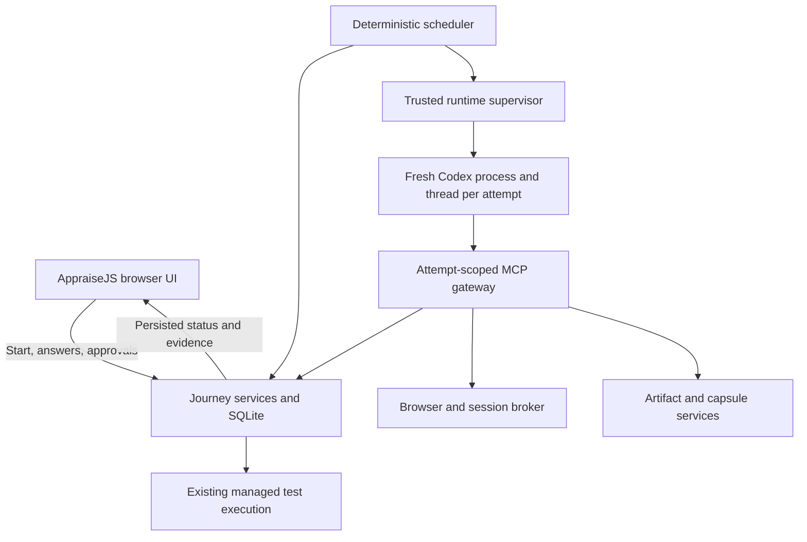

# AppraiseJS-Owned Quality Journey Coordinator — Development Plan

Status: planned; implementation has not started. Research baseline: 2026-09-09.

This plan is the named specification for replacing external Quality Journey coordination with an AppraiseJS-owned
local runtime. The [task register](TASK_REGISTER.md) is authoritative for task status, dependencies, verification
evidence, phase gates, blockers, and the next executable task. Saving these documents does not execute the migration.

## 1. Outcome and accepted product decisions

A user creates a Quality Journey in AppraiseJS, explicitly starts it, answers questions and reviews artifacts in
AppraiseJS, and receives a completed, evidence-backed report. AppraiseJS schedules and supervises the workers and
test runtime throughout. The user does not open an external coding-agent task to coordinate the Journey.

| Decision                | Selected behavior                                                                                                                                  |
| ----------------------- | -------------------------------------------------------------------------------------------------------------------------------------------------- |
| Product scope           | Complete Quality Journey: analysis, discovery, scenario design, automation preparation, execution, triage, revision/remediation/rerun, and closure |
| Coordinator             | Deterministic workflow engine; AI workers perform bounded role assignments                                                                         |
| Initial provider        | Installed Codex CLI through App Server; provider-neutral internal contract                                                                         |
| Authentication          | Provider-native account login; no automatic API-key or billing fallback                                                                            |
| Deployment              | Local macOS service with the existing browser UI                                                                                                   |
| Starting work           | Explicit Start Journey action after confirmation; confirmation alone does not spend AI work                                                        |
| Continuation            | Automatic between existing human gates while the Start grant remains valid                                                                         |
| Target modes            | Existing local-workspace and remote-black-box web targets                                                                                          |
| Authenticated scouting  | Included in the first production release                                                                                                           |
| Target sign-in          | Human login/SSO/MFA in an AppraiseJS-owned browser; no automated password login in v1                                                              |
| Browser session storage | In memory; restarting the owning service requires sign-in again                                                                                    |
| External workflow       | Full replacement; the feature is unreleased, so no active external-Journey migration path                                                          |
| Concurrency             | One active AI worker globally in v1; enforce through persisted ownership                                                                           |
| Attempt policy          | Preserve existing authorization attempt ceilings; no automatic increases                                                                           |
| Active-work deadline    | Default 30 minutes per AI attempt; display before Start; expiry creates an operational pause requiring user action                                 |

Human waits do not consume the active-work deadline. Pausing admission is distinct from cancelling a Journey or
changing a lifecycle blocker. Budget changes cannot silently modify an already-issued immutable authorization.

Out of scope: general coding-task coordination, autonomous product-code repair, Claude/Cursor adapters, hosted
execution, desktop application packaging, Linux/Windows qualification, automated target credential login, and
changes to the repository-development swarm policy. Existing test-automation preparation is in scope.

## 2. Research findings and feasibility

The transition is a conditional go. AppraiseJS already owns durable Journey state and acceptance rules, but its
current handoff asks an external harness to coordinate workers. This split plausibly explains handoff and continuation
friction; it does not prove that all workflow failures originate there.

### Current source baseline

Reverify these observations before implementation; file names and line numbers may change after this research.

| Existing mechanism                                                               | Reuse or missing work                                                            |
| -------------------------------------------------------------------------------- | -------------------------------------------------------------------------------- |
| Journey stages, versions, immutable artifacts, commands and events               | Keep as domain authority                                                         |
| Transactional work claim, authorization, assignment, input hash and dispatch key | Reuse; add runtime ownership and renewal                                         |
| Agent Factory `supports` / `dispatch` interface                                  | No production registration was found; add the operational adapter                |
| `DISPATCH_UNRESOLVED` and explicit resume                                        | Reuse safe blocking; add continuous provider reconciliation                      |
| Worker lease expiry and heartbeat interval                                       | No Journey worker renewal implementation was found                               |
| Scout submission validation                                                      | No concrete Scout browser runtime was found                                      |
| Scout credential scope                                                           | Currently empty; authenticated scouting requires a new immutable profile version |
| Capsule execution reserve/launch/reconcile                                       | Reuse and connect to managed progression                                         |
| Human decision and consent services                                              | Preserve exact revision/scope binding                                            |
| Broad project coordinator bearer token                                           | Keep out of workers; introduce a narrower gateway and runtime principal          |

Primary local navigation:

- [Agent Factory](../../../../../src/lib/quality-journey/agent-factory.ts)
- [Role definitions](../../../../../src/lib/quality-journey/role-definitions.ts)
- [Journey service](../../../../../src/services/coordinator/quality-journey-service.ts)
- [Discovery service](../../../../../src/services/coordinator/quality-journey-discovery-service.ts)
- [Execution runtime service](../../../../../src/services/coordinator/quality-journey-runtime-service.ts)
- [Handoff service](../../../../../src/services/coordinator/quality-journey-handoff-service.ts)
- [Persistence schema](../../../../../prisma/schema.prisma)
- [Coordinator request guard](../../../../../src/lib/coordinator-api/request-guard.ts)

### External findings

T3Code provides a useful precedent: the server owns agent processes and workspace operations, orchestration records
durable intent, and provider adapters translate normalized commands/events. Its engine commits events, projections
and command receipts together before publishing resulting state. This is architectural evidence, not proof that its
runtime satisfies AppraiseJS role isolation. Sources: [architecture][t3-architecture], [engine][t3-engine],
[adapter contract][t3-adapter].

Codex App Server documents stdio JSON-RPC, thread creation/resume/read, turn start/interruption, approval requests,
and provider-managed login. The locally observed CLI was `0.153.4`; this is a qualification candidate, not a certified
version. Prefer stdio and required MCP over experimental dynamic tools. [Codex App Server][codex-server]

Configuration controls exist for shell, memory and other surfaces. Requested settings do not establish an effective
tool inventory or enforce every filesystem/context boundary. [Codex configuration][codex-config]

Future Claude integration must separately resolve authentication: the SDK documentation restricts third-party
subscription-login offerings without prior approval. Cursor has a documented bidirectional ACP integration,
including permissions and cancellation. Neither adapter is part of v1. [Claude SDK][claude-sdk], [Cursor ACP][cursor-acp]

Playwright provides isolated browser contexts and authenticated state. Saved state can contain credentials capable
of impersonating the account; v1 keeps session state in memory and outside worker payloads. [Playwright auth][pw-auth]

### Unproven feasibility conditions

Phase 0 must establish effective tool inventory, context isolation, interception of unauthorized effects, process
ownership after supervisor death, and safe thread/turn reconciliation for the qualified Codex build. It must also
establish a viable browser isolation approach. Prompt instructions and negative probes alone are insufficient proof
of host-enforced confinement. Store effective host/configuration evidence alongside behavioral probes.

If a required boundary is unsupported, stop before Phase 1. Record the unsupported behavior and propose a separately
reviewed confinement design. Do not fabricate attestations, relax the role contract, silently use full access, or
replace Codex with another provider. The full-release estimate must then be reconsidered.

## 3. Architecture and invariants



### Ownership

1. Journey services and SQLite retain lifecycle authority. Do not introduce a parallel workflow truth in provider
   transcripts, browser state, the CLI, or a second database.
2. Extend the existing `appraisejs` CLI with a runtime entrypoint. It communicates through authenticated runtime
   endpoints; domain services continue to own database mutations.
3. Supervise the local application and runtime independently of browser tabs. A launchd user service is the macOS
   production packaging target. Sleep/logout interrupt availability; wake/restart initiates reconciliation.
4. The trusted supervisor owns provider transport/authentication, process control and sealed runtime capabilities.
   Model-visible workers receive only canonical assignment data and role-permitted tools.
5. The browser broker owns target cookies and authenticated sessions. Target credentials, provider login and
   execution consent are separate authorities.
6. `NETWORK` scope describes worker-visible target/data access. Provider transport connectivity belongs to the
   trusted control plane; this distinction must be explicit in contract documentation and evidence.

### Worker isolation and effects

- Use a fresh process, configuration/work directory and new thread per attempt. Do not fork external conversations.
- Same-attempt resume requires the persisted exact thread identity and matching runtime/configuration digest.
  Replacement gets a new process/thread and no predecessor transcript.
- Disable unrequested native tools, apps, memory, inherited configuration and project instruction ingestion using
  the qualified provider mechanism; verify actual effective state before the first model turn.
- Route model-visible artifact, browser and filesystem operations through the scoped gateway. The worker cannot
  directly access the database, broad coordinator token, lease token, raw credentials or unrestricted shell/network.
- Map every exposed concrete tool to an allowed abstract role capability. Unexpected tools/approval requests fail
  closed; answering a provider approval cannot broaden a Journey assignment.
- Validate attempt, generation, lease, role, input and authorization before a tool call and again after external I/O.
  Preserve an audit record of effects that occurred before revocation; rejecting output cannot undo those effects.
- Broker receipts bind attempt, tool, canonical argument/result hashes, policy decision and evidence identity.
  Worker narratives and raw stdout cannot substitute for those receipts or specialized semantic validation.

### Persistence and interfaces

Use additive migrations. Extend existing records where responsibility matches; do not duplicate immutable lineage.

| Record/interface      | Required content or behavior                                                                                                              |
| --------------------- | ----------------------------------------------------------------------------------------------------------------------------------------- |
| Start grant           | Journey and requirement identity, allowed automatic progression, limits, issue/revocation state; never a human-gate approval              |
| Runtime ownership     | Installation owner, expiry and monotonically increasing fencing generation                                                                |
| Provider dispatch     | Unique dispatch key, attempt, adapter, process birth identity, version/config digest, thread/turn IDs, state and reconciliation result    |
| Outbox                | Unique effect identity, canonical payload hash, pending/claimed/acknowledged/unknown status and attempt generation                        |
| Inbox                 | Provider delivery identity or stable adapter-derived identity, payload hash, processing status and durable cursor                         |
| Runtime attestation   | Actual evidence content, digest, qualified executable/protocol/config identities and effective boundaries                                 |
| Browser session grant | Journey/target/environment, allowed origins/routes/actions, issue/expiry/revocation state and opaque session reference                    |
| Adapter               | Dispatch, inspect/reconcile, event observation, interrupt and confirmed termination; provider-specific behavior stays here                |
| Runtime endpoints     | Start/pause/resume/status, fenced claims/renewal, event/effect ingestion and reconciliation; authenticated principal determines authority |
| Worker gateway        | Scoped reads/proposals/observations only; no worker-selected actor or arbitrary lifecycle command                                         |

Do not accept a client-supplied `actor: USER` or an adapter-authored digest as proof of authority. Resolve principals
and attestation provenance on the trusted side. Preserve useful MCP/catalog capabilities outside the removed external
coordination flow.

### Launch and recovery protocol

Dispatch state: `RESERVED -> STARTING -> READY -> RUNNING -> OUTPUT_RECEIVED -> FINISHED`, with explicit `UNKNOWN`
and `FAILED` outcomes. Physical stop state is independent: `STOP_REQUESTED -> STOPPING -> STOPPED`, or `STOP_FAILED`.

1. Atomically persist claim, immutable assignment and launch intent before any external spawn.
2. Claim the outbox effect under current runtime/attempt fencing. Persist `STARTING` before spawning.
3. Create and identify the provider process, handshake, create the thread and qualify its effective boundaries.
   No model turn begins until the session identity and valid receipt are durable (`READY`).
4. Persist turn-start intent, then request the turn. A lost acknowledgement produces `UNKNOWN`; inspect the bound
   session rather than blindly sending another turn.
5. Persist normalized events and deduplicate effects. Accept output only through its specialized role ingress.
6. Revoke capabilities on logical cancellation immediately. Track physical termination until confirmed.
7. Resume the exact bound attempt, prove absence/non-start and retry safely, or remain unresolved. These are the
   only automatic recovery outcomes. No replacement while a predecessor may still execute.

Do not claim exactly-once external model execution. AppraiseJS transitions and accepted artifacts must be idempotent;
provider creation/turn ambiguity remains explicit unless a qualified provider primitive proves otherwise.

### Scheduler policy

| Current persisted condition                          | Automatic action                                                      |
| ---------------------------------------------------- | --------------------------------------------------------------------- |
| Eligible work + valid Start grant + available slot   | Claim next eligible role in existing stage order                      |
| Claimed work without dispatch                        | Reserve and dispatch                                                  |
| Starting/unknown dispatch or uncertain termination   | Reconcile only                                                        |
| Confirmed worker active                              | Observe and renew the current fenced lease                            |
| Output received                                      | Invoke specialized role validation; never infer completion from prose |
| Analyzer/design/report feedback                      | Issue only the existing revision work authorized by that decision     |
| Execution ready                                      | Start only when exact existing execution consent is valid             |
| Remediation/rerun proposed                           | Wait for required exact proposal approval before issuing new work     |
| Question, review, login or operational pause pending | Wait; do not busy-loop or invent consent                              |
| Revoked/cancelled/closed                             | Revoke access, stop owned processes and reconcile termination         |

Start grants authorize scheduling, not analysis/scenario approval, execution consent, remediation/rerun approval,
report review, risk acceptance or closure. Preserve every specialized human gate already present.

### Authenticated browser behavior

The user signs in through an AppraiseJS-launched isolated browser. Scout receives authorized observations and an
opaque grant reference, never cookies, headers, passwords or login-page captures. Session expiry pauses for login;
service restart loses the session and visibly requests login again. Automated password login is excluded from v1.

Scope page, resource and identity-provider origins explicitly. Enforce redirects, frames, background requests,
service workers, WebSockets and downloads through the qualified broker policy; unsupported traffic fails visibly.
Authentication effects need their own user authorization. Observation access does not authorize arbitrary form
submissions, mutations or cross-origin navigation. Do not equate GET/navigation with a universal absence of target
side effects. Validate application-specific interaction policy using controlled fixtures.

## 4. How to progress through this plan

### Start or resume an implementation session

1. Read this plan and the register, then current root/package `AGENTS.md` and applicable skills. Classify the task
   through the repository router. Default to one coordinator for a bounded, verifiable task.
2. Confirm what the user requested: one task, a phase, or the complete plan. Work only within that authorized range.
   A request to save or revise this plan is not a request to start implementation.
3. Inspect branch and dirty state. Branch before implementation using `codex/`; preserve unrelated work, including
   the pre-existing `package-lock.json` modification observed when this plan was saved.
4. Reverify the source baseline relevant to the next task. Treat source drift as evidence to record, not a reason to
   silently change accepted product decisions.
5. Select the lowest-numbered `pending` task whose dependencies are `verified` and whose preceding phase gate passed.
   Set its status to `in_progress` and fill in the active handoff record before editing source.

### Execute a task

1. Read the task's scope, acceptance and verification. Define its exact changed surface and any fault fixture first.
2. Keep work bounded. If a task requires independent responsibilities or is too large for a focused change, split
   it into suffix IDs (for example `P1.3a`, `P1.3b`) in the register before implementing; preserve parent acceptance.
3. Implement canonical source. Change scaffold templates only through the root-to-template sync workflow.
4. Run focused checks and the task-specific behavioral tests. Expand checks based on affected surfaces and risk.
5. Review the exact diff. Obtain independent review for boundary, authentication, persistence and recovery changes.
   Bind that review to a commit SHA or a content digest covering the complete reviewed artifact.
6. Record commands, outcomes, artifact references and unresolved limitations in the task's evidence record.
7. Only then mark the task `verified` and its master checkbox `[x]`. `Implemented`, `tests not run`, `waived` and
   `looks correct` are not equivalent to verified.
8. Continue to the next eligible task within the user's requested range. Do not ask for routine reapproval at each
   task. Pause only at a genuine missing decision, required product gate, or failed feasibility boundary.

### Phase gates

At each phase end, evaluate the gate criteria in the register. All required tasks must be verified, evidence must
match the current artifact, and blocking findings must be resolved. Record `passed` or `blocked`; do not advance on a
partial pass. A later change invalidating a gate reopens the affected tasks and gate before downstream work proceeds.

Phase 0 is a hard investment gate. A failure requires an explicit unsupported-boundary record and revised design,
not a best-effort production adapter. Later phases may use deterministic fake providers for development, but cannot
claim real-provider acceptance until qualification passes.

### Blockers, changes and safe stopping

- Record a blocker ID, affected task/gate, observed behavior, reproduction, impact, attempted resolution and exact
  condition required to unblock. Differentiate code defects, infrastructure failures and product decisions.
- Continue independent authorized work only when dependencies permit. Never mark a blocked task complete.
- A change to providers, isolation, authority, human gates, concurrency policy, billing, target-login method or
  supported platforms requires explicit user direction and an updated decision record.
- Do not weaken required boundaries, bypass hooks, reset the database or discard dirty changes to get green checks.
- On interruption, leave an exact next action, file/branch state, test evidence and any owned process identities.
  A successor must recheck live process ownership before signalling or replacing anything.
- Commit/push/PR/merge/release only within the user's authorized delivery scope. Do not invent a publication task.
  When publication is requested, record terminal CI and exact reviewed/merged identity; do not mark publication
  complete merely because a PR was opened.

### Recordkeeping rules

The register is the sole task-status source. Keep task IDs stable. Update the master row, its evidence record and
active handoff together. Do not duplicate status checkboxes in other plans. Reference evidence by stable repo path
or sanitized artifact URI; keep credentials, raw authentication state and unsanitized provider logs out of Git.

Recommended evidence layout during implementation: `evidence/P0.1.md` and corresponding task IDs beside this plan,
with only sanitized summaries and hashes. Do not create placeholder evidence that implies a test ran. Raw local
diagnostics remain ignored outside the committed plan directory.

## 5. Validation and release contract

Use deterministic fake-provider/fault tests first, followed by real qualified-provider tests on macOS. Never use an
external production application as a destructive test fixture.

| Area           | Required evidence                                                                                                            |
| -------------- | ---------------------------------------------------------------------------------------------------------------------------- |
| Ownership      | Duplicate Start, two supervisors, singleton fencing, stale generations                                                       |
| Leases         | Renewal, expiry, revocation races, no immutable-manifest rewriting                                                           |
| Launch         | Crash before/after each commit, spawn, handshake, thread creation, turn creation and acknowledgement                         |
| Cancellation   | Late calls/results, hung descendants, PID reuse, stop failure, supervisor death                                              |
| Isolation      | Effective inventory and host evidence plus forbidden file/shell/network/context/tool probes                                  |
| Authentication | Human login/MFA, expiry/restart, revoked grants, cross-Journey reuse, redirect escape, secret canaries                       |
| Evidence       | Forged receipts, stale input, duplicate delivery, partial outputs, oversized payloads, interrupted I/O                       |
| Lifecycle      | All six roles, exact human gates, revision loops, execution failure, remediation/rerun, risk acceptance and closure          |
| Operations     | Fresh installation, browser close, sleep/wake, service restart, offline state, unavailable MCP, unsupported provider version |

Relevant command sources are current `package.json` and `docs/agent-validation-matrix.md`. Expected checks include:

```sh
npx eslint <affected-source-files>
npx prettier --check <affected-files>
npm run validate:unit -- <related-test-files>
npm --prefix packages/appraisejs test -- <related-package-test-files>
npm run validate:migrations
npm run build
npm run release:check:artifacts
npm run release:check:packages
npm run check:harness
```

Use migration checks for schema work; run broader build/package/harness checks when affected and at integration
gates. Use the repository Browser workflow for interactive UI verification; document any required fallback. Execute
real-provider tests only with the authorized test account and bounded workload. Re-run invalidated checks after fixes.

When applicable, synchronize canonical changes with:

```sh
npm --prefix packages/create-appraisejs run prepare-template
npm run graphify:auto
```

Regenerate coordinator references and operation projections/certification only when their source changes require it;
use the current scripts. Never hand-edit generated output or format generated certification receipts after generation.

Release acceptance requires all phase gates, complete anonymous and authenticated Journey demonstrations, and no
unresolved boundary/recovery/security findings. Separately evaluate artifact quality, user interventions, latency
and resource use. Passing process tests does not prove the AI produces useful scenarios or correct triage.

## 6. Cutover and compatibility

The external coordination feature is unreleased. Remove handoff/ticket/launch surfaces and stale onboarding only
after the managed path passes its gates. A temporary development admission switch may hide incomplete managed work;
it is not a supported dual-owner product mode.

Preserve historical records. Explicitly retire or make old active external attempts ineligible for runtime adoption;
disable legacy resume behavior that would synthesize authority for them. No database reset, fabricated receipt,
approval transfer or active-Journey migration path is required. Do not delete unrelated authored artifacts or targets.

Qualify updates against stored data as well as the protocol. Drain active work before switching executable versions.
If an old binary cannot decode new schema/state, refuse downgrade clearly rather than opening incompatible storage.
Uninstalling the service stops its processes and preserves user data.

## 7. Estimates, assumptions and evidence limits

Planning estimate for one experienced engineer familiar with AppraiseJS and assisted by coding agents:

| Milestone                       | Effort                 |
| ------------------------------- | ---------------------- |
| Provider/boundary proof         | 1–2 weeks              |
| Managed analysis vertical slice | 3–5 weeks cumulative   |
| Complete hardened release       | 12–20 weeks cumulative |

These are estimates, not measured delivery times. Failure of provider confinement or process-recovery qualification
can require a separate macOS enforcement design and invalidate the estimate. No prototype, paid provider test,
crash drill or isolation qualification was performed during research.

### Sources

External sources were consulted on 2026-09-09. T3Code links track mutable `main`; record exact upstream revisions
when deriving implementation behavior or vendoring any material. Reverify vendor protocol documentation at Phase 0.

- [T3Code architecture][t3-architecture]
- [T3Code orchestration engine][t3-engine]
- [T3Code provider adapter][t3-adapter]
- [T3Code provider constraints][t3-providers]
- [Codex App Server][codex-server]
- [Codex configuration][codex-config]
- [Claude Agent SDK][claude-sdk]
- [Cursor ACP][cursor-acp]
- [Playwright authentication][pw-auth]

[t3-architecture]: https://github.com/pingdotgg/t3code/blob/main/docs/internals/overview.md
[t3-engine]: https://github.com/pingdotgg/t3code/blob/main/apps/server/src/orchestration/Layers/OrchestrationEngine.ts
[t3-adapter]: https://github.com/pingdotgg/t3code/blob/main/apps/server/src/provider/Services/ProviderAdapter.ts
[t3-providers]: https://github.com/pingdotgg/t3code/blob/main/docs/internals/providers.md
[codex-server]: https://learn.chatgpt.com/docs/app-server
[codex-config]: https://learn.chatgpt.com/docs/config-file/config-reference
[claude-sdk]: https://code.claude.com/docs/en/agent-sdk/overview
[cursor-acp]: https://cursor.com/docs/cli/acp
[pw-auth]: https://playwright.dev/docs/auth
