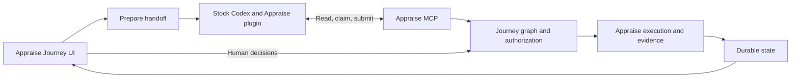

# AppraiseJS Quality Journey — Stock Codex Plugin Architecture

Status: architecture adopted by the user on 2026-09-11; C0.1, C0.2, C0.2e, C0.3 and C0.4 verified; GC0 passed its
feasibility gate after independent exact-artifact review; C1.1, C1.2 and C1.3 are verified. GC1 `passed` after
[independent usable-handoff review](evidence/GC1.md); C2.1 is verified after independent exact-artifact review, and
C2.2 is the exact next eligible task. The
explicitly authorized retained C0.2e slice was the only implementation permitted before GC0 passed.
The [task register](TASK_REGISTER.md) owns active task status, dependencies, gates and evidence. **C0.1: qualify the
Appraise-to-Codex handoff** is verified as a bounded qualification task. Its [evidence](evidence/C0.1.md) records
28 passing tests, human-operated local/remote URI and authenticated handoffs, disposable plugin recognition,
and missing-plugin/marketplace, protocol-denial, unsent-composer and expiry observations. C0.1 did not itself pass a
GC gate or start general feature implementation. **C0.2: qualify graph
acceptance and interrupted resume** is verified
as a bounded negative qualification. Its [evidence](evidence/C0.2.md) demonstrates claim, isolation, fencing and
interrupted resume while recording the missing stock-task dispatch/submission bridge. C0.2 did not itself evaluate
GC0 or start C1 implementation.

The [C0.2 blocker investigation](evidence/C0.2-BLOCKER-INVESTIGATION.md) traces this gap to managed-worker admission
and originally proposed a disposable experiment. On 2026-09-12 the user authorized a narrow implementation-order
exception: **C0.2e delivers retained, production-intended external-assignment admission code before GC0**, then
qualifies it with disposable fixtures. Follow [C0.2e implementation scope](C0.2e-IMPLEMENTATION.md) and the register.
This retained slice is verified after independent exact-artifact review; C0.1 and the original C0.2 negative evidence
retain their meaning. C0.2e did not itself evaluate GC0 or authorize C1.

**C0.3: qualify discovery and evidence feasibility** is verified as a bounded feasibility/negative-production result. Its
[evidence](evidence/C0.3.md) demonstrates a disposable Journey/target/origin-bound browser-session prototype,
synthetic login/MFA separation, redirect/request containment, context-replacement/expiry/logout/revocation behavior
and limited secret-canary projection checks. It also establishes that current discovery receipt descriptors are not
issuer-backed and therefore cannot promote host-browser observations into trusted Appraise evidence. Production human
login, process-restart invalidation, comprehensive secret containment and sealed discovery receipts remain C2.3/
`C-B04` work. The result does not evaluate GC0 or start C0.4/C1/C2.

**C0.4: review feasibility and establish exact implementation gaps** is verified. Its
[evidence](evidence/C0.4.md) preserves every earlier qualification boundary, maps all six roles and supported target
modes, and supports the independently accepted GC0 feasibility pass. C-B01 has since closed through C1.1–C1.3, and
the C1.3 portion of C-B03 is closed; C-B02 later closed through verified C2.1, while C-B03–C-B05 retain their
assigned C2–C3 ownership. GC0
`passed`; this does not certify production integration.

**C1.1: plugin setup and compatibility diagnostics** is verified after independent exact-artifact review. It delivers
the package-shipped, skills-only plugin, operator setup commands, compatibility diagnostics, manual MCP fallback and
live install/uninstall/reconnect evidence.

**C1.2: prepared Journey launch** is verified with validated encoded deep links, minimal redacted plugin prompts,
local and neutral remote-target host contexts, copy fallback, truthful connection observation, and bounded
non-consuming rejection envelopes. Its [evidence](evidence/C1.2.md) includes a live Appraise-to-Codex authenticated
redemption/read smoke and the accepted independent exact-artifact review.

**C1.3: later-stage reconnect and takeover** is verified after independent exact-artifact review. Its
[evidence](evidence/C1.3.md) covers mutable-stage reconnect, fresh scoped fallback when known-task reopen is not
qualified, exact state/effect snapshots, expiring UI-only approval, monotonic generation fencing, transaction-local
mutation admission, restart/lost-reply/concurrency recovery, and a live generation-6 to generation-7 takeover with a
non-mutating stale-owner rejection. This closes C-B01 and the C1.3 portion of C-B03. The first independent gate
review found the live later-stage and current-product remote sequence incomplete. A current-product remote
`DISCOVERY` trace subsequently closed `GC1-B01` through launch, Send, redemption/read, Appraise UI takeover and
stale-predecessor rejection; [GC1](evidence/GC1.md) passed. **C2.1: graph claim and submission contracts** is
verified. Its [evidence](evidence/C2.1.md) covers role-neutral durable external claim/admission, all six existing
specialized submission boundaries, atomic acceptance and replay/outcome reconciliation, legacy-ingress fencing,
native MCP/CLI parity and bounded recovery instructions. Independent exact-artifact re-review accepted manifest
`fbbfd9dd0d04b66aed8106af416082a39bbb7bd2acdd41d0346801aed1d0afb5` after generated-reference and legacy-bypass
repairs. This closes C-B02 for its C0.2e/C2.1 scope. GC2 remains `not_evaluated`; C2.2 is eligible and unstarted.

## 1. Decision and product experience

Keep the complete Journey graph and Appraise-owned lifecycle. Use stock Codex as the external AI executor, connected
through Appraise MCP and packaged with workflow skills as a plugin. The user begins in AppraiseJS, prepares and
confirms a Journey, then selects **Continue in Codex**. Codex opens with a workspace and a prefilled handoff prompt;
the user sends it. Appraise remains the place for progress, questions, approvals, execution evidence and closure.

This supersedes the managed-runtime direction, including D10/D14 provider attestation/interception, D15 development
admission, and removal of external handoffs. Preserve the [old plan](PLAN.managed-runtime-archive.md),
[old register](TASK_REGISTER.managed-runtime-archive.md), and all existing evidence. Old P0–P6 tasks and G0/G0D gates
are inactive for this architecture. They must not be marked passed or used to admit this release.

| Area                    | Adopted behavior                                                                                                                                           |
| ----------------------- | ---------------------------------------------------------------------------------------------------------------------------------------------------------- |
| Lifecycle               | Analysis, discovery, scenario review/revision, automation preparation, execution consent, execution, triage, remediation/rerun and closure remain in scope |
| Start                   | Prepare in Appraise; explicitly open Codex; user sends the prefilled prompt; confirmation alone starts no AI work                                          |
| Execution host          | Stock installed Codex on macOS; its normal login, model selection, permissions and usage limits                                                            |
| Integration             | MCP enforces Appraise operations; plugin bundles setup and workflow guidance; hooks are optional conveniences                                              |
| Authority               | Appraise validates graph eligibility and commits lifecycle changes; Codex proposes work and requests authorized operations                                 |
| Continuation            | Agent requests next eligible work while its task runs; explicit resume after stops or human waits; no guaranteed background wake                           |
| Target modes            | Local workspace and remote black-box web targets; remote targets never acquire invented filesystem bindings                                                |
| Human decisions         | Existing Appraise-owned answers, reviews, consent, risk acceptance and closure gates remain mandatory                                                      |
| Concurrency             | One active AI assignment per Journey; cross-Journey work remains independently scoped; host-global AI concurrency is not promised                          |
| Limits                  | Preserve immutable authorization attempt ceilings; assignment expiry and retry admission are Appraise-enforced; no claim to cap all Codex spend            |
| Authenticated discovery | Human-assisted access with a separately qualified Appraise-owned browser/evidence path; no automatic credential login                                      |
| Future service          | Separately scoped managed orchestrator, potentially paid and API-backed; no subscription-token forwarding or billing fallback in this release              |

API access is a likely integration choice for a future hosted/managed offering, not a proven technical requirement
for every orchestrator. Provider agreement, billing, tenancy, secret storage, budgets and service operation require
separate design and approval. This plan makes no legal clearance or paid-service commitment.

## 2. Ownership and graph contract

```mermaid
flowchart LR
    UI[Appraise Journey UI] --> H[Prepare handoff]
    H --> C[Stock Codex and Appraise plugin]
    C <-->|Read, claim, submit| M[Appraise MCP]
    M --> G[Journey graph and authorization]
    G --> E[Appraise execution and evidence]
    E --> S[Durable state]
    S --> UI
    UI -->|Human decisions| G
```

The graph is persisted workflow state, not a mandatory topology of isolated model processes. Existing role contracts
remain useful for task context and artifact requirements. One Codex task may perform multiple eligible roles;
host-native delegation is optional. A claimed role, worker registration or skill invocation does not establish an
independent reviewer, isolated context or restricted host tools. Where independence is required, record and verify
an independently identified reviewer or retain the human gate; otherwise report the review's actual assurance.

The normative cycle is: read authoritative state → claim eligible assignment → fetch bounded context → perform work
→ submit candidate → validate and commit → read next eligible work. Reuse specialized `quality_journey_*` operations
and existing claims, authorization, artifacts, events and runtime capsules. Do not add a generic state-mutation API
or duplicate workflow engine. Audit each existing operation before relying on its enforcement.

Required service invariants:

- Derive the principal from authenticated transport, validate target/Journey binding, and enforce every applicable
  prerequisite, permission and human gate server-side. A prompt, ticket or plugin declaration is never sufficient authority.
- Assignments bind immutable input revisions, role, target and an ownership generation/lease. A second claimant or
  stale owner cannot commit. Renewals, expiry and explicit takeover must be transactional and auditable.
- Validate full canonical arguments and artifact schemas at the service boundary, even if Codex presents a simplified
  schema. Reject invalid data with structured correction guidance; do not silently remove canonical constraints.
- Bind idempotency to principal, operation, assignment and payload identity. Exact retries return the recorded result;
  reuse with different input conflicts. Lost acknowledgement requires querying durable outcome before repeating effects.
- Recheck authority at effect admission and result acceptance. Late, revoked, wrong-target and stale submissions do
  not advance the graph. Retain useful rejected-attempt diagnostics without publishing partial artifacts as accepted.
- Execution remains Appraise-owned and consent-bound. Agent text, arbitrary host browser output and independent
  TestRuns cannot substitute for required sealed Journey evidence. Structural validation does not establish semantic quality.
- All normal client paths, including the supported local CLI bridge, apply equivalent authorization. No capability
  guarantee depends on hiding a tool from Codex or trusting skill compliance.

Trust limit: this integration protects operations mediated by Appraise. It is not a sandbox against an external
agent with direct write access to Appraise's database, service code or credentials. Keep the target workspace separate
from the hub's data/credentials in supported deployment, avoid exposing broad credentials in prompts, and document
remaining same-user host trust. General Codex shell/browser access remains controlled by Codex and the user.

## 3. Handoff, setup and connection paths

Use documented `codex://new` or `codex://threads/new` links with URI-encoded `prompt` and, for a local target, validated
absolute `path`. A plugin mention can be included in the prompt. These links prefill the composer; they do not submit
it. Existing-task links can reopen a known local task but do not prove it resumed work. Qualify installed-version
behavior before implementing the default launch. Record the resolved application bundle and CLI separately; do not
assume the application is named Codex.app. A host-tool denial blocks observation, not proof of URI support or failure.

Reuse the existing ten-minute, one-time handoff ticket mechanism after checking its scope. The ticket is not a
coordinator bearer credential: redemption must still require the configured authenticated MCP client and exact
Journey/target match. Do not put provider tokens, passwords, full requirements or broad Appraise credentials into a
URL. Redact short-lived tickets from logs/diagnostics and minimize prompt contents. Fetch requirements after redemption.

| Path                                       | Required behavior and acceptance                                                                                                                              |
| ------------------------------------------ | ------------------------------------------------------------------------------------------------------------------------------------------------------------- |
| New local Journey                          | Confirm immutable requirement, prepare ticket, open correct workspace and plugin prompt, send, redeem, then fetch authoritative state                         |
| Remote web target                          | Use a qualified projectless host task or explicit neutral workspace; retain remote target identity and never treat neutral workspace as the target repository |
| Codex absent / URI handler denied          | Show actionable setup plus copy-prompt fallback; retain Journey; do not label launch as connected                                                             |
| Plugin missing / marketplace unavailable   | Guide install/connect through a documented distribution path; manual registered MCP plus exact prompt is the fallback; no automatic trusted-hook dependency   |
| MCP unavailable / wrong hub / wrong target | Stop Appraise work and show diagnostic/reconnect guidance; never forward credentials to an arbitrary origin                                                   |
| User closes composer / ticket expires      | No work claimed; offer a fresh handoff; expired or replayed ticket cannot connect                                                                             |
| Repeated click / concurrent redemption     | One effective redemption; superseded links cannot create a second active assignment                                                                           |
| Browser return / Appraise reload           | Reconstruct status from durable state; opening an app is not evidence that the task is running                                                                |
| Existing task available                    | Reopen recorded task if supported; user resumes; verify current assignment and state through MCP                                                              |
| Task missing / archived / new host         | Offer fresh context handoff and explicit fenced takeover after reconciliation; never replay the entire old prompt as authority                                |

Product status distinguishes prepared, launch requested, connected, assignment active, awaiting human, paused,
reconnecting, failed and completed. Map existing persisted values rather than inventing observed liveness. A heartbeat
or recent call can report last activity; silence means unknown/inactive, not automatically success or failure.

C0.1 observed that omitting `path` inherits the current workspace on the tested host; it does not establish a
projectless task. Do not use a pathless URI as a projectless guarantee. Qualify an explicit neutral workspace for
remote targets, retaining the remote URL as target identity, or independently demonstrate another projectless path.

Current implementation prepares and validates an encoded `codex://new` link with a copyable minimal prompt. Local
targets use their validated absolute workspace; qualified remote targets use a per-handoff neutral temporary host
workspace while retaining the normalized remote URL as the Appraise target. Every mutable Journey stage may prepare a
generation-fenced reconnect. Stock Codex does not expose a qualified known-task reopen contract, so Appraise records
host availability as unknown and prepares a fresh scoped fallback. Redemption remains connection evidence; an
expiring, request-bound Appraise UI approval and exact authoritative reread are required before takeover.

## 4. Lifecycle and recovery coverage

| Stage/path                        | Graph and user behavior                                                                            | Required evidence                                                                        |
| --------------------------------- | -------------------------------------------------------------------------------------------------- | ---------------------------------------------------------------------------------------- |
| Requirement analysis              | Read immutable input; submit analysis or bounded questions; human answers return through Appraise  | Revision binding and exact question/answer lineage                                       |
| Discovery                         | Anonymous first; authenticated path only with qualified human sign-in; record scope and provenance | Target-bound observations; missing access is an explicit blocker                         |
| Scenario design/revision          | Candidate review, rejection and revision loop in Appraise                                          | Exact artifact/version decision; old approval cannot apply to new content                |
| Automation preparation            | Use canonical operations and approved definitions; stay within target/assignment scope             | Bound preparation artifacts and required verification; no autonomous product-code repair |
| Execution                         | Obtain Appraise consent, reserve/launch/reconcile runtime capsule                                  | Sealed run identity, inputs, logs and evidence; no duplicate launch on retry             |
| Triage/remediation/rerun          | Classify evidence, seek required decisions, issue fresh scoped work and consent where required     | Lineage to exact failed run and changed artifact                                         |
| Report/closure                    | Human report review, risk acceptance where allowed, final closure through dedicated operations     | Required decisions and evidence; agent's final message never closes Journey              |
| Human wait                        | Release or park assignment according to explicit lease policy; preserve durable blocker            | No hidden renewal or assumed approval; re-read state after decision                      |
| Codex crash / offline / quota     | Preserve accepted work; pause external progress; reconcile before fresh claim                      | No automatic model/billing fallback, no assumption Codex can be killed by Appraise       |
| Appraise restart / lost MCP reply | Recover committed outcome and execution status; reconnect with current credentials                 | Duplicate/stale rejection and uncertain-effect reconciliation                            |
| Pause / cancel / revoke           | Stop new Appraise admissions, fence late calls; stop owned test/browser runtime with receipt       | UI distinguishes request from observed stop; external Codex may continue unrelated work  |
| Target edit / deletion / archive  | Invalidate mismatched input/grants; preserve historical evidence                                   | Explicit new revision/rebinding or refusal; no silent migration of authority             |

Authenticated browser policy: human login/SSO/MFA occurs only in the qualified Appraise-owned session. Credentials
are not sent to the model, plugin, artifacts or diagnostics. Bind session grants to Journey/target/origins, keep them
in memory, require sign-in again after restart/expiry, and verify logout/revocation, redirects and cross-Journey denial.
If this boundary cannot be demonstrated, authenticated discovery remains visibly unsupported/blocked. Human-provided
observations may be labelled supplemental but cannot silently satisfy the required trusted-evidence gate.

## 5. Qualification and implementation order

**Do not build old P1.1–P1.5 first.** C0 uses disposable fixtures and the current application/MCP surfaces to test the
new risk boundaries. A missing operation produces a precise gap and bounded follow-up experiment, not a simulated pass.
The user-approved **C0.2e exception** permits only the retained external Analyzer admission vertical slice described
in [C0.2e-IMPLEMENTATION.md](C0.2e-IMPLEMENTATION.md), including necessary canonical contracts, persistence,
authenticated MCP/CLI mapping, tests and documentation. Qualification uses disposable data and an explicit opt-in;
normal product-flow enablement remains gated. Do not discard qualified canonical code merely because it was built
in C0.2e. C2.1 reuses and hardens it. This is not permission to begin C1 or unrelated C2 implementation.
A local deterministic probe does not count as a live Codex integration check. Use a disposable target and bounded
account-authorized workload; do not execute model work merely because this plan was saved.

| Gate                     | Required outcome                                                                                                                                                                                                                                   |
| ------------------------ | -------------------------------------------------------------------------------------------------------------------------------------------------------------------------------------------------------------------------------------------------- |
| GC0 — feasibility        | Real handoff/redemption, one graph task, invalid/stale/duplicate rejection, interruption/resume, human gate, and browser feasibility verdict; evidence reviewed before general feature implementation; only the authorized C0.2e slice is excepted |
| GC1 — usable handoff     | Fresh setup/install, launch and fallback paths, early/later-stage resume and remote-target handling work end to end                                                                                                                                |
| GC2 — complete lifecycle | All stages, revision loops, consent-bound execution, authenticated discovery and report/closure gates verified                                                                                                                                     |
| GC3 — release            | Fault matrix, data compatibility, onboarding, plugin/contract version compatibility and clean installation verified                                                                                                                                |

GC0 may record a specific bounded browser implementation gap only if feasibility is demonstrated; an unresolved
browser architecture cannot be hidden behind a passing gate. Authenticated discovery remains a GC2/GC3 requirement.
All gates start not evaluated. GC0 must pass before C1 implementation. C0 evidence must bind source revision, relevant
dirty diff, stock Codex version, plugin/MCP contract version, target fixture, expected versus observed outcome and
cleanup. Record direct tests, live tests and untested assumptions separately.

The [task register](TASK_REGISTER.md) breaks the work into qualification, handoff, graph/lifecycle, recovery and release
slices. Split tasks further before implementation if source inspection identifies more than one bounded responsibility.
No schedule estimate is adopted until GC0 establishes the actual gaps and reusable surfaces.

## 6. Compatibility, release and future extension

Retain existing handoff APIs, stored Journeys and lifecycle IDs. Reuse source-backed contracts and migrate additively
only when needed. Old provider prototypes remain research fixtures and must never become default launch paths.
Document how preexisting active assignments expire/reconcile; no automatic ownership transfer, DB reset, approval
fabrication or adoption of unresolved effects. Resume and schema compatibility need tests with stored pre-change data.

Version plugin instructions against supported MCP contracts. Detect stale clients and provide reconnect/upgrade
instructions. Define a supported macOS/Codex version matrix; unknown versions require capability diagnostics, not
silent qualification. Uninstall/disconnect revokes Appraise access and stops admissions while preserving user data;
owned execution is reconciled explicitly. Upgrade/downgrade must refuse incompatible storage without data loss.

Future managed orchestration can implement the same graph-facing executor contract through a separately qualified
provider adapter. Keep reusable graph/authorization/evidence boundaries, but do not build hosting, payment, account
brokering, a model proxy, a Codex fork or managed-runtime supervision now. Revisit deferred provider research only
with explicit scope and an appropriate documented provider integration; it is not a prerequisite for this release.

## 7. Verification and source references

For each implementation slice, run relevant service/package tests and affected-file lint/format checks using current
`package.json`. Run migration checks for schema changes, build for runtime/config/schema or broad changes, contract
regeneration for MCP changes, scaffold sync when affected and Graphify update for committed source scopes. Follow
`docs/agent-validation-matrix.md`; use the repository Browser workflow for live UI checks and record fallback reasons.
Documentation-only updates require formatting, local links and an independent consistency/path-coverage review.

Current reusable source: `src/services/coordinator/quality-journey-handoff-service.ts`,
`src/services/coordinator/quality-journey-service.ts`, `src/services/coordinator/quality-journey-runtime-service.ts`,
`src/lib/quality-journey/agent-factory.ts`, `src/lib/quality-journey/role-definitions.ts`, and
`packages/appraisejs/src/mcp/registry.ts`. Inspect their actual contracts before editing.

- [Architecture decision](../../../../../docs/decisions/0004-stock-codex-journey-handoff.md)
- [Current lifecycle authority](../../../../../docs/agent-lifecycle-flow.md)
- [Current MCP setup](../../../../../docs/agent-mcp-setup.md)
- [Codex deep links](https://learn.chatgpt.com/docs/reference/commands#deep-links), checked 2026-09-11: new-task workspace/prompt/plugin prefill; user must send; existing-task links open only.
- [Plugin packaging and skills](https://learn.chatgpt.com/docs/skills-and-plugins), checked 2026-09-11: skills/MCP bundle and optional hooks, not an independent authority boundary.
