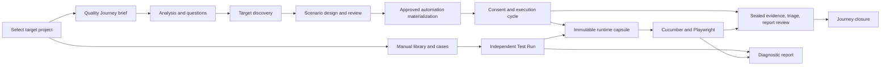

# AppraiseJS 0.5 application workflow reference

> **Documentation baseline:** the committed `appraise-0.5` branch at `86cd587ce74c6354ce7532dcd5a4a6145d4941de`, inspected on 27 September 2026. This is source material for the upcoming documentation-site update. It describes the application implemented at that commit, not work in progress in another checkout or a claim that every external provider has passed live qualification. Follow the linked source and contract documents when behavior changes.

## Purpose and audience

AppraiseJS is a local-first, single-user test-management and execution application. It has two complementary workflows:

1. **Quality Journey** guides a requirement through analysis, target discovery, scenario review, automation preparation, controlled execution, evidence review, and closure. Appraise owns the state and approvals; an agent may produce bounded work but cannot approve it for the user.
2. **Manual authoring** lets an expert maintain reusable test resources, compose cases and suites, and run independent tests for feedback or debugging. An independent run never becomes Quality Journey evidence simply because it passed.

This reference is written for documentation authors and agents updating [appraisejs.dev](https://appraisejs.dev/). It explains what a user does, what Appraise stores or generates, where the authority lies, and which source files should be checked before changing public instructions. The public site may describe an older workflow; use the pinned branch and this reference as the release baseline, then verify any later release changes.

## Product boundary and mental model

- One Appraise process serves one local user. Supported web and HTTP MCP processes bind to `127.0.0.1`; remote and multi-user exposure are outside the 0.5 design. A registered target can itself be a local workspace or a remote black-box HTTP(S) origin. These are distinct concepts. [README](../README.md), [project ownership](project-ownership-boundary.md)
- SQLite through Prisma owns authored records, Journey state, execution metadata, reports, and metrics. `automation/` is derived distribution output, never a second authoring database or a managed-run input. [schema](../prisma/schema.prisma), [automation authority](automation-sync-rules.md)
- The active **Target Project** scopes almost every record and view. Ready Step Definitions form a shared library; project-owned cases and Journey materializations may reference them. [project ownership](project-ownership-boundary.md)
- A **Step Definition** is a reviewed, versioned unit of behavior. A case stores exact Step Invocations: definition ID, version, integrity hash, and typed inputs. Built-in operations supply trusted handlers. Drafts are not executable. [step and operation contract](operation-catalog-contract.md)
- A **runtime capsule** is an immutable execution snapshot. It freezes selected cases, steps, locators, environment identity, files, and expected results before a Test Run starts. Both Journey and independent runs use this pipeline. [runtime](test-run-runtime.md)
- A **Quality Journey** is the only agent-enabled quality authority. Its revisions, work assignments, review decisions, execution cycles, evidence receipts, and closure are durable Appraise records. Chat agreement, a connected agent, and a completed generic Test Run do not advance its gates. [lifecycle](agent-lifecycle-flow.md), [contracts](quality-journey-contracts.md)

### End-to-end picture

The two paths share authoring primitives and execution infrastructure. Their authority differs: only the Journey path can produce a Journey quality outcome.

## 1. Install, start, and select a project

The public entry path is `npx create-appraisejs`. The package includes one base application template plus starter and blank overlays; normal scaffolding does not fetch a remote template. The generated project runs the local app, database, and browser tooling. For repository development, `package.json` is the command source of truth: `npm run setup` installs dependencies, sets up environment and Git configuration, generates/migrates Prisma, synchronizes built-in Step Definitions, and installs Playwright; `npm run dev` starts the development app with MCP support. Do not copy development commands verbatim into end-user quick starts without comparing the generated package README. [scaffold flow](agent-scaffold-flow.md), [root scripts](../package.json)

On first use, register a Target Project in **Projects**. A local workspace is identified by its canonical path; a remote black-box target is identified by a normalized credential-free HTTP(S) origin. Remote registration creates a default Environment but has no local Git/workspace or launch capability. The project selector determines the scope for subsequent pages. A valid `?project=<id>` URL wins over the active-project cookie; an invalid explicit ID does not silently fall back. Missing scope leads to project selection. Removing a project is name-confirmed and deletes its owned data. [project ownership](project-ownership-boundary.md), [Projects page](../src/app/%28base%29/projects/page.tsx)

**Dashboard** shows project-scoped case, suite, Step Definition, and running-run counts, attention items, execution health, and quick actions. **Settings** links to the actual Project, Environment, and Codex setup controls; it is a configuration overview, not a separate preference store. **Help** provides the Journey example, manual-authoring entry, setup/recovery pointers, and glossary. [dashboard](../src/app/page.tsx), [settings](../src/app/%28base%29/settings/page.tsx), [help](../src/app/%28base%29/help/page.tsx)

### Navigation at the release baseline

| Group     | Destinations                                                                            | User purpose                                                                   |
| --------- | --------------------------------------------------------------------------------------- | ------------------------------------------------------------------------------ |
| Control   | Dashboard, Quality Journeys, Collaboration                                              | See status, run the guided quality process, exchange reviewed repository data. |
| Execution | Test Runs, Reports, Test Suites, Test Cases                                             | Run and inspect tests, maintain executable cases and suites.                   |
| Library   | Step Definitions, Case Templates, Locators, Locator Groups, Modules, Environments, Tags | Build the reusable vocabulary and target context for tests.                    |
| System    | Projects, Settings, Help                                                                | Select scope, find configuration, get guidance.                                |

The route list and visible labels come from [navigation commands](../src/components/navigation/nav-command-helpers.ts). The UI calls reusable test-case structures **Case Templates** even where source and database identifiers remain `TemplateTestCase`. [navigation and help](desktop-navigation-and-help.md)

The old `/template-steps` URL redirects to `/step-definitions`; it is not a separate reusable-step authoring system. [redirect](../src/app/%28base%29/template-steps/page.tsx)

## 2. Model the target and reusable test library

### Projects, modules, environments, and tags

Each project is an isolation boundary for modules, suites, cases, templates, locators, environments, tags, runs, reports, metrics, collaboration, and Journeys. Module and environment names are project-local. **Modules** organize authored test assets. **Environments** identify the target used for execution or discovery; remote projects start with a default one. Environment secrets are configured by process-environment variable name and resolved only in the execution process, so do not put secret values in Appraise records or documentation examples. **Tags** classify authored assets and feed test selection/report grouping. [ownership](project-ownership-boundary.md), [schema](../prisma/schema.prisma), [environment pages](../src/app/%28base%29/environments/page.tsx)

### Locator Groups and Locators

**Locator Groups** organize target routes or pages under a module, and **Locators** define named selectors within that context. The UI includes create/modify pages and a browser-assisted locator workspace: choose a saved Environment or enter a URL, capture a selector, then save it under an existing or new group with its route and module. A locator binding carries persistent identity, version, project ownership, and group ancestry; reuse cannot silently reparent a group or cross a project boundary. The picker is an authoring aid, not permission to mutate a target beyond the operation being performed. [locator contracts](locator-graph-contracts.md), [locator pages](../src/app/%28base%29/locators/page.tsx), [group pages](../src/app/%28base%29/locator-groups/page.tsx)

### Step Definitions and built-in operations

The Step Definition registry is shared across projects. Authors can search ready definitions, create/edit drafts, validate or preview draft artifacts, and publish a reviewed ready version. Ready versions are immutable executable contracts; deprecation is audited and may identify a replacement. A composition definition can call exact ready child versions and map parent inputs or earlier outputs, with cycle and input checks at publication. The built-in operation catalog projects trusted browser handlers into ready definitions; a free-form step label is not executable authority. [contract](operation-catalog-contract.md), [registry page](../src/app/%28base%29/step-definitions/page.tsx), [operation source](../packages/cucumber-runtime/src/operations)

### Case Templates, Test Cases, and Test Suites

**Case Templates** are reusable project-owned case structures with steps, flow blocks, and parameters. A user can create one, maintain its flow, then select it under **Create from template**, provide parameter values, refine the prefilled case, and save a new Test Case. A template is authoring input, not a run result. **Test Cases** have a title/description, suite and tag associations, and an executable scenario made of exact Step Invocations. The graph-first editor and full linear editor are alternate views of the same authored flow. **Test Suites** collect project-owned cases, a module, and tags for organized execution and reporting. These entities have list, create, edit, and delete controls. [case routes](../src/app/%28base%29/test-cases/page.tsx), [template routes](../src/app/%28base%29/template-test-cases/page.tsx), [suite routes](../src/app/%28base%29/test-suites/page.tsx), [schema](../prisma/schema.prisma)

The library is also used by Journey discovery and automation. A published Step Definition may be shared globally, but a module, locator, environment, case, or suite belongs to one project. A Journey cannot treat a cross-project record as local merely because its name matches. [project boundary](project-ownership-boundary.md), [Journey contracts](quality-journey-contracts.md)

### Manual authoring walkthrough

1. Select a Target Project and register the Environment that will supply the execution base URL and any secret-variable references.
2. Create a Module, route-bearing Locator Group, and Locators for the target pages that the scenario will use. Tags are optional classification and selection aids.
3. Find a ready Step Definition whose typed inputs and behavior fit each action. Create and review a new definition draft only when the library lacks the behavior; a draft cannot run.
4. Create a Case Template when several cases share a reusable structure. Otherwise create a Test Case directly. Give each step an exact ready definition and inputs, and review the graph or linear flow.
5. Add the case to a Test Suite. Choose **Test Runs → Create Test Run** to execute by suite or tag, then inspect its report. For requirement-level quality decisions, start a separate Quality Journey and pass its own gates.

This is an ordering guide, not a requirement to create every resource: a project may already have ready definitions, locators, or suites. The UI and services validate the actual prerequisites at each save and run boundary. [case form](../src/app/%28base%29/test-cases/test-case-form.tsx), [run form](../src/app/%28base%29/test-runs/test-run-form.tsx)

## 3. Run authored tests independently

An expert can create a **Test Run** by selecting project-owned test suites or tags, an Environment, and browser settings, without opening a Journey. The create form warns when no suite contains a case. The service resolves the selected filters to cases within the active project. The run is marked `INDEPENDENT`; it has no Journey execution binding. Appraise validates that every required Step Invocation resolves to an executable ready definition. It materializes an immutable runtime capsule, performs preflight, starts a managed attempt, records logs and results, and parses a report. The target's mutable authored data or workspace `automation/` files are not reread as execution input after the capsule is sealed. [run runtime](test-run-runtime.md), [run form](../src/app/%28base%29/test-runs/test-run-form.tsx), [run service](../src/services/test-run/test-run-service.ts), [run pages](../src/app/%28base%29/test-runs/page.tsx)

Inside the capsule, the generator writes Gherkin features from selected cases and bindings that dispatch exact Step Invocations through the sealed Step Definition registry. The executor validates the command receipt and capsule contents before spawning the Cucumber/Playwright process. Execution events and output become durable Test Run status, logs, a parsed Cucumber report, and case/suite metrics. Root `cucumber.mjs` also describes direct workspace Cucumber invocation; it is not the managed run's authoring or execution source. [capsule materializer](../src/lib/runtime-capsule/materializer.ts), [file generator](../src/lib/runtime-capsule/file-generator.ts), [executor](../src/lib/executor/capsule-executor-adapter.ts), [automation authority](automation-sync-rules.md)

The Test Run page exposes status and diagnostics. Project-scoped routes provide bounded logs, trace/download artifacts, and failure diagnostics; logs support active streaming and stored `full`, `summary`, `errorsOnly`, `tail`, and `aroundFailure` reads. Foreign run IDs return opaque not-found responses. **Reports** provide run and case/suite views with parsed scenarios, steps, hooks, screenshots where present, timings, and metrics. Dashboard aggregates draw from the same project-scoped execution data. A failed or passed independent report helps debug authored work, but cannot be attached retroactively as a Journey execution receipt. [run routes](../src/app/api/test-runs/[runId]/logs/route.ts), [reports](../src/app/%28base%29/reports/page.tsx), [runtime](test-run-runtime.md)

## 4. Start a Quality Journey

A Quality Journey begins with a target-scoped requirement. The guided UI uses a mutable **draft** for the brief. It asks for an objective and supporting scope, actors, test data, risks, constraints, environment choices, coverage rigor, and desired evidence. The UI requires a complete guided brief before confirmation; the versioned API and MCP requirement contract accept an objective-only start for compact integrations. Drafts can be edited, archived, and restored. They are workspace content, not lifecycle work. [requirements](quality-journey-contracts.md), [new Journey](../src/app/%28base%29/quality-journeys/new/page.tsx), [draft page](../src/app/%28base%29/quality-journeys/drafts/[draftId]/page.tsx)

Confirming a saved draft consumes its exact version and normalized requirement hash in one transaction. Appraise creates the immutable requirement revision, enters Analysis through the canonical command boundary, issues the Analysis work item, and marks the draft confirmed. A stale or failed confirmation rolls back; an exact retry returns the same Journey. Once confirmed, the brief is part of immutable Journey history, not an editable draft. [lifecycle](agent-lifecycle-flow.md)

The visible Journey page groups canonical state into **Your brief**, **Test approach**, **Test scenarios**, **Test preparation**, **Run tests**, and **Results**. These are presentation stages. The underlying stage, revision identity, work item, and approval gates remain authoritative. The page polls a project-scoped status snapshot while visible and asks the user to explicitly load a newer version before making an exact-version decision; observation does not replace unfinished form input. [lifecycle](agent-lifecycle-flow.md), [Journey page](../src/app/%28base%29/quality-journeys/[journeyId]/page.tsx)

### Agent connection and work authority

The Journey can prepare a Codex coordinator handoff. The bootstrap uses a short-lived, one-use ticket; preparation does not itself connect an agent or approve work. Appraise validates ticket redemption, work claims, lease ownership, assignment version, capability boundaries, effective receipts, and immutable output artifacts. A replacement handoff supersedes older unredeemed tickets. Setup diagnostics describe the last observed state, not proof of a present live connection. [handoff contract](quality-journey-contracts.md), [MCP setup](agent-mcp-setup.md), [coordinator API](coordinator-api-mcp.md)

The six semantic agent roles are Requirement Analyzer, Scout, Resource Explorer, Test Scenario Designer, Automator, and Triager. The Runner and Factory coordinate bounded work; neither is a second quality authority. Appraise owns claims, attempt ceilings, expiry, revocation, retries, and stage transitions. User decisions always bind an exact revision and review hash. [role definitions](../src/lib/quality-journey/role-definitions.ts), [contracts](quality-journey-contracts.md)

## 5. Quality Journey stage by stage

The canonical normal path is:

`INTAKE → ANALYSIS → ANALYSIS_REVIEW → DISCOVERY → SCENARIO_DESIGN → SCENARIO_REVIEW → AUTOMATION → EXECUTION → TRIAGE → REPORT_REVIEW → CLOSED`

The table describes the successful path. Revision requests, invalidation, cancellations, blockers, and retries remain visible in durable history; they do not authorize a shortcut around a later gate. [lifecycle contract](quality-journey-contracts.md)

| Stage           | What happens                                                                                                                               | What the user reviews or controls                                                              | Durable output / gate                                                                                  |
| --------------- | ------------------------------------------------------------------------------------------------------------------------------------------ | ---------------------------------------------------------------------------------------------- | ------------------------------------------------------------------------------------------------------ |
| Intake          | Confirm the exact brief for a selected target.                                                                                             | Scope, environments, rigor, risks, desired evidence.                                           | Immutable requirement revision and Analysis work item.                                                 |
| Analysis        | Requirement Analyzer proposes a charter and explicit questions.                                                                            | Answer genuine gaps and correct answers before approval.                                       | Immutable charter, question, answer, and publication records.                                          |
| Analysis review | Runner publishes the exact charter and ordered Q&A review hash.                                                                            | Approve that exact analysis or request a revision with feedback.                               | Exact decision; approval starts frozen discovery.                                                      |
| Discovery       | Scout observes allowed target routes; Resource Explorer classifies existing project resources and operation capabilities.                  | Inspect provenance and resolve blockers through the supported retry or upstream revision path. | Target Observation and Resource Resolution bundles with hashes and evidence references.                |
| Scenario design | Designer proposes a portfolio with coverage rationale, dependency/branch/shared-setup graph, and separate scenario intent and feasibility. | Inspect proposed scenarios and their source coverage.                                          | Immutable portfolio and scenario revisions.                                                            |
| Scenario review | Each scenario receives a classification; comments may block approval.                                                                      | Comment, dispose of blocking comments, accept/reject scenarios or request revision.            | Approved subset must still cover mandatory approved requirements; final hashes freeze accepted intent. |
| Automation      | Automator maps approved scenarios to target-owned suites, cases, exact Step Definitions and canonical operations.                          | Resolve classified missing or incompatible capabilities before advancing.                      | Materialization records and prepared-capsule manifests; no Test Run starts yet.                        |
| Execution       | A frozen reservation and required consent authorize a Journey execution cycle.                                                             | Grant consent for risky operations and credential use when required.                           | Journey-bound Test Runs, immutable runtime capsules and execution attempts.                            |
| Triage          | Seal and classify the cycle's execution evidence.                                                                                          | Inspect failures, missing evidence, and proposed reruns/remediation.                           | Evidence and triage receipts tied to the cycle and run bindings.                                       |
| Report review   | Review the exact report revision and any rerun proposal.                                                                                   | Make the explicit report decision.                                                             | Review record and disposition.                                                                         |
| Closed          | Appraise records the final Journey outcome.                                                                                                | Inspect final decisions and retained evidence.                                                 | Closure record; no more active work.                                                                   |

### Analysis and discovery details

The Analyzer must trace supplied structured intake fields into its charter. It may ask about ambiguity, contradiction, or feasibility, but cannot silently discard requested dimensions. Answers and corrections are append-only for the current revision. Publication waits until required questions are answered. A correction after publication changes the canonical review hash, so a stale approval fails. A requested revision sends exact saved feedback and predecessor artifacts to a fresh assignment; retired requirement IDs cannot be silently reused. [analysis contract](quality-journey-contracts.md)

Discovery freezes authority from registered Environments, route-bearing Locator Groups, Locators, ready Step Definitions, and operation catalog entries. It does not grant wildcard access from prose. The Scout's observations are bounded to its environment and route assignment. The Resource Explorer receives finite resource and operation IDs and has no target/network access. Each result carries provenance and is checked against the frozen inventory. Registry drift or invalidation requires an explicit retry or upstream revision. [discovery contract](quality-journey-contracts.md)

### Scenario approval and preparation details

Portfolio graph edges must be declared dependency, branch, or shared-setup relationships. They are not inferred from a decorative diagram. A review stays in `SCENARIO_REVIEW` until every scenario is classified, and approved scenarios must cover all mandatory approved requirements. Decisions may carry to a successor only when the reviewed scenario content and its discovery, graph, and coverage inputs remain unchanged. An open blocking comment prevents approval. The Appraise review path is separate from the Designer submission: approve, reject, comments, and revision requests use local Journey UI actions, not project-credential coordinator or MCP mutations. The UI records `actor=USER` but does not verify a distinct natural person or host context for the reviewer. [scenario contract](quality-journey-contracts.md)

Automation materialization consumes the exact approved portfolio, scenario decisions, and compatible operation catalog. It records project-owned suite/case/step identities and a prepared capsule manifest for each accepted scenario. It does not create a Test Run or start a browser. Missing compatible ready definitions, module authority, or drift are explicit conflicts. Execution starts only after the separate gate. [automation contract](quality-journey-contracts.md)

### Execution evidence and closure

Journey runs have `intent=QUALITY_JOURNEY` and an exact execution-cycle binding. A reservation freezes the scenario, prepared capsule, target, Environment snapshot, browser, and Test Run before launch. Known harmless operations can run without a routine human consent step; credential-consuming, mutating, or unclassified effects need a recorded UI grant for the exact scope. Merely configuring an unused credential does not trigger that gate. The run engine may share implementation with independent runs, but Journey evidence is usable only after the Journey seals and reviews it. A cancelled run or missing artifact cannot be presented as successful validated evidence. [execution contract](quality-journey-contracts.md), [runtime](test-run-runtime.md)

Once all runs in an active terminal cycle have sealed evidence receipts, the Triager receives only the approved charter, exact approved scenarios, frozen capsule bindings, and those receipts. It can read bounded report or log text named by a receipt and submit an immutable Test Report Analysis; it cannot browse arbitrary artifact paths or rewrite run evidence. Findings preserve run, receipt, scenario, requirement, attribution, confidence, competing hypotheses, and unresolved state. A report's coverage and residual risks are immutable report content. [triage contract](quality-journey-contracts.md)

**Report review** is a local UI decision on the exact active report and Journey state hash. The user may request a full-report revision with feedback, approve a bounded automation correction proposal where present, or consider a rerun proposal. Rerun consent is separate from the initial execution consent and allows one immutable successor cycle; it does not claim a defect was fixed. If the report changes, a proposal bound to its old revision becomes stale. MCP can prepare Triager work and submit its report but cannot approve remediation or request a report revision for the user. [report review contract](quality-journey-contracts.md)

The final **closure** is also a local UI decision. Ordinary closure requires no findings, no non-passing coverage, and no residual risks. Otherwise the user must explicitly risk-accept the complete closure-item set and provide a rationale. Appraise checks the exact current report, upstream approvals, sealed lineage, blockers, and unfinished work before atomically recording closure. A closed Journey rejects new work but keeps its artifact history readable. A follow-up creates a new Journey linked to the predecessor closure rather than reopening it. The artifact library can show revisions, decisions, cycles, run evidence, reports, and closure; its JSON export omits worker leases and sensitive provider or Environment snapshots. [closure contract](quality-journey-contracts.md), [artifact library](../src/app/%28base%29/quality-journeys/[journeyId]/artifacts/page.tsx)

## 6. Repository collaboration and distribution

**Collaboration** is a reviewed exchange for project-owned authored aggregates through `appraise/collaboration/` in a registered local Git workspace. It is separate from the Quality Journey lifecycle and from managed execution. Connect the exact local project root, remote, and tracked branch. Observe and prepare permissions begin enabled; integrate, commit, push, resolve, and archive begin disabled. Policy changes and public review decisions use a one-action local UI authority receipt. Repository files, worker proposals, and chat cannot grant those permissions. [collaboration](repository-collaboration.md), [Collaboration page](../src/app/%28base%29/collaboration/page.tsx)

Preparation compares incoming, local, and last acknowledged records. Non-conflicting changes can proceed; conflicting aggregates require a whole-record Keep local, Use incoming, or validated Edit decision. Receive pins the tracked branch snapshot before review. A true collaboration-only divergence may use a bounded worker proposal, but a reviewer must accept its exact digest before integration. Appraise persists each Git/filesystem/database boundary for recovery; it does not reset, stash, clean, rebase, force-push, bypass hooks, or consume unrelated staged content. Shared Journey content imported through collaboration remains advisory reuse and must pass all local Journey gates. [collaboration contract](repository-collaboration.md)

**Repository export** is a different distribution mechanism for reviewed Validation AST publications under `automation/appraise/`. Its projection and safe filesystem helpers exist, but the proposed durable `RepositoryExportJob`/`RepositoryExportReceipt` service and coordinator HTTP endpoints do **not** exist at this baseline. Do not document a working export-job UI or API. Distribution files are never imported into SQLite authoring or used as managed execution input. [repository export](repository-export-runtime.md), [automation authority](automation-sync-rules.md)

## 7. Reports, status, and recovery

The Dashboard, Test Runs, Reports, Journey detail, and Collaboration pages show different slices of state. Use the record that owns a decision:

| Question                          | Inspect                                                      | Interpretation                                             |
| --------------------------------- | ------------------------------------------------------------ | ---------------------------------------------------------- |
| Did a browser run finish or fail? | Test Run detail, logs, diagnostics, trace and report.        | Execution observation for one immutable capsule.           |
| Is a requirement approved?        | Journey Analysis review decision.                            | Approval of the exact charter and Q&A hash.                |
| Are scenarios approved?           | Journey scenario decisions and final portfolio hashes.       | Accepted intent and mandatory coverage, not mere proposal. |
| May a Journey run start?          | Journey execution consent, authorization, and cycle state.   | Permission for the exact managed run.                      |
| Is the quality work complete?     | Journey report review and closure.                           | The authoritative quality outcome.                         |
| Was Git collaboration applied?    | Collaboration operation steps, receipts, and recovery state. | A separate repository exchange outcome.                    |

For a stale Journey page, use **Check for updates** and explicitly load the newer version before deciding. For a failed or expired Codex handoff, prepare a replacement from that Journey. For a blocked worker attempt, inspect the exact blocker and assignment lineage; do not resubmit a result under a new lease without the supported claim/replacement flow. For collaboration, repair credentials or external Git state and use the persisted operation's recovery path; a background check does not override a paused authentication boundary. [lifecycle](agent-lifecycle-flow.md), [collaboration](repository-collaboration.md)

### Supported boundaries and current limits

- **Quality Plan** and **Assessment** are removed lifecycle surfaces. There are no supported legacy aliases, redirects, or imported approvals. A development database containing the removed unreleased schema needs the documented reset path. [cutover](quality-journey-experience-cutover.md)
- Codex is the Journey handoff launch provider in this version. A prepared or launched handoff is not proof that a worker connected, that a target login succeeded, or that human MFA was completed. The committed contracts defer other editor/provider adapters. [Journey contracts](quality-journey-contracts.md), [experience cutover](quality-journey-experience-cutover.md)
- There is no general persistent Test Run schedule UI or service in the committed execution path. Background completion of a run and the process-local Collaboration remote-check scheduler are different mechanisms. [run service](../src/services/test-run/test-run-service.ts), [collaboration](repository-collaboration.md)
- The root `cucumber.mjs` supports direct workspace Cucumber invocation, while managed Appraise Test Runs use sealed capsule commands. Do not document root `automation/` files as a managed-run input or automatically synchronized copy of database authoring. [automation authority](automation-sync-rules.md), [runtime](test-run-runtime.md)
- A remote black-box target can be registered and observed under its authorized Environment and route scope. That does not turn AppraiseJS itself into a remotely hosted multi-user service or give remote targets local Git integration. [README](../README.md), [ownership](project-ownership-boundary.md)

## 8. Agent and docs-site update map

The following map makes this reference actionable for a documentation-site update. Read source at `appraise-0.5` before publishing claims, and keep user-facing examples distinct from internal contracts.

| Proposed docs-site area       | User-facing content to create or refresh                                                                 | Canonical release evidence                                                                                                                                |
| ----------------------------- | -------------------------------------------------------------------------------------------------------- | --------------------------------------------------------------------------------------------------------------------------------------------------------- |
| Quick start and scope         | Local install, first project, local vs remote target, project selector.                                  | [README](../README.md), [scaffold](agent-scaffold-flow.md), [ownership](project-ownership-boundary.md)                                                    |
| App overview and navigation   | Two workflow paths, Dashboard, four navigation groups, Help and Settings.                                | [navigation](../src/components/navigation/nav-command-helpers.ts), [Help](../src/app/%28base%29/help/page.tsx)                                            |
| Test library                  | Modules, environments, locators, tags, Step Definitions, Case Templates, cases and suites.               | [schema](../prisma/schema.prisma), [Step Definition contract](operation-catalog-contract.md), `src/app/(base)/*` pages                                    |
| Manual execution              | Independent run creation, immutable capsule, status, logs, reports, diagnostics.                         | [runtime](test-run-runtime.md), [run service](../src/services/test-run/test-run-service.ts), [reports](../src/app/%28base%29/reports/page.tsx)            |
| Quality Journey guide         | Brief/draft, six visible stages, exact review gates, execution, triage and closure.                      | [lifecycle](agent-lifecycle-flow.md), [contracts](quality-journey-contracts.md), [Journey UI](../src/app/%28base%29/quality-journeys/page.tsx)            |
| Agent setup and MCP reference | Registration, diagnostic observation, handoff ticket, coordinator operations and authority boundaries.   | [MCP setup](agent-mcp-setup.md), [coordinator API](coordinator-api-mcp.md), [generated operation reference](generated/coordinator-operation-reference.md) |
| Collaboration                 | Git binding, permissions, prepare/review/apply, divergence, recovery and reuse.                          | [collaboration](repository-collaboration.md), [Collaboration UI](../src/app/%28base%29/collaboration/page.tsx)                                            |
| Architecture and outputs      | SQLite authority, exact Step Invocation, runtime capsule, derived distribution and current export limit. | [automation authority](automation-sync-rules.md), [runtime](test-run-runtime.md), [export](repository-export-runtime.md)                                  |

### Publication checks for the documentation agent

1. Verify the eventual release commit and update the baseline label if it moved after this reference was written.
2. Compare each public page against the route/UI and service at that commit. A database model, test fixture, or planned API does not by itself prove a visible feature or a qualified external integration.
3. Use **Quality Journey** for the current guided process. Do not resurrect removed Quality Plan or Assessment routes or describe them as aliases. [lifecycle](agent-lifecycle-flow.md)
4. Keep the terms _draft_, _agent connection_, _work claim_, _human approval_, _execution consent_, _run result_, and _Journey closure_ separate.
5. Show all secret examples as environment-variable **names**. Do not ask users to paste target credentials into a Journey brief or agent chat.
6. Check generated-project behavior against its package README and prepared template when writing install instructions; this root repository is the source for the app and package, but its developer scripts are not automatically the generated user's command sequence.
7. Mark future designs and unqualified live paths explicitly. In particular, repository export jobs/endpoints are future work, and a synthetic coordinator test is not evidence of a completed live target login or MFA flow.
8. Replace any claim that saving a case automatically writes and later executes working-tree feature/step/locator files. The database stores authoring; managed runs generate their exact files inside a sealed capsule. Direct workspace Cucumber use and reviewed distribution export need separate explanations.

## Source index

- [Repository guidance](../AGENTS.md), [data model](../prisma/schema.prisma), [package scripts](../package.json)
- [Project ownership](project-ownership-boundary.md), [Step Definitions and operations](operation-catalog-contract.md), [locator contracts](locator-graph-contracts.md)
- [Quality Journey lifecycle](agent-lifecycle-flow.md), [Quality Journey contracts](quality-journey-contracts.md), [MCP and coordinator API](coordinator-api-mcp.md)
- [Test Run runtime](test-run-runtime.md), [automation authority](automation-sync-rules.md), [repository export](repository-export-runtime.md), [repository collaboration](repository-collaboration.md)
- [Scaffold flow](agent-scaffold-flow.md), [navigation and Help](desktop-navigation-and-help.md)
