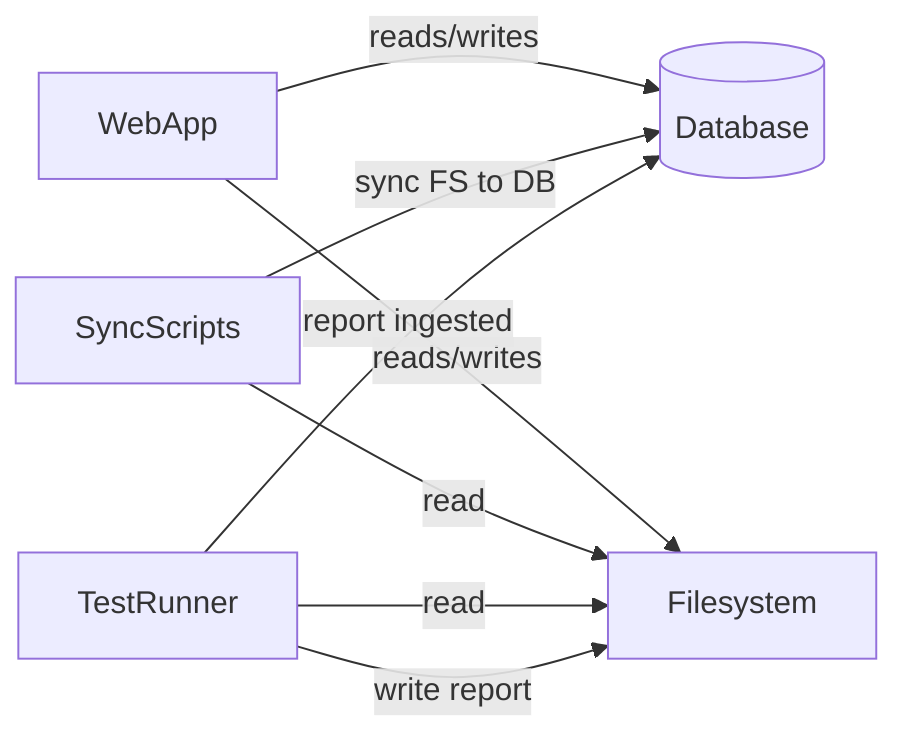
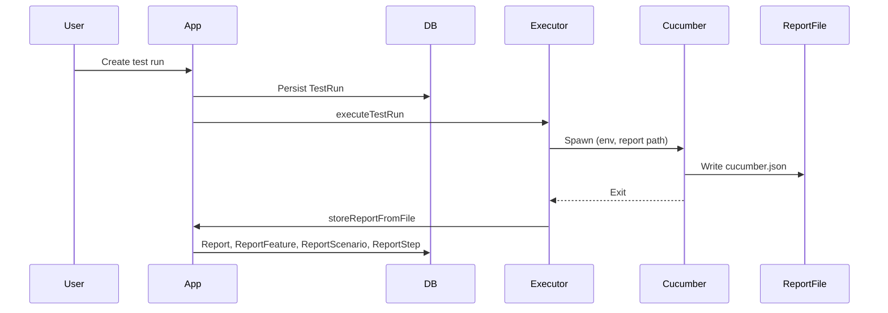

# Architecture

This document explains the system architecture, data flows, and boundaries.

## System Overview

The application is built with **Next.js 16** (App Router), **React 19**, **Prisma** (SQLite), **Cucumber**, and **Playwright**. The web app provides a dashboard and CRUD for test authoring entities; sync scripts keep the database in sync with the filesystem; and the test runner executes Cucumber against feature files and ingests reports into the database.

**Core components:**

- **Web app:** Next.js app under `src/app` (dashboard and entity CRUD for modules, environments, tags, locator-groups, locators, template-step-groups, template-steps, template-test-cases, test-suites, test-cases, test-runs, reports, reviews). Server actions in `src/actions`; shared UI in `src/components`; single Prisma client in `src/config/db-config.ts`.
- **Database:** SQLite via Prisma. Main entity groups: module hierarchy (Module, LocatorGroup, Locator); test authoring (TemplateStepGroup, TemplateStep, TemplateTestCase, TestSuite, TestCase, Tag); environments (Environment); runs and reports (TestRun, Report and nested ReportFeature, ReportScenario, ReportStep, ReportHook); conflict resolution (ConflictResolution); and metrics (TestCaseMetrics, TestSuiteMetrics, DashboardMetrics).
- **Filesystem:** Feature files (`src/tests/features/**/*.feature`), locator JSON (`src/tests/locators/**/*.json`), config files (e.g. `src/tests/config/environments/environments.json`), and report output directory (`src/tests/reports/`).
- **Sync pipeline:** CLI scripts (sync-all: one-way FS → DB only) and optional UI-triggered locator sync. No bidirectional sync script is in use; the filesystem plus git is the source of truth.
- **Test runner:** Cucumber process spawned by the Next server; reads feature files and step definitions from the filesystem, writes Cucumber JSON reports; report files are parsed and ingested into the database on run completion.

## Data Flow

**Authoring:** Content is authored in the filesystem (versioned with git). Sync scripts (FS → DB) bring that content into the database for the app to use. Optionally, the UI can create or update test suites and test cases, writing to both the database and to feature files so the file remains the source of truth and can be committed to git.

**Sync:** Sync is **one-way FS → DB** for all entities via sync-all (modules, environments, tags, template steps, locator-groups, locators, test-suites, test-cases). "Sync Locators" is the only in-app sync trigger; the bidirectional sync script (regenerate-features) is no longer used.

**Test execution:** The user creates a test run in the UI; the app persists a TestRun, spawns Cucumber with environment and report path, and Cucumber runs feature files and step definitions from the filesystem. It writes a JSON report; on process exit the app parses the report and stores Report and related rows; `scenario::end` events update TestRunTestCase status in real time.

See also: [Syncing](syncing.md), [Runner and Reports](runner-and-reports.md).

## Source of Truth

**Filesystem is the only source of truth** for authored content; **git** is used for version control. Feature files, locators, environments, tags, modules, template-step-groups, template-steps, locator-groups, test-suites, and test-cases are all defined in files. Sync scripts (FS → DB) align the database with the files; deleting or changing files and re-running sync-all (or the relevant script) can remove or update database rows.

**Database-authoritative (runtime only):** Test run state, report data (after a run completes), reviews, conflict resolution (ConflictResolution), and dashboard/entity metrics. No bulk DB → FS sync is used; the bidirectional sync script is deprecated.

**Optional UI writes:** When creating or updating test suites or test cases in the UI, the app writes to both the database and to feature files (generateFeatureFile / deleteFeatureFile), so the file remains the source of truth and can be committed to git.

## Sync Pipeline

**sync-all (one-way FS → DB):** Sync is performed by nine scripts in dependency order (run from CLI: `npm run sync-all`; there is no UI trigger for full sync):

1. sync-modules
2. sync-environments
3. sync-tags
4. sync-template-step-groups
5. sync-template-steps
6. sync-locator-groups (depends on modules)
7. sync-locators (depends on locator-groups)
8. sync-test-suites (depends on modules, tags)
9. sync-test-cases (depends on test-suites, template-steps, tags)

Order is required by dependencies (e.g. locator-groups depend on modules; test-cases depend on test-suites, template-steps, tags). All sync is **one-way: filesystem → database**.

**In-app sync:** Only "Sync Locators" (syncLocatorsFromFilesAction) runs sync from the UI; all other syncs are CLI-only.

| Entity               | Script                    | Direction | UI trigger |
| -------------------- | ------------------------- | --------- | ---------- |
| Modules              | sync-modules              | FS→DB     | Planned    |
| Environments         | sync-environments         | FS→DB     | Planned    |
| Tags                 | sync-tags                 | FS→DB     | Planned    |
| Template step groups | sync-template-step-groups | FS→DB     | Planned    |
| Template steps       | sync-template-steps       | FS→DB     | Planned    |
| Locator groups       | sync-locator-groups       | FS→DB     | Planned    |
| Locators             | sync-locators             | FS→DB     | Planned    |
| Test suites          | sync-test-suites          | FS→DB     | Planned    |
| Test cases           | sync-test-cases           | FS→DB     | Planned    |

See also: [Syncing](syncing.md).

## Constraints and Tradeoffs

- **Local-first:** SQLite and local files; no built-in multi-machine or cloud database. Suited to single-machine and offline-friendly workflows.
- **Single-tenant:** No tenant or org model in the schema; one database and one file tree per deployment.
- **Sync discipline:** Running sync-all in the correct order is required; out-of-order or partial sync can leave inconsistent state. Author content in the filesystem (or via the UI, which writes to both DB and feature files); run sync-all (or the relevant script) to keep the database in sync with the files.
- **Test execution:** Runs in the same process environment as the Next app (Cucumber spawned by the server); report path and environment variables are process-local. No distributed runner or external job queue is documented in the codebase.

See also: [Configuration](configuration.md), [Syncing](syncing.md), [Runner and Reports](runner-and-reports.md).
