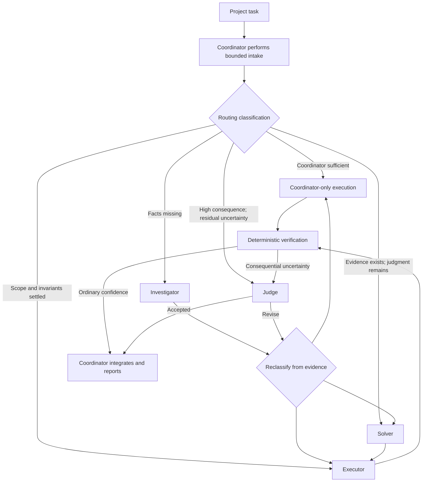
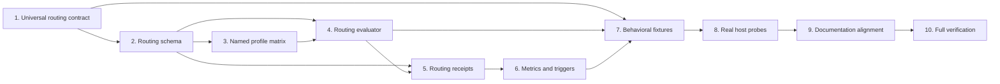

# Implementation Plan: Universal, Cost-Aware Project Swarm Routing

## Goal

Make the AppraiseJS repository's custom Codex swarm the default decision layer for project work without forcing
subagent activity. Every task should receive a lightweight routing classification; trivial work should resolve to a
coordinator-only path, while missing evidence, complex judgment, settled execution, and consequential evaluation
should route to appropriately priced named agents. Preserve the existing evidence-first role boundaries, independent
solver/judge context, deterministic verification preference, and user-governed harness evolution.

This plan changes the repository's coding-agent harness only. It does not alter AppraiseJS product lifecycle behavior,
MCP lifecycle gates, or generated project scaffolds.

## Current-State Constraints

- The repository can instruct and validate coordinator behavior, but it cannot install a host-level interceptor that
  deterministically runs before every user message.
- `.codex/config.toml` registers fixed named-agent profiles; registration is requested configuration, not proof of the
  effective runtime model, reasoning effort, context inheritance, or sandbox.
- The current harness activates `swarm-orchestrator` only for qualifying non-trivial work, so classification can be
  skipped before the skill is loaded.
- The current ledger records scored swarm runs but has no compact first-class routing receipt for coordinator-only
  work or model-selection rationale.
- Existing user work under `tasks/`, `appraise/plans/`, source files, templates, and lockfiles must be preserved.

## Target Flow

## Architecture Decisions

1. **Universal classification, optional delegation.** Root routing instructions will require a bounded classification
   for project work. A valid result is `coordinator-only`; trivial work must not create ceremonial subagents.
2. **Epistemic routing before effort routing.** Select investigator, solver, executor, or judge from the kind of
   uncertainty first. Select model/reasoning tier only after the role is known.
3. **Named profiles instead of arbitrary per-call overrides.** Add only profiles supported by demonstrated task
   classes, keeping authority and sandbox fixed by role. Initial profiles should cover:
   - investigator: inexpensive read-only evidence gathering;
   - executor standard: routine settled implementation;
   - executor advanced: cross-module but deterministically verifiable implementation;
   - solver: high-judgment decisions after evidence exists;
   - judge: independent high-consequence review.
     A lower-effort Sol profile should be added only if a distinct judgment class cannot be served reliably by
     Terra-high and the host supports the requested effort.
4. **Objective escalation signals.** Cross-module scope, persistence/security/public-contract risk, contradictory
   evidence, weak verification, material ambiguity, invalidated assumptions, and repeated executor failure will
   override a coordinator's initial low-complexity estimate.
5. **Two evidence levels.** Keep a compact routing receipt for all meaningful project tasks. Use the full scored swarm
   run and evolution lifecycle only when subagents are used, a routing anomaly occurs, or the task is consequential.
6. **No self-modifying optimizer.** Metrics and repeated routing findings may propose changes, but role, model,
   threshold, and concurrency updates still require explicit user guidance.
7. **Behavioral validation over token presence alone.** Harness checks must validate the routing matrix and profile
   contracts, while scenario tests exercise expected classification, escalation, coordinator-only handling, and
   independence requirements.

## Phase 1: Define the Universal Routing Contract

### Task 1: Specify task intake, classification, and stopping rules

**Description:** Replace conditional “load the swarm for non-trivial work” language with a universal but lightweight
project-task classification contract. Define inputs, routing outcomes, escalation signals, and the coordinator-only
fast path without implying that every task spawns an agent.

**Acceptance criteria:**

- Every project task is classified as coordinator-only, investigation, solving, execution, or independent judgment.
- The contract distinguishes epistemic need, consequence, verifiability, separability, and estimated effort.
- Trivial and deterministically verifiable work explicitly defaults to zero subagents.
- Product lifecycle gates remain outside this custom engineering swarm.

**Verification:**

- Run Prettier on the changed Markdown and skill files.
- Run `npm run check:harness`.
- Manually review the routing examples against localized fixes, cross-module features, architecture reviews, and
  release-gate tasks.

**Dependencies:** None.

**Files likely touched:**

- `AGENTS.md`
- `.agents/skills/swarm-orchestrator/SKILL.md`
- `.agents/skills/swarm-orchestrator/references/routing-and-evolution.md`
- `docs/agent-harness.md`

**Estimated scope:** Medium.

### Task 2: Define a machine-checkable routing decision schema

**Description:** Introduce a small repository-owned contract representing the coordinator's routing decision,
including task class, selected route, material signals, verification strength, consequence, selected profile,
delegation count, and runtime-proof status.

**Acceptance criteria:**

- The schema represents coordinator-only and delegated paths without fabricating host receipts.
- Missing or unsupported role/model/context claims are recorded as unverified.
- The schema can be validated deterministically and reused by tests and ledger commands.

**Verification:**

- Add unit tests for valid coordinator-only, investigation, solver, executor, and judge decisions.
- Add rejection tests for contradictory routes, unknown profiles, blank rationale, and false runtime-proof claims.
- Run the focused Node test file.

**Dependencies:** Task 1.

**Files likely touched:**

- `scripts/lib/swarm-routing-contract.mjs`
- `scripts/tests/swarm-routing.test.mjs`
- `scripts/check-swarm-harness.mjs`

**Estimated scope:** Medium.

## Checkpoint 1: Routing Contract

- Universal classification is stated consistently across root instructions, skill, and active harness docs.
- A coordinator-only task is a valid, test-covered outcome.
- No configuration or documentation claims host enforcement without a receipt.
- `npm run check:harness` passes.

## Phase 2: Add Cost-Aware Agent Profiles

### Task 3: Define the supported model and reasoning profile matrix

**Description:** Add the smallest useful set of named agent profiles and document why each exists. Preserve read-only
authority for evidence and judgment roles and workspace-write authority only for execution roles.

**Acceptance criteria:**

- Every profile maps to one epistemic role, model, reasoning effort, sandbox, and stopping condition.
- Terra-high is available for difficult but strongly verifiable execution if supported by the host configuration.
- Sol-high remains reserved for irreducible judgment and independent evaluation.
- No profile duplicates another profile without a distinct routing condition.

**Verification:**

- Extend `scripts/check-swarm-harness.mjs` to validate all registered profiles and prohibit unsafe role/sandbox
  combinations.
- Verify the host-visible named selectors where receipts are available; otherwise document the limitation.
- Run `npm run check:swarm-harness`.

**Dependencies:** Task 2.

**Files likely touched:**

- `.codex/config.toml`
- `.codex/agents/*.toml`
- `scripts/check-swarm-harness.mjs`
- `docs/agent-harness.md`

**Estimated scope:** Medium.

### Task 4: Encode deterministic profile selection and escalation rules

**Description:** Implement a pure routing evaluator used for testable recommendations. It should recommend a route
and profile from declared signals, while leaving the coordinator responsible for context-sensitive judgment.

**Acceptance criteria:**

- Low-risk deterministic work recommends coordinator-only or the standard executor.
- Missing evidence recommends an investigator before a solver.
- High judgment requires an evidence ledger before solver execution.
- Security, persistence, migration, and public-contract risk require Sol-level judgment and conditional independent
  evaluation.
- Two executor failures or an invalidated invariant force reclassification.

**Verification:**

- Add table-driven scenario tests for each routing branch and escalation trigger.
- Add boundary tests preventing mechanical work from being routed directly to Sol without rationale.
- Run the focused routing tests.

**Dependencies:** Tasks 2 and 3.

**Files likely touched:**

- `scripts/lib/swarm-router.mjs`
- `scripts/tests/swarm-routing.test.mjs`
- `.agents/skills/swarm-orchestrator/references/routing-and-evolution.md`

**Estimated scope:** Medium.

## Checkpoint 2: Dynamic Routing

- Named profiles and router outputs agree.
- Every profile is justified by a distinct task class.
- Standard scenarios use the lowest-cost profile consistent with evidence quality and consequence.
- Escalation cannot silently bypass evidence or authority requirements.

## Phase 3: Make Routing Observable Without Creating Bureaucracy

### Task 5: Add compact routing receipt recording

**Description:** Extend the existing swarm CLI/ledger boundary with a lightweight routing receipt command or event
type. Avoid forcing trivial tasks through the full five-dimension scorecard.

**Acceptance criteria:**

- Coordinator-only decisions can be recorded with task class, route, signals, rationale, profile, delegation count,
  and runtime-proof status.
- Delegated receipts link to the corresponding scored run when a full swarm run is recorded.
- Existing ledger schema migration, hash-chain validation, concurrency safety, recovery, and symlink protections
  remain intact.

**Verification:**

- Add serialization, migration, tamper, concurrency, and linkage tests.
- Verify legacy journals remain readable or migrate through an explicit supported path.
- Run `npm run test:swarm-harness`.

**Dependencies:** Tasks 2 and 4.

**Files likely touched:**

- `scripts/record-swarm-route.mjs`
- `scripts/lib/swarm-cli.mjs`
- `scripts/lib/swarm-ledger-store.mjs`
- `scripts/swarm-ledger.mjs`
- `scripts/tests/swarm-evolution.test.mjs`
- `package.json`

**Estimated scope:** Large; split storage migration and CLI integration if more than five files require substantive
changes.

### Task 6: Add routing metrics and proportional evolution triggers

**Description:** Track classification latency, selected profiles, zero-agent rate, escalations, reroutes, retries, and
unverified runtime claims. Apply longitudinal optimization triggers without treating healthy coordinator-only work as
a failed or incomplete swarm.

**Acceptance criteria:**

- Metrics distinguish efficient zero-agent handling from missed delegation.
- Repeated under-routing, oversized Sol use, duplicate delegation, and avoidable rerouting produce structured
  observations.
- Metrics never authorize automatic profile or threshold changes.

**Verification:**

- Add metric aggregation tests covering mixed coordinator-only and delegated runs.
- Add longitudinal tests for repeated under-routing and oversized-model use.
- Confirm the evolution note → notify → guidance → update → verification sequence remains mandatory.

**Dependencies:** Task 5.

**Files likely touched:**

- `scripts/lib/swarm-ledger-store.mjs`
- `scripts/swarm-ledger.mjs`
- `scripts/tests/swarm-evolution.test.mjs`
- `.agents/skills/swarm-orchestrator/references/routing-and-evolution.md`

**Estimated scope:** Medium.

## Checkpoint 3: Observable Operation

- Trivial tasks produce at most a compact receipt and zero subagents.
- Delegated tasks retain full scorecard and evolution evidence.
- Metrics distinguish cost efficiency from routing quality.
- Existing ledger integrity and recovery tests remain green.

## Phase 4: Validate Real Coordinator Behavior

### Task 7: Add adversarial routing fixtures and harness checks

**Description:** Expand the harness beyond static token checks using frozen task briefs with expected allowed and
prohibited routes. Include deceptive cases where effort and consequence differ.

**Acceptance criteria:**

- Fixtures cover trivial work, long mechanical work, small high-consequence changes, missing-cause debugging,
  architecture decisions, cross-module implementation, and release evaluation.
- Tests validate allowed route sets and required escalation signals rather than brittle prose output.
- Harness checks fail when universal classification, coordinator-only handling, or independence constraints drift.

**Verification:**

- Run the focused behavioral tests.
- Run `npm run check:harness`.
- Confirm the fixtures are excluded from generated scaffold output.

**Dependencies:** Tasks 1–6.

**Files likely touched:**

- `scripts/fixtures/swarm-routing-contracts.json`
- `scripts/tests/swarm-routing.test.mjs`
- `scripts/check-agent-harness.mjs`
- `scripts/check-swarm-harness.mjs`
- `docs/agent-validation-matrix.md`

**Estimated scope:** Medium.

### Task 8: Conduct real host routing probes

**Description:** Exercise the custom agents through the actual host using a small frozen matrix. Capture the effective
named role, model/reasoning receipt, context inheritance, sandbox behavior, latency, retries, and token use when the
host exposes them.

**Acceptance criteria:**

- At least one coordinator-only, investigator, executor, solver, and judge route is exercised.
- Solver and judge independence is verified from host receipts or explicitly marked unverified.
- Any mismatch between repository configuration and effective runtime is reported as a harness observation.
- The probe does not modify product source unless its fixture explicitly authorizes an isolated temporary change.

**Verification:**

- Preserve task-local host receipts and compact evidence ledgers.
- Record scored delegated runs and link any required evolution cycle.
- Have a fresh independent judge evaluate the frozen acceptance matrix.

**Dependencies:** Task 7.

**Files likely touched:**

- `docs/agent-real-subagent-audit-protocol.md`
- Local Git-ignored swarm evidence only, unless active documentation must reflect a confirmed host limitation.

**Estimated scope:** Medium.

## Checkpoint 4: Effective Behavior

- Repository checks validate both structure and routing scenarios.
- Real host probes establish what is actually enforced and what remains requested configuration.
- Coordinator-only work stays cheap.
- Sol usage is justified by evidence and consequence.
- Any non-optimal finding follows the governed evolution cycle before harness changes continue.

## Phase 5: Documentation, Integration, and Release Validation

### Task 9: Align all active harness documentation

**Description:** Update the active harness map, guardrails, validation matrix, and task recipes to describe universal
classification, proportional recording, profile selection, escalation, and host-proof limitations consistently.

**Acceptance criteria:**

- No active document says the swarm applies only after a coordinator has already declared work non-trivial.
- Documentation clearly separates custom project engineering from AppraiseJS product lifecycle orchestration.
- Generated scaffolds do not inherit repository-only swarm configuration or administration commands.

**Verification:**

- Run Prettier checks on all changed documentation.
- Run link and generated-artifact boundary checks.
- Run `npm run check:harness`.

**Dependencies:** Tasks 7 and 8.

**Files likely touched:**

- `docs/agent-harness.md`
- `docs/agent-harness-guardrails.md`
- `docs/agent-task-recipes.md`
- `docs/agent-validation-matrix.md`
- `docs/agent-generated-artifacts.md`
- `AGENTS.md`

**Estimated scope:** Medium.

### Task 10: Run full harness and release verification

**Description:** Validate the integrated harness at the level required for a project toolchain and agent-governance
change.

**Acceptance criteria:**

- Focused routing, ledger, migration, concurrency, recovery, and adversarial tests pass.
- Full harness, documentation, artifact-boundary, package, static-analysis, and build checks pass.
- An independent judge finds no material gap against this plan's target flow.
- The final report separates deterministic evidence from unverified host behavior.

**Verification:**

- `npm run check:harness`
- `npm run test:swarm-harness`
- `npm run docs:check-links`
- `npm run release:check:artifacts`
- `npm run release:check:packages`
- `npm run quality:fallow:commit`
- `npm run quality:react-doctor:commit` when React files are touched
- `npm run build`

**Dependencies:** Task 9.

**Files likely touched:** None beyond fixes required by validation.

**Estimated scope:** Medium.

## Dependency Graph

## Parallelization Opportunities

- After Task 2 establishes the contract, Task 3 profile configuration and Task 4 routing evaluator design can be
  prepared independently, but their writes must not overlap.
- Documentation drafting for Task 9 can begin after Task 7, but final claims must wait for Task 8 host evidence.
- Ledger storage changes in Task 5 must remain sequential and single-owner because concurrent edits would overlap
  integrity, migration, and recovery boundaries.
- The final judge must not inherit the producing agents' full transcript or recommendations.

## Risks and Mitigations

| Risk                                                                | Impact | Mitigation                                                                                                    |
| ------------------------------------------------------------------- | ------ | ------------------------------------------------------------------------------------------------------------- |
| Repository instructions are mistaken for a host-enforced dispatcher | High   | State the enforcement boundary explicitly and require runtime receipts                                        |
| Universal routing adds bureaucracy to trivial work                  | High   | Use a compact coordinator-only receipt and reserve full scoring for meaningful swarm runs                     |
| Too many profiles make routing inconsistent                         | Medium | Require a distinct task class and tests for each added profile                                                |
| Coordinator underestimates complexity                               | High   | Add objective escalation signals and adversarial fixtures                                                     |
| Sol is overused for routine work                                    | Medium | Prefer Terra-high for strongly verifiable complexity and trigger `oversized-sol` observations                 |
| Ledger schema changes corrupt prior evidence                        | High   | Version events, test migration/tamper/recovery/concurrency, and preserve explicit recovery                    |
| Solver or judge inherits producer anchoring                         | High   | Require no/bounded context receipts and treat missing proof as an evolution trigger                           |
| Existing dirty work is overwritten                                  | High   | Stage and edit only scoped harness files; preserve existing `tasks/`, plans, source, templates, and lockfiles |

## Definition of Done

- Every project task is subject to a bounded routing classification.
- Coordinator-only is a first-class, inexpensive outcome.
- Role and model selection follows evidence need, consequence, and verification strength.
- Dynamic profiles are registered, validated, and justified without weakening role authority.
- Escalation and reclassification rules are deterministic where possible and behaviorally tested.
- Routing receipts and full swarm runs are recorded proportionally.
- Runtime role/model/context/sandbox claims use host evidence or are disclosed as unverified.
- Active harness documentation is consistent and generated scaffold boundaries remain intact.
- Deterministic checks and a fresh independent evaluation pass.

## Open Questions Requiring Confirmation Before Implementation

1. Should Terra-high be represented as a separate named executor profile, or should the coordinator override reasoning
   effort per assignment where the host supports it?
2. Should coordinator-only routing receipts be mandatory for every project task or only tasks above a small
   materiality threshold?
3. Is a lower-effort Sol solver profile desired immediately, or should it be deferred until metrics demonstrate a
   judgment class that Terra-high cannot handle reliably?
